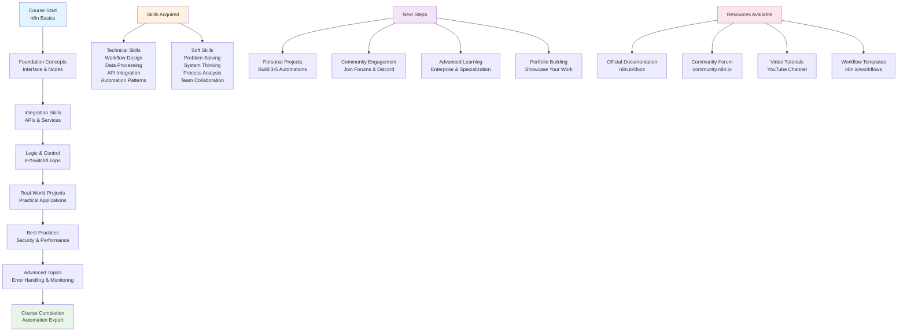

# Course Wrap-Up & Your Automation Journey

## 🎉 Congratulations!

You've completed the n8n automation course! This guide will help you recap what you've learned, plan your next steps, and continue your automation journey with confidence.

## Table of Contents

1. [Course Recap](#course-recap)
2. [Key Skills Acquired](#key-skills-acquired)
3. [Your Automation Journey](#your-automation-journey)
4. [Project Ideas for Practice](#project-ideas-for-practice)
5. [Finding Help and Resources](#finding-help-and-resources)
6. [Building Your Automation Portfolio](#building-your-automation-portfolio)
7. [Advanced Learning Paths](#advanced-learning-paths)
8. [Community and Networking](#community-and-networking)

## Course Recap

### Your Learning Journey



### What You've Learned

Throughout this course, you've gained hands-on experience with:

#### 🏗️ **Foundation Concepts**
- Understanding n8n's visual workflow interface
- Working with triggers, nodes, and connections
- Basic data manipulation and transformation
- Expression syntax and JavaScript in n8n

#### 🔗 **Integration Skills**
- Connecting to external APIs and services
- Setting up credentials securely
- Working with Google Sheets, Gmail, Slack, Discord
- Handling webhooks and HTTP requests

#### 🧠 **Logic and Control Flow**
- Using IF nodes for conditional logic
- Implementing Switch nodes for multiple conditions
- Working with loops and batch processing
- Error handling and workflow resilience

#### 🚀 **Real-World Applications**
- Building practical automation workflows
- Implementing scheduled tasks with Cron triggers
- Creating notification systems
- Processing and transforming data

#### 🛡️ **Best Practices**
- Security considerations and credential management
- Backup and version control strategies
- Error handling and monitoring
- Performance optimization techniques

## Key Skills Acquired

### Technical Skills

#### 1. **Workflow Design**
- ✅ Creating logical, maintainable workflow structures
- ✅ Implementing proper data flow between nodes
- ✅ Using appropriate node types for different tasks
- ✅ Designing for scalability and reusability

#### 2. **Data Processing**
- ✅ Transforming data using Set nodes
- ✅ Working with JSON structures and arrays
- ✅ Implementing data validation and filtering
- ✅ Handling different data formats and sources

#### 3. **API Integration**
- ✅ Making HTTP requests to external services
- ✅ Handling authentication and credentials
- ✅ Processing API responses and errors
- ✅ Working with rate limits and retries

#### 4. **Automation Patterns**
- ✅ Event-driven automation with triggers
- ✅ Scheduled automation with Cron nodes
- ✅ Conditional automation with IF/Switch nodes
- ✅ Batch processing with Split in Batches

### Soft Skills

#### 1. **Problem-Solving**
- ✅ Breaking down complex processes into automatable steps
- ✅ Identifying opportunities for automation
- ✅ Troubleshooting workflow issues
- ✅ Optimizing existing processes

#### 2. **System Thinking**
- ✅ Understanding end-to-end processes
- ✅ Considering error scenarios and edge cases
- ✅ Planning for scalability and maintenance
- ✅ Integrating multiple systems and services

## Your Automation Journey

### Where You Are Now

You now have the foundation to:

- **Build simple to intermediate workflows** independently
- **Integrate common services** like email, spreadsheets, and messaging platforms
- **Handle basic error scenarios** and implement recovery strategies
- **Design workflows** that are maintainable and scalable
- **Troubleshoot issues** using n8n's debugging tools

### Where You're Going

Your next steps should focus on:

#### 🎯 **Immediate Goals (Next 1-2 months)**
- Build 3-5 personal automation projects
- Practice with different node types and integrations
- Experiment with error handling and monitoring
- Join the n8n community and start networking

#### 🚀 **Medium-term Goals (3-6 months)**
- Tackle more complex automation scenarios
- Learn advanced n8n features and community nodes
- Build workflows for others (friends, family, or small businesses)
- Contribute to the n8n community

#### 🌟 **Long-term Goals (6+ months)**
- Become an n8n expert and thought leader
- Build a portfolio of automation solutions
- Consider automation consulting or freelancing
- Contribute to n8n's development or ecosystem

## Project Ideas for Practice

### Beginner Projects (Start Here!)

#### 1. **Personal Productivity Automation**
- **Daily Weather Report**: Get weather updates via email every morning
- **Expense Tracker**: Automatically categorize and log expenses from bank emails
- **Reading List Manager**: Save articles from various sources to a central list
- **Social Media Backup**: Automatically save posts and photos to cloud storage

#### 2. **Home Automation**
- **Smart Home Notifications**: Get alerts when devices change status
- **Energy Usage Monitor**: Track and report on home energy consumption
- **Grocery List Manager**: Sync shopping lists across family members
- **Maintenance Reminders**: Get alerts for home maintenance tasks

#### 3. **Business Automation**
- **Lead Management**: Automatically capture and categorize leads
- **Invoice Processing**: Extract data from invoices and update accounting systems
- **Customer Support**: Route support tickets based on content
- **Social Media Monitoring**: Track mentions and engagement across platforms

### Intermediate Projects

#### 1. **E-commerce Automation**
- **Inventory Management**: Sync inventory across multiple sales channels
- **Order Processing**: Automatically process and fulfill orders
- **Customer Communication**: Send personalized follow-up emails
- **Price Monitoring**: Track competitor prices and adjust accordingly

#### 2. **Content Management**
- **Blog Automation**: Automatically publish content across multiple platforms
- **Social Media Scheduler**: Schedule and post content across networks
- **SEO Monitoring**: Track keyword rankings and website performance
- **Content Curation**: Automatically find and curate relevant content

#### 3. **Data Processing**
- **ETL Pipelines**: Extract, transform, and load data between systems
- **Report Generation**: Automatically generate and distribute reports
- **Data Validation**: Validate and clean incoming data
- **Analytics Automation**: Process and analyze business metrics

### Advanced Projects

#### 1. **Enterprise Integration**
- **CRM Automation**: Sync customer data across multiple systems
- **HR Workflows**: Automate employee onboarding and offboarding
- **Financial Reporting**: Automate complex financial calculations and reporting
- **Compliance Monitoring**: Track and report on regulatory compliance

#### 2. **IoT and Device Integration**
- **Sensor Data Processing**: Collect and process IoT sensor data
- **Device Management**: Automate device configuration and monitoring
- **Predictive Maintenance**: Analyze device data to predict failures
- **Smart Building Management**: Automate building systems and energy usage

## Finding Help and Resources

### Official Resources

#### 📚 **Documentation**
- **[n8n Documentation](https://docs.n8n.io/)**: Complete official documentation
- **[Node Reference](https://docs.n8n.io/integrations/)**: Detailed information about each node
- **[Expression Reference](https://docs.n8n.io/code-examples/expressions/)**: JavaScript expressions guide
- **[API Documentation](https://docs.n8n.io/api/)**: REST API reference

#### 🎥 **Video Resources**
- **[n8n YouTube Channel](https://www.youtube.com/c/n8nio)**: Official tutorials and demos
- **[Community Tutorials](https://www.youtube.com/results?search_query=n8n+tutorial)**: User-created content
- **[Conference Talks](https://www.youtube.com/results?search_query=n8n+conference)**: Expert presentations

#### 💻 **Code Examples**
- **[Workflow Templates](https://n8n.io/workflows/)**: Pre-built workflow templates
- **[GitHub Examples](https://github.com/n8n-io/n8n/tree/master/packages/cli/src/workflows)**: Official examples
- **[Community Workflows](https://github.com/search?q=n8n+workflow)**: User-contributed workflows

### Community Resources

#### 🌐 **Forums and Communities**
- **[n8n Community Forum](https://community.n8n.io/)**: Official community forum
- **[Discord Server](https://discord.gg/n8n)**: Real-time community chat
- **[Reddit Community](https://www.reddit.com/r/n8n/)**: Discussion and help
- **[Stack Overflow](https://stackoverflow.com/questions/tagged/n8n)**: Technical Q&A

#### 📰 **News and Updates**
- **[n8n Blog](https://blog.n8n.io/)**: Official blog and updates
- **[Newsletter](https://n8n.io/newsletter/)**: Weekly automation tips and updates
- **[Twitter](https://twitter.com/n8n_io)**: Latest news and announcements
- **[LinkedIn](https://www.linkedin.com/company/n8n-io/)**: Professional updates

### Learning Platforms

#### 🎓 **Online Courses**
- **[n8n Academy](https://academy.n8n.io/)**: Official learning platform
- **[Udemy Courses](https://www.udemy.com/courses/search/?q=n8n)**: Third-party courses
- **[YouTube Channels](https://www.youtube.com/results?search_query=n8n+course)**: Video tutorials

#### 📖 **Books and Guides**
- **[n8n Cookbook](https://docs.n8n.io/cookbook/)**: Recipe-style guides
- **[Automation Best Practices](https://docs.n8n.io/workflows/best-practices/)**: Official best practices
- **[Community Guides](https://community.n8n.io/c/guides)**: User-written guides

## Building Your Automation Portfolio

### Portfolio Components

#### 1. **Project Documentation**
For each automation project, document:

```markdown
# Project Name

## Overview
Brief description of what the automation does

## Problem Solved
What business or personal problem this addresses

## Technical Implementation
- Nodes used
- Key integrations
- Special techniques applied

## Results
- Time saved
- Errors reduced
- Efficiency gains

## Code/Workflow
Link to workflow JSON or screenshots

## Lessons Learned
What you learned while building this
```

#### 2. **Case Studies**
Create detailed case studies for your best projects:

- **Challenge**: What problem were you solving?
- **Solution**: How did you approach it?
- **Implementation**: Technical details and decisions
- **Results**: Measurable outcomes and benefits
- **Reflection**: What worked well, what didn't

#### 3. **Workflow Templates**
Share reusable workflow templates:

- **Email Automation Templates**
- **Data Processing Templates**
- **Integration Templates**
- **Error Handling Templates**

### Portfolio Platforms

#### 🌐 **Online Portfolio**
- **GitHub**: Host your workflow files and documentation
- **Personal Website**: Showcase your automation projects
- **LinkedIn**: Share case studies and achievements
- **Medium/Dev.to**: Write about your automation experiences

#### 📱 **Social Media**
- **Twitter**: Share automation tips and project updates
- **LinkedIn**: Professional automation content
- **YouTube**: Create video tutorials and project walkthroughs
- **Instagram**: Visual workflow diagrams and results

## Advanced Learning Paths

### Specialization Areas

#### 1. **Enterprise Automation**
- **Complex System Integration**: Connecting multiple enterprise systems
- **Compliance and Security**: Meeting enterprise security requirements
- **Scalability**: Building workflows that handle high volume
- **Team Collaboration**: Managing automation across teams

#### 2. **Industry-Specific Automation**
- **Healthcare**: HIPAA-compliant patient data automation
- **Finance**: Financial data processing and reporting
- **E-commerce**: Multi-channel retail automation
- **Manufacturing**: IoT and production line automation

#### 3. **Technical Specialization**
- **Custom Node Development**: Building your own n8n nodes
- **API Development**: Creating APIs for n8n workflows
- **DevOps Integration**: CI/CD and deployment automation
- **Cloud Architecture**: Building scalable automation infrastructure

### Advanced Skills to Develop

#### 🔧 **Technical Skills**
- **JavaScript/TypeScript**: Advanced expression writing
- **API Design**: Creating and consuming REST APIs
- **Database Management**: Working with various database systems
- **Cloud Platforms**: AWS, Google Cloud, Azure integration

#### 🎯 **Business Skills**
- **Process Analysis**: Identifying automation opportunities
- **ROI Calculation**: Measuring automation benefits
- **Change Management**: Implementing automation in organizations
- **Project Management**: Leading automation projects

## Community and Networking

### Getting Involved

#### 🤝 **Community Participation**
- **Answer Questions**: Help others in forums and Discord
- **Share Workflows**: Contribute templates and examples
- **Write Tutorials**: Create educational content
- **Report Issues**: Help improve n8n by reporting bugs

#### 🎤 **Speaking and Writing**
- **Conference Talks**: Present at automation conferences
- **Blog Posts**: Write about your automation experiences
- **Podcast Interviews**: Share your automation journey
- **Workshop Hosting**: Teach others about n8n

#### 🏆 **Recognition and Awards**
- **Community Contributor**: Become a recognized community member
- **Certification**: Pursue n8n certifications when available
- **Open Source**: Contribute to n8n's development
- **Thought Leadership**: Become a recognized automation expert

### Networking Opportunities

#### 🌍 **Events and Conferences**
- **n8n Conference**: Annual n8n community conference
- **Automation Meetups**: Local automation community events
- **Tech Conferences**: Broader technology conferences
- **Online Events**: Virtual conferences and webinars

#### 👥 **Professional Networks**
- **LinkedIn Groups**: Join automation and n8n groups
- **Professional Associations**: Join relevant industry associations
- **Mentorship**: Find mentors or become a mentor
- **Collaboration**: Partner with other automation professionals

## Presenting Your Automation Journey

Now that you have learned so much, it's time to think about how you can share your knowledge and projects with others. A great way to do this is by creating a presentation. And what better way to create a presentation for a tech-savvy audience than by using a tool that is based on Markdown?

### Introducing Marp

Marp is a Markdown-based presentation ecosystem. It allows you to create beautiful presentations using simple Markdown syntax. This is a great way to present your n8n projects and workflows, as you can easily include code snippets, diagrams, and other technical details.

### Why Use Marp?

*   **Markdown-based**: Write your presentations in a familiar and simple syntax.
*   **Code-friendly**: Easily include code snippets with syntax highlighting.
*   **Exportable**: Export your presentations to PDF, HTML, and PowerPoint.
*   **Customizable**: Create your own themes to match your personal brand.

### Example Marp Slide

Here is an example of a simple Marp slide that you can use to present one of your projects:

```markdown
---
marp: true
theme: default

# My n8n Automation Project

## Daily Weather Report

This workflow sends a daily weather report to my email every morning.

- **Trigger**: Cron trigger (daily at 8 AM)
- **API**: OpenWeatherMap API
- **Action**: Send email with formatted weather report

```

To get started with Marp, you can check out the [official documentation](https://marp.app/).

## Final Words of Encouragement

### You've Come a Long Way! 🎉

From learning the basics of n8n to building complex automation workflows, you've developed valuable skills that can transform how you and others work. Automation is not just about saving time—it's about:

- **Eliminating repetitive tasks** so you can focus on what matters
- **Reducing human error** in critical processes
- **Scaling operations** without scaling headcount
- **Creating consistent, reliable outcomes**
- **Enabling innovation** by freeing up mental bandwidth

### Your Automation Superpowers

You now have the power to:

- **See automation opportunities** everywhere you look
- **Design solutions** that solve real problems
- **Build reliable systems** that work when you're not there
- **Connect disparate systems** to create seamless experiences
- **Transform manual processes** into automated workflows

### The Journey Continues

This course is just the beginning of your automation journey. Every new project will teach you something new, every challenge will make you stronger, and every success will inspire you to tackle bigger problems.

### Remember These Principles

1. **Start Small**: Begin with simple automations and gradually increase complexity
2. **Think Big**: Always consider the bigger picture and potential impact
3. **Fail Fast**: Learn from mistakes and iterate quickly
4. **Share Knowledge**: Help others learn and grow in the community
5. **Stay Curious**: Keep exploring new technologies and possibilities

### Your Next Challenge

Here's your challenge: **Build one automation this week** that solves a real problem in your life or work. It doesn't have to be complex—just useful. Share it with the community and inspire others to start their automation journey.

## Resources Quick Reference

### 📚 **Essential Links**
- [n8n Documentation](https://docs.n8n.io/)
- [Community Forum](https://community.n8n.io/)
- [Workflow Templates](https://n8n.io/workflows/)
- [Discord Community](https://discord.gg/n8n)

### 🛠️ **Tools and Services**
- [n8n Cloud](https://app.n8n.cloud/) - Hosted n8n
- [n8n Desktop](https://docs.n8n.io/hosting/installation/desktop-app/) - Local development
- [GitHub](https://github.com/n8n-io/n8n) - Source code and issues

### 🎯 **Learning Paths**
- [Beginner Projects](#project-ideas-for-practice)
- [Advanced Learning](#advanced-learning-paths)
- [Community Resources](#finding-help-and-resources)

---

## 🚀 Ready to Automate the World?

You have everything you need to start building amazing automations. The only limit is your imagination. Go forth and automate! 

**Happy Automating!** 🤖✨

*Remember: Every expert was once a beginner. Every pro was once an amateur. Every icon was once an unknown. Keep going, and don't be afraid to fail. The automation community is here to support you every step of the way.*

## Final Words of Encouragement

### You've Come a Long Way! 🎉

From learning the basics of n8n to building complex automation workflows, you've developed valuable skills that can transform how you and others work. Automation is not just about saving time—it's about:

- **Eliminating repetitive tasks** so you can focus on what matters
- **Reducing human error** in critical processes
- **Scaling operations** without scaling headcount
- **Creating consistent, reliable outcomes**
- **Enabling innovation** by freeing up mental bandwidth

### Your Automation Superpowers

You now have the power to:

- **See automation opportunities** everywhere you look
- **Design solutions** that solve real problems
- **Build reliable systems** that work when you're not there
- **Connect disparate systems** to create seamless experiences
- **Transform manual processes** into automated workflows

### The Journey Continues

This course is just the beginning of your automation journey. Every new project will teach you something new, every challenge will make you stronger, and every success will inspire you to tackle bigger problems.

### Remember These Principles

1. **Start Small**: Begin with simple automations and gradually increase complexity
2. **Think Big**: Always consider the bigger picture and potential impact
3. **Fail Fast**: Learn from mistakes and iterate quickly
4. **Share Knowledge**: Help others learn and grow in the community
5. **Stay Curious**: Keep exploring new technologies and possibilities

### Your Next Challenge

Here's your challenge: **Build one automation this week** that solves a real problem in your life or work. It doesn't have to be complex—just useful. Share it with the community and inspire others to start their automation journey.

## Resources Quick Reference

### 📚 **Essential Links**
- [n8n Documentation](https://docs.n8n.io/)
- [Community Forum](https://community.n8n.io/)
- [Workflow Templates](https://n8n.io/workflows/)
- [Discord Community](https://discord.gg/n8n)

### 🛠️ **Tools and Services**
- [n8n Cloud](https://app.n8n.cloud/) - Hosted n8n
- [n8n Desktop](https://docs.n8n.io/hosting/installation/desktop-app/) - Local development
- [GitHub](https://github.com/n8n-io/n8n) - Source code and issues

### 🎯 **Learning Paths**
- [Beginner Projects](#project-ideas-for-practice)
- [Advanced Learning](#advanced-learning-paths)
- [Community Resources](#finding-help-and-resources)

---

## 🚀 Ready to Automate the World?

You have everything you need to start building amazing automations. The only limit is your imagination. Go forth and automate! 

**Happy Automating!** 🤖✨

*Remember: Every expert was once a beginner. Every pro was once an amateur. Every icon was once an unknown. Keep going, and don't be afraid to fail. The automation community is here to support you every step of the way.*
