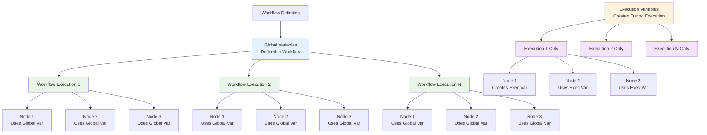

# Global Variables versus Execution Variables

In n8n, there are two main types of variables that you can use to store and access data: **Global Variables** and **Execution Variables**. Understanding the difference between these two is crucial for effective workflow design.

## Global Variables

Global variables are **workflow-level** variables that persist across all executions of a workflow. They are defined within the workflow itself and can be accessed by any node in that workflow.

### Variable Scope and Lifecycle



### Key Characteristics:
- **Scope**: Available to all nodes within the same workflow
- **Persistence**: Values persist across multiple workflow executions
- **Access**: Can be accessed using `$vars.variableName` syntax
- **Use Cases**: Configuration values, API keys, default settings, shared data between nodes

### Example Use Cases:
- API endpoints and authentication tokens
- Default configuration values
- Shared business logic parameters
- Environment-specific settings

## Execution Variables

Execution variables are **execution-level** variables that are created during a specific workflow execution and are only available within that execution context.

### Key Characteristics:
- **Scope**: Available only within the current execution
- **Persistence**: Values are lost when the execution completes
- **Access**: Can be accessed using `$vars.variableName` syntax (same as global)
- **Use Cases**: Temporary data, execution-specific calculations, dynamic values

### Example Use Cases:
- Processing results from previous nodes
- Temporary calculations
- Dynamic values that change per execution
- Data transformation results

## Key Differences

| Aspect | Global Variables | Execution Variables |
|-------|------------------|-------------------|
| **Scope** | Workflow-wide | Execution-specific |
| **Persistence** | Across executions | Single execution only |
| **Definition** | Set in workflow settings | Set during execution |
| **Use Case** | Configuration, constants | Dynamic, temporary data |
| **Access Pattern** | `$vars.variableName` | `$vars.variableName` |

## Best Practices

### When to Use Global Variables:
- Store configuration values that don't change often
- API keys and authentication tokens
- Default settings and parameters
- Business logic constants

### When to Use Execution Variables:
- Store results from node processing
- Temporary calculations and transformations
- Dynamic values that change per execution
- Data that needs to be passed between nodes

## Syntax and Access

Both types of variables use the same syntax for access:
```javascript
// Access a variable
$vars.myVariable

// Use in expressions
{{ $vars.apiEndpoint }}/users

// Use in code
const value = $vars.tempValue;
```

## Examples

### Global Variables Example:
```json
{
  "variables": {
    "apiEndpoint": "https://api.example.com",
    "timeout": 30000,
    "retryAttempts": 3
  }
}
```

### Execution Variables Example:
```javascript
// Set during execution
$vars.processedCount = 0;
$vars.currentBatch = items.length;
$vars.timestamp = new Date().toISOString();
```

## Workflow Examples

This folder contains sample workflows demonstrating both types of variables:

1. **global-variables-workflow.json** - Shows how to define and use global variables
2. **execution-variables-workflow.json** - Demonstrates execution-level variable usage

## Tips for Effective Variable Management

1. **Use descriptive names** for your variables
2. **Document your variables** in workflow comments
3. **Group related variables** logically
4. **Use global variables sparingly** - only for truly global data
5. **Clean up execution variables** when no longer needed
6. **Consider security** - don't store sensitive data in global variables unless necessary

## Common Pitfalls

- **Mixing scopes**: Using execution variables where global variables are needed
- **Overusing global variables**: Making everything global when it should be execution-specific
- **Variable name conflicts**: Using the same name for both global and execution variables
- **Security issues**: Storing sensitive data in global variables that persist across executions
