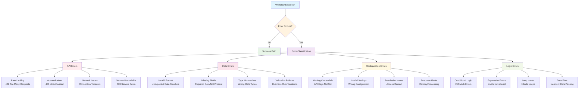
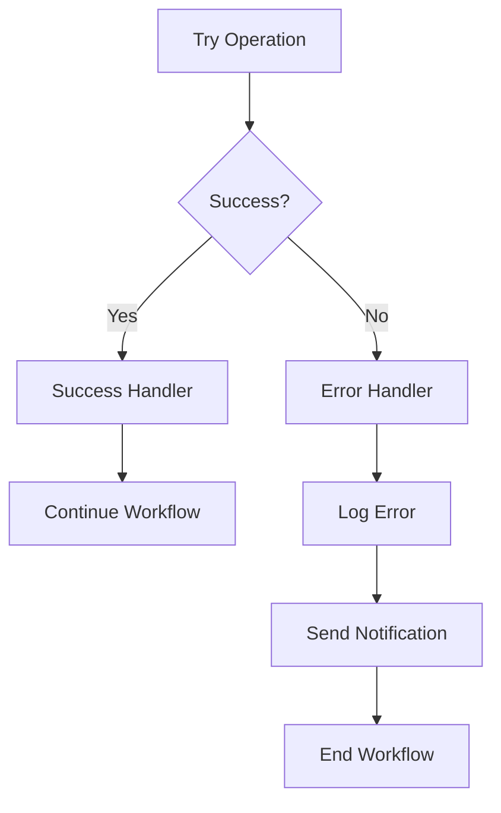

# Handling Errors in Your Workflows

## Overview

This guide covers comprehensive error handling strategies for n8n workflows, including error workflows, execution monitoring, and design patterns for robust automation systems.

## Table of Contents

1. [Understanding Error Types](#understanding-error-types)
2. [Error Workflows Introduction](#error-workflows-introduction)
3. [Monitoring Executions](#monitoring-executions)
4. [Error Handling Design Patterns](#error-handling-design-patterns)
5. [Debugging Techniques](#debugging-techniques)
6. [Best Practices](#best-practices)
7. [Real-World Examples](#real-world-examples)

## Understanding Error Types

### Error Classification System



### Common Error Categories

#### 1. **API Errors**
- **Rate Limiting**: Too many requests to external services
- **Authentication**: Invalid credentials or expired tokens
- **Network Issues**: Connection timeouts or network failures
- **Service Unavailable**: External API downtime

#### 2. **Data Errors**
- **Invalid Format**: Unexpected data structure
- **Missing Fields**: Required data not present
- **Type Mismatches**: Wrong data types in expressions
- **Validation Failures**: Data doesn't meet business rules

#### 3. **Configuration Errors**
- **Missing Credentials**: Required credentials not configured
- **Invalid Settings**: Incorrect node configuration
- **Permission Issues**: Insufficient access rights
- **Resource Limits**: Memory or processing limits exceeded

#### 4. **Logic Errors**
- **Conditional Logic**: Incorrect IF/Switch conditions
- **Expression Errors**: Invalid JavaScript expressions
- **Loop Issues**: Infinite loops or incorrect iteration
- **Data Flow**: Incorrect data passing between nodes

## Error Workflows Introduction

### What are Error Workflows?

Error workflows are specialized workflows that automatically execute when your main workflow encounters an error. They provide a centralized way to handle failures and implement recovery strategies.

### Setting Up Error Workflows

#### 1. Create Error Workflow

```json
{
  "name": "Error Handler Workflow",
  "nodes": [
    {
      "parameters": {
        "options": {}
      },
      "name": "Error Trigger",
      "type": "n8n-nodes-base.errorTrigger"
    },
    {
      "parameters": {
        "values": {
          "string": [
            {
              "name": "errorMessage",
              "value": "={{$json.error.message}}"
            },
            {
              "name": "errorType",
              "value": "={{$json.error.name}}"
            },
            {
              "name": "failedNode",
              "value": "={{$json.node.name}}"
            },
            {
              "name": "workflowName",
              "value": "={{$json.workflow.name}}"
            },
            {
              "name": "executionId",
              "value": "={{$json.execution.id}}"
            },
            {
              "name": "timestamp",
              "value": "={{$now}}"
            }
          ]
        }
      },
      "name": "Extract Error Details",
      "type": "n8n-nodes-base.set"
    }
  ]
}
```

#### 2. Link Error Workflow to Main Workflow

```json
{
  "settings": {
    "errorWorkflow": {
      "id": "error-handler-workflow-id",
      "name": "Error Handler Workflow"
    }
  }
}
```

### Error Workflow Capabilities

#### 1. **Error Information Access**
```javascript
// Available error data in error workflows
{
  "error": {
    "message": "API request failed",
    "name": "Error",
    "stack": "Error stack trace..."
  },
  "node": {
    "name": "HTTP Request",
    "type": "n8n-nodes-base.httpRequest"
  },
  "workflow": {
    "name": "Main Workflow",
    "id": "workflow-id"
  },
  "execution": {
    "id": "execution-id",
    "mode": "manual"
  }
}
```

#### 2. **Notification Strategies**
```json
{
  "parameters": {
    "operation": "postMessage",
    "channel": "#alerts",
    "text": "🚨 Workflow Error Alert",
    "attachments": [
      {
        "color": "danger",
        "fields": [
          {
            "title": "Workflow",
            "value": "={{$json.workflowName}}",
            "short": true
          },
          {
            "title": "Failed Node",
            "value": "={{$json.failedNode}}",
            "short": true
          },
          {
            "title": "Error Message",
            "value": "={{$json.errorMessage}}",
            "short": false
          },
          {
            "title": "Execution ID",
            "value": "={{$json.executionId}}",
            "short": true
          }
        ]
      }
    ]
  },
  "name": "Send Error Alert",
  "type": "n8n-nodes-base.slack"
}
```

## Monitoring Executions

### Accessing Execution Logs

#### 1. **Via n8n Interface**
- Navigate to "Executions" in the left sidebar
- View all workflow executions
- Filter by status (Success, Error, Running)
- Click on individual executions for details

#### 2. **Execution Status Indicators**
- 🟢 **Success**: Workflow completed without errors
- 🔴 **Error**: Workflow failed with errors
- 🟡 **Running**: Workflow currently executing
- ⏸️ **Waiting**: Workflow paused or waiting for input

#### 3. **Execution Details**
```json
{
  "id": "execution-id",
  "workflowId": "workflow-id",
  "mode": "manual|trigger|webhook",
  "status": "success|error|running|waiting",
  "startedAt": "2024-01-15T10:30:00Z",
  "finishedAt": "2024-01-15T10:30:15Z",
  "data": {
    "resultData": [...],
    "error": {...}
  }
}
```

### Failed Run Analysis

#### 1. **Common Failure Patterns**

##### API Rate Limiting:
```javascript
// Error message pattern
"Rate limit exceeded. Try again in 60 seconds."

// Handling strategy
if ($json.error.message.includes("rate limit")) {
  return "RETRY_AFTER_DELAY";
}
```

##### Authentication Errors:
```javascript
// Error message pattern
"Authentication failed" || "Invalid credentials" || "401 Unauthorized"

// Handling strategy
if ($json.error.message.includes("auth") || $json.statusCode === 401) {
  return "REFRESH_CREDENTIALS";
}
```

##### Network Timeouts:
```javascript
// Error message pattern
"Request timeout" || "Connection timeout" || "ECONNRESET"

// Handling strategy
if ($json.error.message.includes("timeout")) {
  return "RETRY_WITH_BACKOFF";
}
```

#### 2. **Debugging Steps**

##### Step 1: Identify Failed Node
- Check execution log for red nodes
- Review node configuration
- Verify input data format

##### Step 2: Analyze Error Message
- Read error message carefully
- Check for specific error codes
- Look for patterns in error types

##### Step 3: Check Node Input Data
- Verify data structure matches expectations
- Check for null/undefined values
- Validate required fields are present

##### Step 4: Test Node Individually
- Use "Execute Node" feature
- Test with sample data
- Verify node configuration

## Error Handling Design Patterns

### 1. **Try-Catch Pattern**

#### Implementation:
```json
{
  "name": "Try-Catch Workflow",
  "nodes": [
    {
      "name": "Try Operation",
      "type": "n8n-nodes-base.httpRequest"
    },
    {
      "name": "Success Handler",
      "type": "n8n-nodes-base.set"
    },
    {
      "name": "Error Handler",
      "type": "n8n-nodes-base.set"
    }
  ]
}
```

#### Error Flow:


### 2. **Circuit Breaker Pattern**

#### Implementation:
```json
{
  "parameters": {
    "conditions": {
      "conditions": [
        {
          "leftValue": "={{$json.consecutiveFailures}}",
          "rightValue": 3,
          "operator": {
            "type": "number",
            "operation": "lt"
          }
        }
      ]
    }
  },
  "name": "Circuit Breaker Check",
  "type": "n8n-nodes-base.if"
}
```

### 3. **Retry with Exponential Backoff**

#### Implementation:
```javascript
// Retry configuration
{
  "retryCount": 3,
  "baseDelay": 1000,
  "maxDelay": 30000,
  "backoffMultiplier": 2
}

// Retry logic
const delay = Math.min(
  baseDelay * Math.pow(backoffMultiplier, retryCount),
  maxDelay
);
```

### 4. **Graceful Degradation**

#### Implementation:
```json
{
  "parameters": {
    "conditions": {
      "conditions": [
        {
          "leftValue": "={{$json.primaryServiceAvailable}}",
          "rightValue": true,
          "operator": {
            "type": "boolean",
            "operation": "equal"
          }
        }
      ]
    }
  },
  "name": "Service Availability Check",
  "type": "n8n-nodes-base.if"
}
```

## Debugging Techniques

### 1. **Node-Level Debugging**

#### Enable Debug Mode:
- Set workflow to "Debug" mode
- Add "No Operation" nodes for inspection
- Use "Set" nodes to log intermediate values

#### Debug Node Example:
```json
{
  "parameters": {
    "values": {
      "string": [
        {
          "name": "debugInfo",
          "value": "Node: {{$node.name}}, Input: {{JSON.stringify($json, null, 2)}}"
        }
      ]
    }
  },
  "name": "Debug Log",
  "type": "n8n-nodes-base.set"
}
```

### 2. **Expression Debugging**

#### Safe Expression Evaluation:
```javascript
// Instead of direct access
$json.data.field

// Use safe access with fallback
$json.data?.field || "default_value"

// Add validation
$json.data && $json.data.field ? $json.data.field : "missing_field"
```

#### Expression Testing:
```javascript
// Test expressions in "Set" nodes
{
  "testExpression": "={{$json.field1 + $json.field2}}",
  "originalData": "={{JSON.stringify($json)}}",
  "result": "={{$json.field1 + $json.field2}}"
}
```

### 3. **Data Flow Tracing**

#### Trace Data Through Workflow:
```json
{
  "parameters": {
    "values": {
      "string": [
        {
          "name": "traceId",
          "value": "={{Math.random().toString(36).substr(2, 9)}}"
        },
        {
          "name": "nodeName",
          "value": "={{$node.name}}"
        },
        {
          "name": "dataSize",
          "value": "={{JSON.stringify($json).length}}"
        },
        {
          "name": "timestamp",
          "value": "={{$now}}"
        }
      ]
    }
  },
  "name": "Data Trace",
  "type": "n8n-nodes-base.set"
}
```

## Best Practices

### 1. **Preventive Measures**

#### Input Validation:
```javascript
// Validate required fields
if (!$json.email || !$json.name) {
  throw new Error("Missing required fields: email and name");
}

// Validate data types
if (typeof $json.age !== 'number') {
  throw new Error("Age must be a number");
}

// Validate ranges
if ($json.age < 0 || $json.age > 120) {
  throw new Error("Age must be between 0 and 120");
}
```

#### Configuration Validation:
```javascript
// Check required credentials
if (!$credentials.apiKey) {
  throw new Error("API key credential is required");
}

// Validate URLs
const urlPattern = /^https?:\/\/.+/;
if (!urlPattern.test($json.apiUrl)) {
  throw new Error("Invalid API URL format");
}
```

### 2. **Error Recovery Strategies**

#### Automatic Retry:
```json
{
  "parameters": {
    "retryOnFail": true,
    "retryTimes": 3,
    "retryInterval": 5000
  },
  "name": "HTTP Request with Retry",
  "type": "n8n-nodes-base.httpRequest"
}
```

#### Fallback Operations:
```json
{
  "parameters": {
    "conditions": {
      "conditions": [
        {
          "leftValue": "={{$json.primaryResult}}",
          "rightValue": "",
          "operator": {
            "type": "string",
            "operation": "exists"
          }
        }
      ]
    }
  },
  "name": "Check Primary Result",
  "type": "n8n-nodes-base.if"
}
```

### 3. **Monitoring and Alerting**

#### Error Rate Monitoring:
```javascript
// Track error rates
const errorRate = (failedExecutions / totalExecutions) * 100;

if (errorRate > 10) {
  // Send high error rate alert
  return "HIGH_ERROR_RATE";
}
```

#### Performance Monitoring:
```javascript
// Track execution time
const executionTime = $now.diff($json.startTime, 'seconds');

if (executionTime > 300) {
  // Send slow execution alert
  return "SLOW_EXECUTION";
}
```

## Real-World Examples

### 1. **Email Processing with Error Handling**

```json
{
  "name": "Email Processing with Error Handling",
  "nodes": [
    {
      "name": "Gmail Trigger",
      "type": "n8n-nodes-base.gmailTrigger"
    },
    {
      "parameters": {
        "conditions": {
          "conditions": [
            {
              "leftValue": "={{$json.attachments}}",
              "rightValue": 0,
              "operator": {
                "type": "number",
                "operation": "gt"
              }
            }
          ]
        }
      },
      "name": "Has Attachments?",
      "type": "n8n-nodes-base.if"
    },
    {
      "name": "Process Attachments",
      "type": "n8n-nodes-base.gmail"
    },
    {
      "name": "Upload to Drive",
      "type": "n8n-nodes-base.googleDrive"
    },
    {
      "name": "Send Success Notification",
      "type": "n8n-nodes-base.emailSend"
    },
    {
      "name": "Handle No Attachments",
      "type": "n8n-nodes-base.set"
    },
    {
      "name": "Send Error Notification",
      "type": "n8n-nodes-base.emailSend"
    }
  ]
}
```

### 2. **API Integration with Circuit Breaker**

```json
{
  "name": "API Integration with Circuit Breaker",
  "nodes": [
    {
      "name": "Check Circuit State",
      "type": "n8n-nodes-base.if"
    },
    {
      "name": "Make API Call",
      "type": "n8n-nodes-base.httpRequest"
    },
    {
      "name": "Update Success Counter",
      "type": "n8n-nodes-base.set"
    },
    {
      "name": "Update Failure Counter",
      "type": "n8n-nodes-base.set"
    },
    {
      "name": "Open Circuit",
      "type": "n8n-nodes-base.set"
    },
    {
      "name": "Use Fallback Service",
      "type": "n8n-nodes-base.httpRequest"
    }
  ]
}
```

### 3. **Data Validation Pipeline**

```json
{
  "name": "Data Validation Pipeline",
  "nodes": [
    {
      "name": "Receive Data",
      "type": "n8n-nodes-base.webhook"
    },
    {
      "name": "Validate Schema",
      "type": "n8n-nodes-base.if"
    },
    {
      "name": "Process Valid Data",
      "type": "n8n-nodes-base.set"
    },
    {
      "name": "Log Validation Error",
      "type": "n8n-nodes-base.set"
    },
    {
      "name": "Send Validation Report",
      "type": "n8n-nodes-base.emailSend"
    }
  ]
}
```

## Conclusion

Effective error handling is crucial for building reliable n8n workflows. By implementing proper error handling strategies:

- **Minimize downtime** from workflow failures
- **Improve user experience** with graceful error handling
- **Enable faster debugging** with comprehensive logging
- **Reduce maintenance overhead** with automated error recovery
- **Ensure data integrity** with validation and fallback mechanisms

### Key Takeaways

1. **Use error workflows** for centralized error handling
2. **Monitor executions** regularly to identify issues early
3. **Implement retry logic** with exponential backoff
4. **Validate inputs** before processing
5. **Use circuit breakers** for external service calls
6. **Log everything** for debugging purposes
7. **Test error scenarios** during development

### Next Steps

1. **Audit existing workflows** for error handling gaps
2. **Implement error workflows** for critical processes
3. **Set up monitoring alerts** for workflow failures
4. **Create error handling templates** for reuse
5. **Train your team** on debugging techniques
6. **Document error handling procedures** for your organization

Remember: Good error handling is not just about catching errors—it's about preventing them, recovering from them gracefully, and learning from them to improve your workflows.
