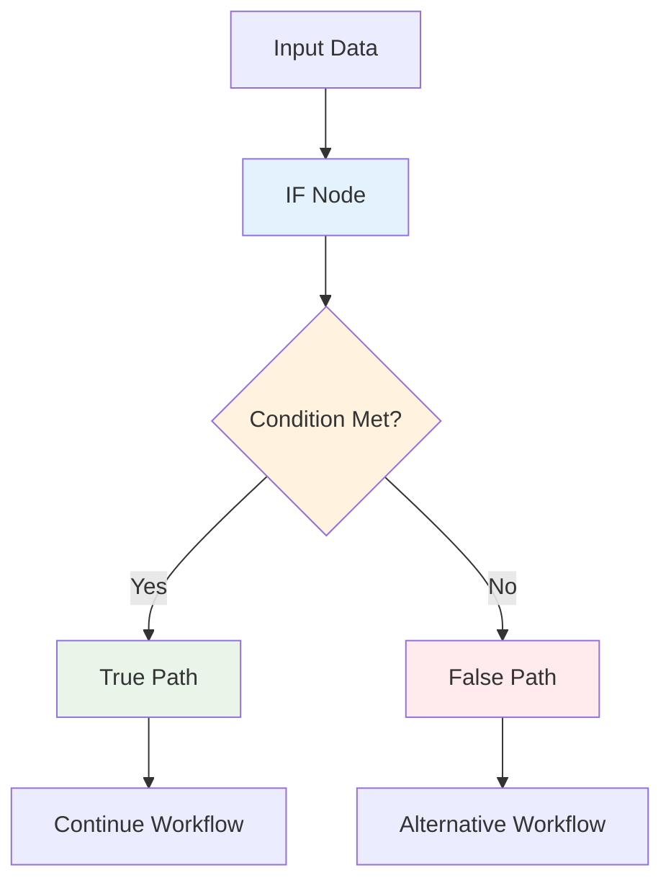
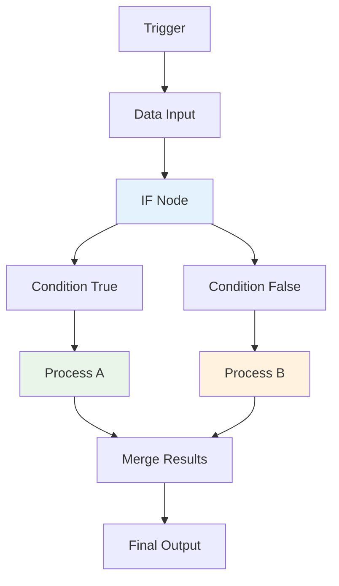

# Lecture 17: The IF Node - Adding Logic to Your Workflows

## Overview

This comprehensive guide covers the IF node in n8n, which is essential for adding conditional logic and decision-making capabilities to your workflows. Learn how to create different paths for your data and set up various conditions to control workflow execution.

## Table of Contents

1. [Understanding the IF Node](#understanding-the-if-node)
2. [Basic IF Node Configuration](#basic-if-node-configuration)
3. [Condition Types and Operators](#condition-types-and-operators)
4. [Advanced Condition Logic](#advanced-condition-logic)
5. [Practical Examples](#practical-examples)
6. [Best Practices](#best-practices)
7. [Common Use Cases](#common-use-cases)

## Understanding the IF Node

### What is the IF Node?

The IF node is a conditional node that allows you to create different execution paths in your workflow based on specified conditions. It evaluates data against criteria and routes the workflow down different branches accordingly.

### How the IF Node Works



### Key Features

- **Binary Decision Making**: Routes data based on true/false conditions
- **Multiple Condition Types**: Supports various data types and operators
- **Flexible Logic**: Combine multiple conditions with AND/OR logic
- **Data Preservation**: Maintains original data while adding routing logic

## Basic IF Node Configuration

### 1. **Simple Condition Setup**

#### Basic Configuration Steps:
1. **Add IF Node**: Drag and drop from the node panel
2. **Configure Conditions**: Set up your condition logic
3. **Test Condition**: Verify the condition works as expected
4. **Connect Outputs**: Link to different workflow branches

#### Example: Temperature Check
```javascript
// Simple temperature condition
Condition: Temperature > 30
Left Value: {{$json.temperature}}
Operator: Greater than
Right Value: 30
```

### 2. **Condition Structure**

#### Basic Condition Format:
```json
{
  "conditions": {
    "options": {
      "caseSensitive": true,
      "leftValue": "",
      "typeValidation": "strict"
    },
    "conditions": [
      {
        "id": "condition-1",
        "leftValue": "{{$json.field}}",
        "rightValue": "expected_value",
        "operator": {
          "type": "string",
          "operation": "equals"
        }
      }
    ],
    "combinator": "and"
  }
}
```

### 3. **Workflow Structure with IF Node**

#### Basic IF Workflow Pattern:


## Condition Types and Operators

### 1. **String Conditions**

#### String Operators:
```javascript
{
  "stringOperators": {
    "equals": "Exact string match",
    "notEquals": "String does not match",
    "contains": "String contains substring",
    "notContains": "String does not contain substring",
    "startsWith": "String starts with prefix",
    "endsWith": "String ends with suffix",
    "regex": "Regular expression match",
    "notRegex": "Does not match regex",
    "isEmpty": "String is empty",
    "isNotEmpty": "String is not empty",
    "exists": "Field exists",
    "notExists": "Field does not exist"
  }
}
```

#### String Examples:
```javascript
// Email validation
{
  "leftValue": "{{$json.email}}",
  "operator": "regex",
  "rightValue": "^[^\\s@]+@[^\\s@]+\\.[^\\s@]+$"
}

// Category filtering
{
  "leftValue": "{{$json.category}}",
  "operator": "equals",
  "rightValue": "electronics"
}

// Search functionality
{
  "leftValue": "{{$json.description}}",
  "operator": "contains",
  "rightValue": "urgent"
}
```

### 2. **Number Conditions**

#### Number Operators:
```javascript
{
  "numberOperators": {
    "equals": "Numbers are equal",
    "notEquals": "Numbers are not equal",
    "lt": "Less than",
    "lte": "Less than or equal",
    "gt": "Greater than",
    "gte": "Greater than or equal",
    "between": "Number is between two values",
    "notBetween": "Number is not between values"
  }
}
```

#### Number Examples:
```javascript
// Price range check
{
  "leftValue": "{{$json.price}}",
  "operator": "between",
  "rightValue": "10,100"
}

// Age validation
{
  "leftValue": "{{$json.age}}",
  "operator": "gte",
  "rightValue": "18"
}

// Quantity check
{
  "leftValue": "{{$json.quantity}}",
  "operator": "gt",
  "rightValue": "0"
}
```

### 3. **Boolean Conditions**

#### Boolean Operators:
```javascript
{
  "booleanOperators": {
    "equal": "Boolean values are equal",
    "notEqual": "Boolean values are not equal"
  }
}
```

#### Boolean Examples:
```javascript
// Active status check
{
  "leftValue": "{{$json.isActive}}",
  "operator": "equal",
  "rightValue": "true"
}

// Feature flag check
{
  "leftValue": "{{$json.featureEnabled}}",
  "operator": "equal",
  "rightValue": "false"
}
```

### 4. **Date Conditions**

#### Date Operators:
```javascript
{
  "dateOperators": {
    "equals": "Dates are equal",
    "notEquals": "Dates are not equal",
    "before": "Date is before",
    "after": "Date is after",
    "between": "Date is between range"
  }
}
```

#### Date Examples:
```javascript
// Expiration check
{
  "leftValue": "{{$json.expirationDate}}",
  "operator": "after",
  "rightValue": "{{$now}}"
}

// Date range validation
{
  "leftValue": "{{$json.orderDate}}",
  "operator": "between",
  "rightValue": "2024-01-01,2024-12-31"
}
```

## Advanced Condition Logic

### 1. **Multiple Conditions**

#### AND Logic (All conditions must be true):
```javascript
{
  "conditions": [
    {
      "leftValue": "{{$json.temperature}}",
      "operator": "gt",
      "rightValue": "30"
    },
    {
      "leftValue": "{{$json.humidity}}",
      "operator": "gt",
      "rightValue": "70"
    }
  ],
  "combinator": "and"
}
```

#### OR Logic (Any condition can be true):
```javascript
{
  "conditions": [
    {
      "leftValue": "{{$json.priority}}",
      "operator": "equals",
      "rightValue": "high"
    },
    {
      "leftValue": "{{$json.category}}",
      "operator": "equals",
      "rightValue": "urgent"
    }
  ],
  "combinator": "or"
}
```

### 2. **Complex Condition Examples**

#### E-commerce Order Processing:
```javascript
{
  "conditions": [
    {
      "leftValue": "{{$json.orderValue}}",
      "operator": "gte",
      "rightValue": "100"
    },
    {
      "leftValue": "{{$json.customerType}}",
      "operator": "equals",
      "rightValue": "premium"
    },
    {
      "leftValue": "{{$json.paymentStatus}}",
      "operator": "equals",
      "rightValue": "completed"
    }
  ],
  "combinator": "and"
}
```

#### Weather Alert System:
```javascript
{
  "conditions": [
    {
      "leftValue": "{{$json.temperature}}",
      "operator": "gt",
      "rightValue": "35"
    },
    {
      "leftValue": "{{$json.windSpeed}}",
      "operator": "gt",
      "rightValue": "25"
    }
  ],
  "combinator": "or"
}
```

### 3. **Expression-Based Conditions**

#### Using JavaScript Expressions:
```javascript
// Complex calculation
{
  "leftValue": "{{$json.price * $json.quantity}}",
  "operator": "gt",
  "rightValue": "1000"
}

// Date calculation
{
  "leftValue": "{{$now.diff($json.createdAt, 'days')}}",
  "operator": "gt",
  "rightValue": "30"
}

// String manipulation
{
  "leftValue": "{{$json.email.split('@')[1]}}",
  "operator": "equals",
  "rightValue": "company.com"
}
```

## Practical Examples

### 1. **Basic Temperature Alert**

#### Workflow: Weather Alert System
```json
{
  "name": "Temperature Alert Workflow",
  "nodes": [
    {
      "name": "Manual Trigger",
      "type": "n8n-nodes-base.manualTrigger"
    },
    {
      "name": "Get Weather Data",
      "type": "n8n-nodes-base.httpRequest"
    },
    {
      "name": "Check Temperature",
      "type": "n8n-nodes-base.if",
      "parameters": {
        "conditions": {
          "conditions": [
            {
              "leftValue": "{{parseInt($json.temperature)}}",
              "rightValue": "30",
              "operator": {
                "type": "number",
                "operation": "gt"
              }
            }
          ]
        }
      }
    },
    {
      "name": "Send Hot Weather Alert",
      "type": "n8n-nodes-base.emailSend"
    },
    {
      "name": "Send Normal Weather",
      "type": "n8n-nodes-base.emailSend"
    }
  ]
}
```

#### Workflow Flow:

```mermaid
graph TD
    A[Manual Trigger] --> B[Get Weather Data]
    B --> C[Check Temperature > 30°C]
    C -->|True| D[Send Hot Weather Alert]
    C -->|False| E[Send Normal Weather]
    
    style C fill:#fff3e0
    style D fill:#ffebee
    style E fill:#e8f5e8
```


### 2. **E-commerce Order Processing**

#### Workflow: Order Classification
```json
{
  "name": "Order Processing Workflow",
  "nodes": [
    {
      "name": "Order Trigger",
      "type": "n8n-nodes-base.webhook"
    },
    {
      "name": "Check Order Value",
      "type": "n8n-nodes-base.if",
      "parameters": {
        "conditions": {
          "conditions": [
            {
              "leftValue": "{{parseInt($json.orderValue)}}",
              "rightValue": "100",
              "operator": {
                "type": "number",
                "operation": "gte"
              }
            }
          ]
        }
      }
    },
    {
      "name": "Process High Value Order",
      "type": "n8n-nodes-base.set"
    },
    {
      "name": "Process Standard Order",
      "type": "n8n-nodes-base.set"
    }
  ]
}
```

### 3. **User Authentication Flow**

#### Workflow: Login Validation
```json
{
  "name": "User Authentication Workflow",
  "nodes": [
    {
      "name": "Login Request",
      "type": "n8n-nodes-base.webhook"
    },
    {
      "name": "Validate Credentials",
      "type": "n8n-nodes-base.if",
      "parameters": {
        "conditions": {
          "conditions": [
            {
              "leftValue": "{{$json.password}}",
              "operator": {
                "type": "string",
                "operation": "exists"
              }
            },
            {
              "leftValue": "{{$json.email}}",
              "operator": {
                "type": "string",
                "operation": "regex"
              },
              "rightValue": "^[^\\s@]+@[^\\s@]+\\.[^\\s@]+$"
            }
          ],
          "combinator": "and"
        }
      }
    },
    {
      "name": "Generate Access Token",
      "type": "n8n-nodes-base.set"
    },
    {
      "name": "Send Login Error",
      "type": "n8n-nodes-base.emailSend"
    }
  ]
}
```

### 4. **Content Moderation System**

#### Workflow: Content Review
```json
{
  "name": "Content Moderation Workflow",
  "nodes": [
    {
      "name": "Content Submission",
      "type": "n8n-nodes-base.webhook"
    },
    {
      "name": "Check Content",
      "type": "n8n-nodes-base.if",
      "parameters": {
        "conditions": {
          "conditions": [
            {
              "leftValue": "{{$json.content}}",
              "operator": {
                "type": "string",
                "operation": "contains"
              },
              "rightValue": "inappropriate"
            }
          ]
        }
      }
    },
    {
      "name": "Flag for Review",
      "type": "n8n-nodes-base.set"
    },
    {
      "name": "Approve Content",
      "type": "n8n-nodes-base.set"
    }
  ]
}
```

## Best Practices

### 1. **Condition Design**

#### Clear and Readable Conditions:
```javascript
// Good: Clear and descriptive
{
  "leftValue": "{{$json.orderTotal}}",
  "operator": "gte",
  "rightValue": "100"
}

// Bad: Unclear condition
{
  "leftValue": "{{$json.a}}",
  "operator": "gt",
  "rightValue": "{{$json.b}}"
}
```

#### Consistent Data Types:
```javascript
// Good: Ensure data types match
{
  "leftValue": "{{parseInt($json.price)}}",
  "operator": "gt",
  "rightValue": "50"
}

// Bad: Mixed data types
{
  "leftValue": "{{$json.price}}", // Could be string
  "operator": "gt",
  "rightValue": "50" // Number
}
```

### 2. **Performance Optimization**

#### Efficient Condition Ordering:
```javascript
// Order conditions by selectivity (most selective first)
{
  "conditions": [
    {
      "leftValue": "{{$json.status}}",
      "operator": "equals",
      "rightValue": "active" // Most selective
    },
    {
      "leftValue": "{{$json.category}}",
      "operator": "equals",
      "rightValue": "electronics" // Less selective
    },
    {
      "leftValue": "{{$json.price}}",
      "operator": "gt",
      "rightValue": "100" // Least selective
    }
  ]
}
```

#### Avoid Complex Expressions:
```javascript
// Good: Simple, direct conditions
{
  "leftValue": "{{$json.temperature}}",
  "operator": "gt",
  "rightValue": "30"
}

// Avoid: Complex calculations in conditions
{
  "leftValue": "{{($json.temp1 + $json.temp2 + $json.temp3) / 3}}",
  "operator": "gt",
  "rightValue": "{{$json.threshold}}"
}
```

### 3. **Error Handling**

#### Safe Data Access:
```javascript
// Good: Safe data access with fallbacks
{
  "leftValue": "{{$json.user?.email || 'unknown'}}",
  "operator": "exists"
}

// Bad: Direct access that could fail
{
  "leftValue": "{{$json.user.email}}",
  "operator": "exists"
}
```

#### Validation Before Conditions:
```javascript
// Add validation node before IF node
{
  "name": "Validate Data",
  "type": "n8n-nodes-base.set",
  "parameters": {
    "values": {
      "string": [
        {
          "name": "isValid",
          "value": "{{$json.email && $json.email.includes('@')}}"
        }
      ]
    }
  }
}
```

### 4. **Documentation and Naming**

#### Descriptive Node Names:
```javascript
// Good: Descriptive names
"Check if Order Value Exceeds $100"
"Validate User Email Format"
"Determine Weather Alert Level"

// Bad: Generic names
"IF Node"
"Condition Check"
"Decision Point"
```

#### Comment Complex Logic:
```javascript
// Add comments for complex conditions
{
  "comment": "Check if user qualifies for premium discount",
  "conditions": [
    {
      "leftValue": "{{$json.orderValue}}",
      "operator": "gte",
      "rightValue": "100"
    },
    {
      "leftValue": "{{$json.membershipYears}}",
      "operator": "gte",
      "rightValue": "2"
    }
  ]
}
```

## Common Use Cases

### 1. **Data Filtering**

#### Filter by Category:
```javascript
{
  "leftValue": "{{$json.category}}",
  "operator": "equals",
  "rightValue": "electronics"
}
```

#### Filter by Date Range:
```javascript
{
  "leftValue": "{{$json.createdAt}}",
  "operator": "after",
  "rightValue": "2024-01-01"
}
```

### 2. **Business Logic**

#### Pricing Rules:
```javascript
{
  "conditions": [
    {
      "leftValue": "{{$json.customerType}}",
      "operator": "equals",
      "rightValue": "premium"
    },
    {
      "leftValue": "{{$json.orderValue}}",
      "operator": "gte",
      "rightValue": "500"
    }
  ],
  "combinator": "and"
}
```

#### Approval Workflows:
```javascript
{
  "conditions": [
    {
      "leftValue": "{{$json.amount}}",
      "operator": "gt",
      "rightValue": "10000"
    },
    {
      "leftValue": "{{$json.approver}}",
      "operator": "exists"
    }
  ],
  "combinator": "and"
}
```

### 3. **Error Handling**

#### Input Validation:
```javascript
{
  "conditions": [
    {
      "leftValue": "{{$json.email}}",
      "operator": "regex",
      "rightValue": "^[^\\s@]+@[^\\s@]+\\.[^\\s@]+$"
    },
    {
      "leftValue": "{{$json.password}}",
      "operator": "gte",
      "rightValue": "8"
    }
  ],
  "combinator": "and"
}
```

#### Service Availability:
```javascript
{
  "leftValue": "{{$json.serviceStatus}}",
  "operator": "equals",
  "rightValue": "available"
}
```

### 4. **Routing and Workflow Control**

#### Priority Routing:
```javascript
{
  "leftValue": "{{$json.priority}}",
  "operator": "equals",
  "rightValue": "high"
}
```

#### Environment Routing:
```javascript
{
  "leftValue": "{{$json.environment}}",
  "operator": "equals",
  "rightValue": "production"
}
```

## Conclusion

The IF node is a fundamental building block for creating intelligent, decision-making workflows in n8n. By mastering its capabilities, you can:

- **Create dynamic workflows** that adapt to different data conditions
- **Implement business logic** with conditional processing
- **Handle errors gracefully** with validation and routing
- **Optimize performance** by filtering and processing data efficiently
- **Build complex automation** with multiple decision points

### Key Takeaways

1. **Understand condition types** and choose appropriate operators
2. **Design clear conditions** that are easy to understand and maintain
3. **Use multiple conditions** with AND/OR logic for complex scenarios
4. **Validate data** before applying conditions
5. **Document complex logic** for future maintenance
6. **Test conditions thoroughly** with various data scenarios
7. **Optimize for performance** by ordering conditions efficiently

### Next Steps

1. **Practice with simple conditions** to build confidence
2. **Experiment with multiple conditions** and combinators
3. **Build real-world workflows** using conditional logic
4. **Explore advanced operators** like regex and date comparisons
5. **Learn about the Switch node** for multiple condition scenarios
6. **Study error handling patterns** with conditional logic

The IF node opens up endless possibilities for creating intelligent, responsive workflows that can make decisions and adapt to different scenarios automatically.
