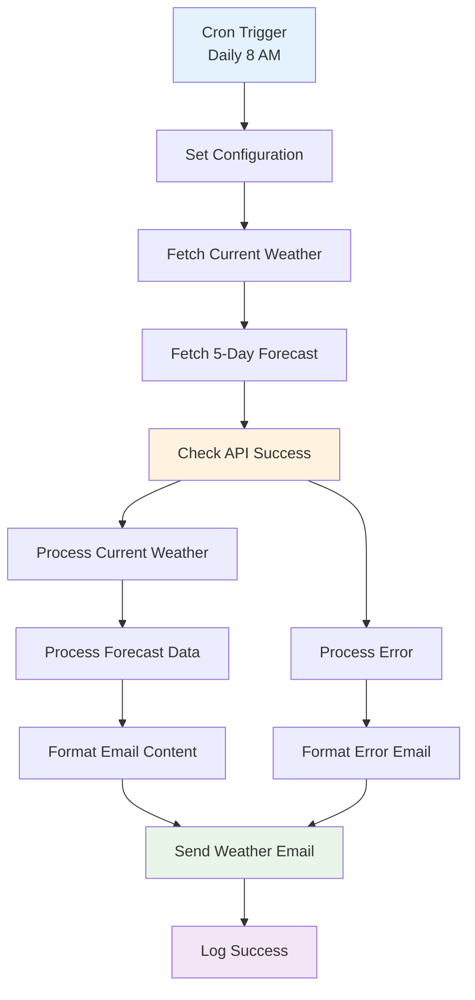
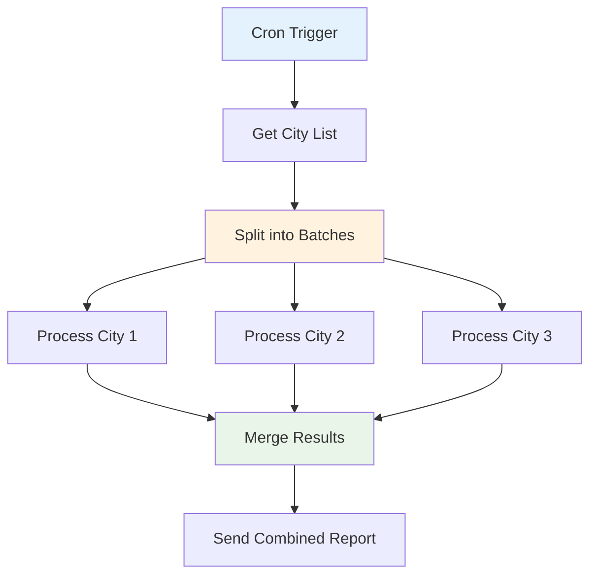

# Practical Real-World Projects

## Overview

This section contains comprehensive real-world automation projects that demonstrate advanced n8n concepts including Cron triggers, API integration, data processing, and email notifications. These projects showcase how to build production-ready automation workflows.

## Table of Contents

1. [Daily Weather Report Workflow](#daily-weather-report-workflow)
2. [Project Setup Requirements](#project-setup-requirements)
3. [API Integration Patterns](#api-integration-patterns)
4. [Error Handling Strategies](#error-handling-strategies)
5. [Monitoring and Alerting](#monitoring-and-alerting)
6. [Advanced Configuration](#advanced-configuration)
7. [Deployment Considerations](#deployment-considerations)

## Daily Weather Report Workflow

### Project Description

The Daily Weather Report workflow demonstrates a complete automation solution that:

- **Runs automatically** every day at 8 AM using a Cron trigger
- **Fetches weather data** from OpenWeatherMap API
- **Processes and formats** the data into a readable report
- **Sends email notifications** with weather information
- **Handles errors gracefully** with fallback notifications
- **Logs all activities** for monitoring and debugging

### Workflow Architecture



### Key Features

#### 1. **Automated Scheduling**
- Uses Cron expression `0 8 * * *` (8 AM daily)
- Configurable timing and frequency
- Timezone-aware execution

#### 2. **Dual API Integration**
- Current weather conditions
- 5-day weather forecast
- Error handling for API failures

#### 3. **Rich Email Content**
- Formatted weather report
- Current conditions and forecast
- Weather tips based on conditions
- Professional email styling

#### 4. **Comprehensive Error Handling**
- API failure detection
- Graceful error notifications
- Detailed error logging
- Fallback mechanisms

## Project Setup Requirements

### 1. **API Credentials**

#### OpenWeatherMap API
1. **Sign up** at [OpenWeatherMap](https://openweathermap.org/api)
2. **Get API key** from your account dashboard
3. **Configure credentials** in n8n:
   ```
   Credential Name: OpenWeatherMap API
   API Key: [your-api-key]
   ```

#### SMTP Email Configuration
1. **Configure SMTP credentials** in n8n:
   ```
   Credential Name: SMTP Email Credentials
   Host: smtp.gmail.com
   Port: 587
   Username: your-email@gmail.com
   Password: your-app-password
   Security: TLS
   ```

### 2. **Environment Configuration**

#### Required Environment Variables
```bash
# OpenWeatherMap API
OPENWEATHER_API_KEY=your_api_key_here

# Email Configuration
SMTP_HOST=smtp.gmail.com
SMTP_PORT=587
SMTP_USER=your-email@gmail.com
SMTP_PASS=your-app-password

# Workflow Configuration
DEFAULT_CITY=New York
DEFAULT_COUNTRY=US
EMAIL_RECIPIENT=recipient@example.com
```

#### n8n Configuration
```javascript
// n8n settings
{
  "workflows": {
    "defaultName": "Weather Report - {{$now.format('YYYY-MM-DD')}}",
    "saveManualExecutions": true,
    "callerPolicy": "workflowsFromSameOwner"
  },
  "credentials": {
    "overwrite": {
      "openWeatherMap": {
        "type": "httpBasicAuth",
        "data": {
          "user": "api",
          "password": "{{$env.OPENWEATHER_API_KEY}}"
        }
      }
    }
  }
}
```

### 3. **Workflow Configuration**

#### Update Configuration Parameters
Before running the workflow, update these parameters:

```javascript
// In "Set Configuration" node
{
  "city": "Your City",
  "countryCode": "US",
  "units": "metric",
  "emailRecipient": "your-email@example.com",
  "emailSubject": "Daily Weather Report - {{$now.format('MMMM DD, YYYY')}}"
}
```

## API Integration Patterns

### 1. **RESTful API Integration**

#### HTTP Request Configuration
```json
{
  "url": "https://api.openweathermap.org/data/2.5/weather",
  "method": "GET",
  "queryParameters": {
    "q": "{{$json.city}},{{$json.countryCode}}",
    "appid": "{{$credentials.openWeatherMap.apiKey}}",
    "units": "{{$json.units}}"
  },
  "options": {
    "timeout": 10000,
    "retry": {
      "enabled": true,
      "maxRetries": 3
    }
  }
}
```

#### Response Handling
```javascript
// Process API response
{
  "currentTemp": "{{Math.round($json.main.temp)}}",
  "feelsLike": "{{Math.round($json.main.feels_like)}}",
  "humidity": "{{$json.main.humidity}}",
  "weatherDescription": "{{$json.weather[0].description}}",
  "cityName": "{{$json.name}}"
}
```

### 2. **Error Handling Patterns**

#### API Error Detection
```javascript
// Check for API errors
{
  "conditions": [
    {
      "leftValue": "={{$json.cod}}",
      "rightValue": 200,
      "operator": {
        "type": "number",
        "operation": "equals"
      }
    }
  ]
}
```

#### Fallback Mechanisms
```javascript
// Fallback data structure
{
  "error": true,
  "message": "Weather data unavailable",
  "fallbackData": {
    "temperature": "N/A",
    "condition": "Unknown",
    "timestamp": "={{$now}}"
  }
}
```

### 3. **Data Transformation**

#### Current Weather Processing
```javascript
// Extract and format current weather data
{
  "temperature": "={{Math.round($json.main.temp)}}°C",
  "feelsLike": "={{Math.round($json.main.feels_like)}}°C",
  "humidity": "={{$json.main.humidity}}%",
  "pressure": "={{$json.main.pressure}} hPa",
  "windSpeed": "={{$json.wind.speed}} m/s",
  "weatherDescription": "={{$json.weather[0].description}}",
  "sunrise": "={{new Date($json.sys.sunrise * 1000).toLocaleTimeString()}}",
  "sunset": "={{new Date($json.sys.sunset * 1000).toLocaleTimeString()}}"
}
```

#### Forecast Processing
```javascript
// Process 5-day forecast data
{
  "forecastSummary": "={{$json.list.slice(0, 5).map(item => `${new Date(item.dt * 1000).toLocaleDateString()}: ${Math.round(item.main.temp)}°C, ${item.weather[0].description}`).join('\\n')}}",
  "maxTemp": "={{Math.round(Math.max(...$json.list.slice(0, 8).map(item => item.main.temp_max)))}}",
  "minTemp": "={{Math.round(Math.min(...$json.list.slice(0, 8).map(item => item.main.temp_min)))}}"
}
```

## Error Handling Strategies

### 1. **API Error Handling**

#### Rate Limiting
```javascript
// Handle rate limiting
if ($json.statusCode === 429) {
  const retryAfter = $json.headers['retry-after'] || 60;
  return `Rate limited. Retry after ${retryAfter} seconds.`;
}
```

#### Service Unavailable
```javascript
// Handle service unavailability
if ($json.statusCode >= 500) {
  return "Weather service temporarily unavailable. Please try again later.";
}
```

#### Invalid API Key
```javascript
// Handle authentication errors
if ($json.statusCode === 401) {
  return "Invalid API key. Please check your OpenWeatherMap credentials.";
}
```

### 2. **Email Error Handling**

#### SMTP Connection Issues
```javascript
// Handle SMTP errors
{
  "errorHandling": {
    "connectionTimeout": "Retry with exponential backoff",
    "authenticationError": "Check SMTP credentials",
    "recipientError": "Validate email addresses"
  }
}
```

#### Email Content Validation
```javascript
// Validate email content
{
  "requiredFields": ["subject", "body", "recipient"],
  "contentLength": {
    "subject": "max 255 characters",
    "body": "max 1MB"
  }
}
```

### 3. **Workflow Error Recovery**

#### Retry Logic
```json
{
  "retry": {
    "enabled": true,
    "maxRetries": 3,
    "retryInterval": 5000,
    "backoffMultiplier": 2
  }
}
```

#### Error Notifications
```javascript
// Send error notifications
{
  "errorNotification": {
    "recipient": "admin@example.com",
    "subject": "Weather Report Error - {{$now.format('YYYY-MM-DD')}}",
    "body": "Error: {{$json.error}}\nTime: {{$now}}"
  }
}
```

## Monitoring and Alerting

### 1. **Execution Monitoring**

#### Success Metrics
```javascript
// Track successful executions
{
  "successMetrics": {
    "executionTime": "={{$now.diff($json.startTime, 'seconds')}}",
    "dataProcessed": "={{$json.forecastData.length}}",
    "emailSent": "={{$json.emailStatus === 'sent'}}",
    "timestamp": "={{$now}}"
  }
}
```

#### Performance Monitoring
```javascript
// Monitor performance
{
  "performanceMetrics": {
    "apiResponseTime": "={{$json.apiResponseTime}}ms",
    "dataProcessingTime": "={{$json.processingTime}}ms",
    "emailDeliveryTime": "={{$json.emailDeliveryTime}}ms",
    "totalExecutionTime": "={{$json.totalTime}}ms"
  }
}
```

### 2. **Alert Configuration**

#### Success Alerts
```json
{
  "successAlert": {
    "condition": "execution_successful",
    "message": "✅ Daily weather report sent successfully",
    "channel": "#weather-alerts"
  }
}
```

#### Error Alerts
```json
{
  "errorAlert": {
    "condition": "execution_failed",
    "message": "🚨 Weather report failed: {{$json.error}}",
    "channel": "#critical-alerts",
    "escalation": "page_oncall"
  }
}
```

### 3. **Logging and Auditing**

#### Execution Logs
```javascript
// Log execution details
{
  "executionLog": {
    "workflowId": "={{$workflow.id}}",
    "executionId": "={{$execution.id}}",
    "startTime": "={{$json.startTime}}",
    "endTime": "={{$now}}",
    "status": "={{$json.status}}",
    "errorCount": "={{$json.errorCount}}",
    "dataProcessed": "={{$json.dataCount}}"
  }
}
```

## Advanced Configuration

### 1. **Multi-City Support**

#### Dynamic City Configuration
```javascript
// Support multiple cities
{
  "cities": [
    {"name": "New York", "country": "US"},
    {"name": "London", "country": "GB"},
    {"name": "Tokyo", "country": "JP"}
  ],
  "currentCity": "={{$json.cities[Math.floor(Math.random() * $json.cities.length)]}}"
}
```

#### Parallel Processing


### 2. **Conditional Logic**

#### Weather-Based Notifications
```javascript
// Conditional weather tips
{
  "weatherTips": "{{$json.currentTemp < 10 ? '❄️ Bundle up! It\\'s cold outside.' : $json.currentTemp > 30 ? '☀️ Stay cool and hydrated!' : '😊 Pleasant weather today!'}}"
}
```

#### Alert Thresholds
```javascript
// Weather alert thresholds
{
  "alerts": {
    "highTemp": "{{$json.currentTemp > 35 ? '🌡️ Heat warning!' : ''}}",
    "lowTemp": "{{$json.currentTemp < 0 ? '🥶 Freeze warning!' : ''}}",
    "highWind": "{{$json.windSpeed > 20 ? '💨 High wind warning!' : ''}}",
    "heavyRain": "{{$json.weatherDescription.includes('rain') ? '☔ Take an umbrella!' : ''}}"
  }
}
```

### 3. **Data Storage**

#### Historical Data
```javascript
// Store historical weather data
{
  "historicalData": {
    "date": "={{$now.format('YYYY-MM-DD')}}",
    "temperature": "={{$json.currentTemp}}",
    "humidity": "={{$json.humidity}}",
    "condition": "={{$json.weatherDescription}}",
    "timestamp": "={{$now}}"
  }
}
```

#### Trend Analysis
```javascript
// Calculate weather trends
{
  "trends": {
    "temperatureTrend": "={{$json.currentTemp > $json.yesterdayTemp ? 'rising' : 'falling'}}",
    "humidityTrend": "={{$json.humidity > $json.yesterdayHumidity ? 'increasing' : 'decreasing'}}",
    "changeAmount": "={{Math.abs($json.currentTemp - $json.yesterdayTemp)}}°C"
  }
}
```

## Deployment Considerations

### 1. **Production Deployment**

#### Environment Setup
```bash
# Production environment variables
export N8N_ENCRYPTION_KEY="your-encryption-key"
export N8N_USER_MANAGEMENT_DISABLED=false
export N8N_BASIC_AUTH_ACTIVE=true
export N8N_BASIC_AUTH_USER="admin"
export N8N_BASIC_AUTH_PASSWORD="secure-password"
```

#### Security Configuration
```javascript
// Security settings
{
  "security": {
    "credentials": {
      "encryption": "AES-256-GCM",
      "rotation": "30_days"
    },
    "api": {
      "rateLimiting": true,
      "maxRequests": 1000,
      "timeWindow": "1_hour"
    }
  }
}
```

### 2. **Scalability**

#### Load Balancing
```yaml
# Docker Compose for scaling
version: '3.8'
services:
  n8n:
    image: n8nio/n8n:latest
    deploy:
      replicas: 3
      resources:
        limits:
          cpus: '0.5'
          memory: 512M
    environment:
      - N8N_HOST=your-domain.com
      - N8N_PORT=5678
```

#### Database Configuration
```javascript
// Database settings for scaling
{
  "database": {
    "type": "postgresql",
    "host": "your-db-host",
    "port": 5432,
    "database": "n8n",
    "username": "n8n_user",
    "password": "secure-password",
    "pool": {
      "min": 2,
      "max": 10
    }
  }
}
```

### 3. **Backup and Recovery**

#### Automated Backups
```bash
#!/bin/bash
# Backup script
DATE=$(date +%Y%m%d_%H%M%S)
BACKUP_DIR="/backups/n8n"

# Create backup
pg_dump n8n_db > $BACKUP_DIR/n8n_backup_$DATE.sql

# Compress backup
gzip $BACKUP_DIR/n8n_backup_$DATE.sql

# Upload to cloud storage
aws s3 cp $BACKUP_DIR/n8n_backup_$DATE.sql.gz s3://n8n-backups/

# Clean up old backups
find $BACKUP_DIR -name "*.sql.gz" -mtime +30 -delete
```

## Conclusion

The Daily Weather Report workflow demonstrates a complete, production-ready automation solution that showcases:

- **Automated scheduling** with Cron triggers
- **Robust API integration** with error handling
- **Rich data processing** and formatting
- **Professional email notifications**
- **Comprehensive error handling** and recovery
- **Monitoring and alerting** capabilities

### Key Learning Outcomes

1. **Real-world automation** patterns and best practices
2. **API integration** techniques and error handling
3. **Email automation** and content formatting
4. **Scheduled workflows** and Cron configuration
5. **Error handling** and recovery strategies
6. **Monitoring and alerting** implementation
7. **Production deployment** considerations

### Next Steps

1. **Customize the workflow** for your specific needs
2. **Add additional weather data** sources or APIs
3. **Implement advanced features** like historical trends
4. **Extend to multiple locations** or personalized reports
5. **Integrate with other services** like calendars or task managers
6. **Deploy to production** with proper monitoring

This project provides a solid foundation for building more complex automation workflows and demonstrates how to create reliable, maintainable automation solutions.
