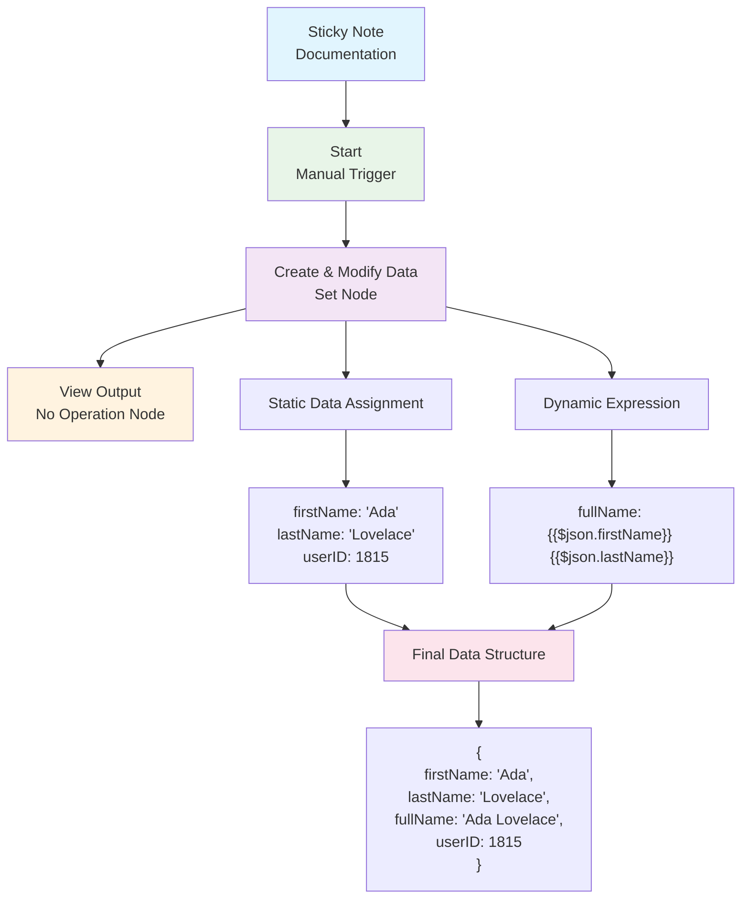
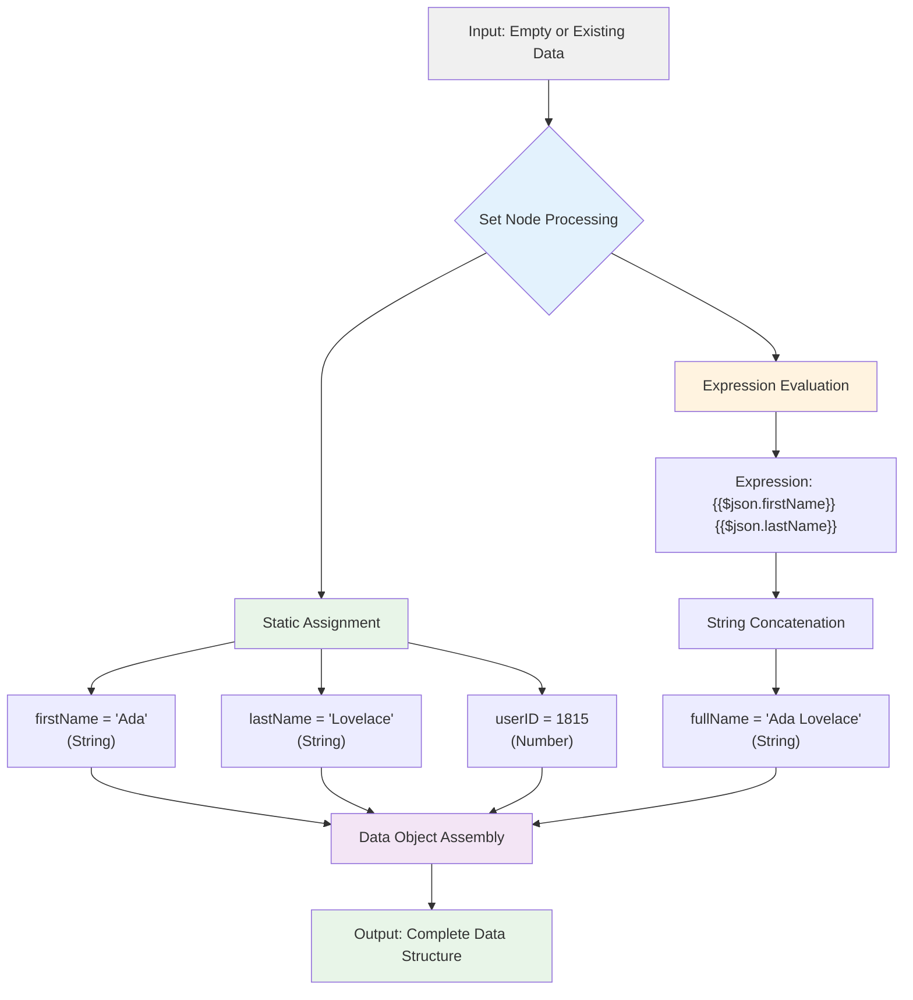

# Set Node Workflow

This n8n workflow demonstrates the fundamental concepts of data manipulation using the **Set** node, which is one of the most commonly used nodes in n8n workflows.

## What This Workflow Does

This workflow showcases:

1. **Data Creation and Modification**: Using the Set node to create and modify data
2. **Simple Expressions**: Demonstrating how to use n8n expressions to combine data
3. **Data Flow**: Showing how data passes from one node to another

## Workflow Components

### Nodes in the Workflow

1. **Sticky Note** - Contains documentation explaining the workflow's purpose
2. **Start** - The trigger node that initiates the workflow
3. **Create & Modify Data** (Set node) - The main node that demonstrates data manipulation
4. **View Output** (No Operation node) - A placeholder to view the final output

### Workflow Flow Diagram



### Data Structure

The Set node creates the following data structure:

```json
{
  "firstName": "Ada",
  "lastName": "Lovelace", 
  "fullName": "Ada Lovelace",
  "userID": 1815
}
```

### Key Learning Points

#### 1. Static Data Assignment
- `firstName`: Set to "Ada" (static string)
- `lastName`: Set to "Lovelace" (static string)
- `userID`: Set to 1815 (static number)

#### 2. Dynamic Data with Expressions
- `fullName`: Uses the expression `={{$json.firstName}} {{$json.lastName}}`
  - This combines the firstName and lastName fields from the current item
  - The `{{}}` syntax indicates an n8n expression
  - `$json` refers to the current data item

#### 3. Data Types
- **String values**: firstName, lastName, fullName
- **Number values**: userID

### Data Processing Flow



## How to Use This Workflow

1. Import the `set-node-workflow.json` file into your n8n instance
2. The workflow will start with the Start node
3. Data flows through the Set node where it's created and modified
4. The final output can be viewed in the "View Output" node

## Expression Syntax

The workflow demonstrates n8n's expression syntax:
- `{{$json.fieldName}}` - Access a field from the current data item
- `{{$json.firstName}} {{$json.lastName}}` - Concatenate two string fields with a space

This is a foundational workflow that teaches the basics of data manipulation in n8n, making it perfect for beginners learning how to work with the Set node and expressions.
