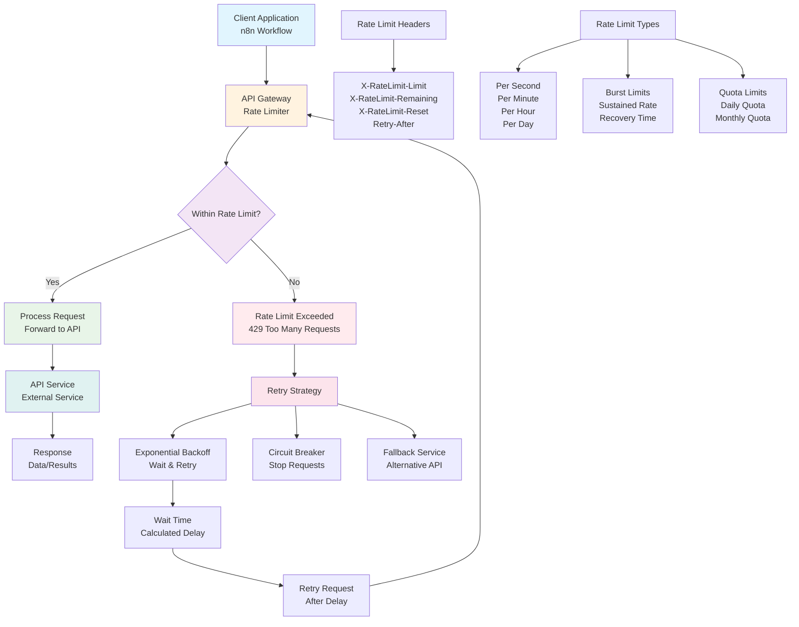

# Rate Limits in Real World

## Overview

This guide covers practical strategies for handling API rate limits in production n8n workflows. Learn how to implement exponential backoff, retry logic, and error recovery mechanisms to build resilient automation systems that gracefully handle API limitations.

## Table of Contents

1. [Understanding Rate Limits](#understanding-rate-limits)
2. [Rate Limit Handling Strategies](#rate-limit-handling-strategies)
3. [Implementation Patterns](#implementation-patterns)
4. [Advanced Techniques](#advanced-techniques)
5. [Monitoring and Alerting](#monitoring-and-alerting)
6. [Best Practices](#best-practices)
7. [Real-World Examples](#real-world-examples)

## Understanding Rate Limits

### What are Rate Limits?

Rate limits are restrictions imposed by APIs to control the number of requests a client can make within a specific time period. They prevent abuse, ensure fair usage, and maintain service stability.

### Rate Limit Architecture



### Common Rate Limit Types

#### 1. **Request Rate Limits**
- **Per Second**: Maximum requests per second
- **Per Minute**: Maximum requests per minute
- **Per Hour**: Maximum requests per hour
- **Per Day**: Maximum requests per day

#### 2. **Burst Limits**
- **Burst Capacity**: Temporary spike allowance
- **Sustained Rate**: Long-term average rate
- **Recovery Time**: Time to restore burst capacity

#### 3. **Quota Limits**
- **Daily Quota**: Maximum requests per day
- **Monthly Quota**: Maximum requests per month
- **Data Limits**: Maximum data transfer limits

### Rate Limit Indicators

#### HTTP Response Headers
```http
X-RateLimit-Limit: 1000
X-RateLimit-Remaining: 999
X-RateLimit-Reset: 1640995200
X-RateLimit-Retry-After: 60
```

#### HTTP Status Codes
- **429 Too Many Requests**: Rate limit exceeded
- **503 Service Unavailable**: Temporary service overload
- **403 Forbidden**: Quota exceeded or account suspended

### Common API Rate Limits

#### Popular Services
```javascript
{
  "github": {
    "authenticated": "5000 requests/hour",
    "unauthenticated": "60 requests/hour",
    "search": "30 requests/minute"
  },
  "twitter": {
    "standard": "300 requests/15 minutes",
    "premium": "300 requests/15 minutes",
    "enterprise": "Custom limits"
  },
  "slack": {
    "web_api": "1+ requests/minute",
    "events_api": "1+ requests/minute",
    "rtm_api": "1+ requests/minute"
  },
  "google_apis": {
    "sheets": "100 requests/100 seconds",
    "gmail": "1 billion quota units/day",
    "drive": "1000 requests/100 seconds"
  }
}
```

## Rate Limit Handling Strategies

### 1. **Exponential Backoff**

#### Basic Implementation
```javascript
// Exponential backoff calculation
const calculateBackoff = (attempt, baseDelay = 1000, maxDelay = 30000) => {
  const delay = Math.min(baseDelay * Math.pow(2, attempt), maxDelay);
  const jitter = Math.random() * 1000; // Add randomness
  return delay + jitter;
};

// Usage example
const backoffDelay = calculateBackoff(retryCount, 1000, 30000);
```

#### n8n Implementation
```json
{
  "parameters": {
    "amount": "={{Math.min(1000 * Math.pow(2, $json.retryCount), 30000)}}",
    "unit": "milliseconds"
  },
  "name": "Exponential Backoff Wait",
  "type": "n8n-nodes-base.wait"
}
```

### 2. **Retry Logic**

#### Retry Configuration
```javascript
{
  "retry": {
    "enabled": true,
    "maxRetries": 5,
    "baseDelay": 1000,
    "maxDelay": 30000,
    "backoffMultiplier": 2,
    "retryableErrors": [429, 503, 502, 504],
    "nonRetryableErrors": [400, 401, 403, 404]
  }
}
```

#### Retry Decision Logic
```javascript
// Determine if request should be retried
const shouldRetry = (statusCode, retryCount, maxRetries) => {
  const retryableErrors = [429, 503, 502, 504];
  const nonRetryableErrors = [400, 401, 403, 404];
  
  if (nonRetryableErrors.includes(statusCode)) {
    return false; // Don't retry client errors
  }
  
  if (retryableErrors.includes(statusCode) && retryCount < maxRetries) {
    return true; // Retry server errors
  }
  
  return false;
};
```

### 3. **Rate Limit Detection**

#### Header-Based Detection
```javascript
// Parse rate limit headers
const parseRateLimitHeaders = (headers) => {
  return {
    limit: parseInt(headers['x-ratelimit-limit']) || null,
    remaining: parseInt(headers['x-ratelimit-remaining']) || null,
    reset: parseInt(headers['x-ratelimit-reset']) || null,
    retryAfter: parseInt(headers['retry-after']) || null
  };
};
```

#### Response Analysis
```javascript
// Analyze API response for rate limit info
const analyzeResponse = (response) => {
  const rateLimitInfo = parseRateLimitHeaders(response.headers);
  const isRateLimited = response.status === 429;
  const retryAfter = rateLimitInfo.retryAfter || 60;
  
  return {
    isRateLimited,
    retryAfter,
    rateLimitInfo,
    shouldRetry: isRateLimited && retryCount < maxRetries
  };
};
```

## Implementation Patterns

### 1. **Circuit Breaker Pattern**

#### Implementation
```javascript
class CircuitBreaker {
  constructor(threshold = 5, timeout = 60000) {
    this.threshold = threshold;
    this.timeout = timeout;
    this.failureCount = 0;
    this.state = 'CLOSED'; // CLOSED, OPEN, HALF_OPEN
    this.nextAttempt = Date.now();
  }
  
  async execute(operation) {
    if (this.state === 'OPEN') {
      if (Date.now() < this.nextAttempt) {
        throw new Error('Circuit breaker is OPEN');
      }
      this.state = 'HALF_OPEN';
    }
    
    try {
      const result = await operation();
      this.onSuccess();
      return result;
    } catch (error) {
      this.onFailure();
      throw error;
    }
  }
  
  onSuccess() {
    this.failureCount = 0;
    this.state = 'CLOSED';
  }
  
  onFailure() {
    this.failureCount++;
    if (this.failureCount >= this.threshold) {
      this.state = 'OPEN';
      this.nextAttempt = Date.now() + this.timeout;
    }
  }
}
```

#### n8n Implementation
```json
{
  "parameters": {
    "conditions": {
      "conditions": [
        {
          "leftValue": "={{$json.failureCount}}",
          "rightValue": "={{$json.threshold}}",
          "operator": {
            "type": "number",
            "operation": "lt"
          }
        }
      ]
    }
  },
  "name": "Circuit Breaker Check",
  "type": "n8n-nodes-base.if"
}
```

### 2. **Token Bucket Algorithm**

#### Implementation
```javascript
class TokenBucket {
  constructor(capacity, refillRate) {
    this.capacity = capacity;
    this.tokens = capacity;
    this.refillRate = refillRate;
    this.lastRefill = Date.now();
  }
  
  consume(tokens = 1) {
    this.refill();
    
    if (this.tokens >= tokens) {
      this.tokens -= tokens;
      return true;
    }
    
    return false;
  }
  
  refill() {
    const now = Date.now();
    const timePassed = (now - this.lastRefill) / 1000;
    const tokensToAdd = timePassed * this.refillRate;
    
    this.tokens = Math.min(this.capacity, this.tokens + tokensToAdd);
    this.lastRefill = now;
  }
  
  getWaitTime(tokens = 1) {
    if (this.tokens >= tokens) {
      return 0;
    }
    
    const tokensNeeded = tokens - this.tokens;
    return (tokensNeeded / this.refillRate) * 1000;
  }
}
```

### 3. **Sliding Window Counter**

#### Implementation
```javascript
class SlidingWindowCounter {
  constructor(windowSize, maxRequests) {
    this.windowSize = windowSize; // in milliseconds
    this.maxRequests = maxRequests;
    this.requests = [];
  }
  
  isAllowed() {
    const now = Date.now();
    const windowStart = now - this.windowSize;
    
    // Remove old requests
    this.requests = this.requests.filter(time => time > windowStart);
    
    if (this.requests.length < this.maxRequests) {
      this.requests.push(now);
      return true;
    }
    
    return false;
  }
  
  getWaitTime() {
    if (this.isAllowed()) {
      return 0;
    }
    
    const oldestRequest = Math.min(...this.requests);
    return oldestRequest + this.windowSize - Date.now();
  }
}
```

## Advanced Techniques

### 1. **Adaptive Rate Limiting**

#### Dynamic Rate Adjustment
```javascript
class AdaptiveRateLimiter {
  constructor(initialRate = 10, adjustmentFactor = 0.1) {
    this.currentRate = initialRate;
    this.adjustmentFactor = adjustmentFactor;
    this.successCount = 0;
    this.failureCount = 0;
  }
  
  adjustRate(success) {
    if (success) {
      this.successCount++;
      this.currentRate = Math.min(
        this.currentRate * (1 + this.adjustmentFactor),
        100 // Max rate
      );
    } else {
      this.failureCount++;
      this.currentRate = Math.max(
        this.currentRate * (1 - this.adjustmentFactor),
        1 // Min rate
      );
    }
  }
  
  getDelay() {
    return 1000 / this.currentRate; // Convert to delay in ms
  }
}
```

### 2. **Priority-Based Rate Limiting**

#### Priority Queue Implementation
```javascript
class PriorityRateLimiter {
  constructor() {
    this.queues = {
      high: [],
      medium: [],
      low: []
    };
    this.processing = false;
  }
  
  async addRequest(request, priority = 'medium') {
    return new Promise((resolve, reject) => {
      this.queues[priority].push({
        request,
        resolve,
        reject,
        timestamp: Date.now()
      });
      
      this.processQueues();
    });
  }
  
  async processQueues() {
    if (this.processing) return;
    this.processing = true;
    
    while (this.hasRequests()) {
      const request = this.getNextRequest();
      if (request) {
        try {
          const result = await request.request();
          request.resolve(result);
        } catch (error) {
          request.reject(error);
        }
      }
      
      // Rate limiting delay
      await this.delay(100);
    }
    
    this.processing = false;
  }
  
  getNextRequest() {
    // Process high priority first, then medium, then low
    for (const priority of ['high', 'medium', 'low']) {
      if (this.queues[priority].length > 0) {
        return this.queues[priority].shift();
      }
    }
    return null;
  }
}
```

### 3. **Distributed Rate Limiting**

#### Redis-Based Implementation
```javascript
class DistributedRateLimiter {
  constructor(redisClient, keyPrefix = 'rate_limit') {
    this.redis = redisClient;
    this.keyPrefix = keyPrefix;
  }
  
  async isAllowed(key, limit, window) {
    const redisKey = `${this.keyPrefix}:${key}`;
    const now = Date.now();
    const windowStart = now - window;
    
    // Use Redis sorted set to track requests
    await this.redis.zremrangebyscore(redisKey, 0, windowStart);
    
    const currentCount = await this.redis.zcard(redisKey);
    
    if (currentCount < limit) {
      await this.redis.zadd(redisKey, now, `${now}-${Math.random()}`);
      await this.redis.expire(redisKey, Math.ceil(window / 1000));
      return true;
    }
    
    return false;
  }
  
  async getWaitTime(key, limit, window) {
    const redisKey = `${this.keyPrefix}:${key}`;
    const now = Date.now();
    const windowStart = now - window;
    
    await this.redis.zremrangebyscore(redisKey, 0, windowStart);
    
    const requests = await this.redis.zrange(redisKey, 0, limit - 1);
    if (requests.length < limit) {
      return 0;
    }
    
    const oldestRequest = Math.min(...requests.map(r => parseInt(r.split('-')[0])));
    return oldestRequest + window - now;
  }
}
```

## Monitoring and Alerting

### 1. **Rate Limit Metrics**

#### Key Metrics to Track
```javascript
{
  "rateLimitMetrics": {
    "requestsPerSecond": "Current request rate",
    "rateLimitHits": "Number of rate limit violations",
    "retryAttempts": "Number of retry attempts",
    "successRate": "Percentage of successful requests",
    "averageResponseTime": "Average API response time",
    "queueLength": "Number of queued requests",
    "circuitBreakerState": "Current circuit breaker state"
  }
}
```

#### Metrics Collection
```javascript
class RateLimitMonitor {
  constructor() {
    this.metrics = {
      totalRequests: 0,
      rateLimitHits: 0,
      retryAttempts: 0,
      successfulRequests: 0,
      failedRequests: 0,
      averageResponseTime: 0
    };
  }
  
  recordRequest(success, responseTime, rateLimited, retried) {
    this.metrics.totalRequests++;
    
    if (success) {
      this.metrics.successfulRequests++;
    } else {
      this.metrics.failedRequests++;
    }
    
    if (rateLimited) {
      this.metrics.rateLimitHits++;
    }
    
    if (retried) {
      this.metrics.retryAttempts++;
    }
    
    // Update average response time
    this.metrics.averageResponseTime = 
      (this.metrics.averageResponseTime + responseTime) / 2;
  }
  
  getMetrics() {
    return {
      ...this.metrics,
      successRate: this.metrics.successfulRequests / this.metrics.totalRequests,
      rateLimitHitRate: this.metrics.rateLimitHits / this.metrics.totalRequests,
      retryRate: this.metrics.retryAttempts / this.metrics.totalRequests
    };
  }
}
```

### 2. **Alerting Rules**

#### Alert Configuration
```json
{
  "alertingRules": [
    {
      "name": "High Rate Limit Hit Rate",
      "condition": "rate_limit_hit_rate > 0.1",
      "severity": "warning",
      "message": "Rate limit hit rate is above 10%",
      "actions": ["slack_notification", "email_alert"]
    },
    {
      "name": "Circuit Breaker Open",
      "condition": "circuit_breaker_state == 'OPEN'",
      "severity": "critical",
      "message": "Circuit breaker is open - service degraded",
      "actions": ["page_oncall", "slack_notification"]
    },
    {
      "name": "High Retry Rate",
      "condition": "retry_rate > 0.2",
      "severity": "warning",
      "message": "Retry rate is above 20%",
      "actions": ["slack_notification"]
    }
  ]
}
```

### 3. **Dashboard Metrics**

#### Grafana Dashboard Queries
```promql
# Rate limit hit rate
rate(rate_limit_hits_total[5m]) / rate(requests_total[5m])

# Average response time
avg(api_response_time_seconds)

# Circuit breaker state
circuit_breaker_state

# Queue length
api_queue_length

# Success rate
rate(successful_requests_total[5m]) / rate(requests_total[5m])
```

## Best Practices

### 1. **Design Principles**

#### Graceful Degradation
```javascript
// Implement graceful degradation
const handleRateLimit = async (request, maxRetries = 3) => {
  for (let attempt = 0; attempt < maxRetries; attempt++) {
    try {
      return await request();
    } catch (error) {
      if (error.status === 429) {
        const retryAfter = error.headers['retry-after'] || 60;
        await delay(retryAfter * 1000);
        continue;
      }
      throw error;
    }
  }
  
  // Fallback to cached data or alternative service
  return await getFallbackData();
};
```

#### Request Batching
```javascript
// Batch requests to reduce API calls
const batchRequests = async (requests, batchSize = 10) => {
  const batches = [];
  for (let i = 0; i < requests.length; i += batchSize) {
    batches.push(requests.slice(i, i + batchSize));
  }
  
  const results = [];
  for (const batch of batches) {
    const batchResults = await Promise.all(batch);
    results.push(...batchResults);
    
    // Rate limiting delay between batches
    await delay(1000);
  }
  
  return results;
};
```

### 2. **Configuration Management**

#### Environment-Based Configuration
```javascript
{
  "rateLimiting": {
    "development": {
      "maxRetries": 3,
      "baseDelay": 1000,
      "maxDelay": 10000,
      "circuitBreakerThreshold": 5
    },
    "staging": {
      "maxRetries": 5,
      "baseDelay": 2000,
      "maxDelay": 30000,
      "circuitBreakerThreshold": 3
    },
    "production": {
      "maxRetries": 7,
      "baseDelay": 1000,
      "maxDelay": 60000,
      "circuitBreakerThreshold": 5
    }
  }
}
```

#### Dynamic Configuration
```javascript
// Update configuration based on API response
const updateRateLimitConfig = (apiResponse) => {
  const headers = apiResponse.headers;
  
  if (headers['x-ratelimit-limit']) {
    config.maxRequests = parseInt(headers['x-ratelimit-limit']);
  }
  
  if (headers['x-ratelimit-remaining']) {
    const remaining = parseInt(headers['x-ratelimit-remaining']);
    if (remaining < config.maxRequests * 0.1) {
      // Reduce request rate when approaching limit
      config.requestDelay = config.requestDelay * 2;
    }
  }
};
```

### 3. **Testing Strategies**

#### Rate Limit Testing
```javascript
// Test rate limit handling
describe('Rate Limit Handling', () => {
  it('should handle rate limits gracefully', async () => {
    const mockApi = jest.fn()
      .mockResolvedValueOnce({ data: 'success' })
      .mockRejectedValueOnce({ status: 429, headers: { 'retry-after': '1' } })
      .mockResolvedValueOnce({ data: 'success after retry' });
    
    const result = await handleRateLimit(mockApi);
    
    expect(result.data).toBe('success after retry');
    expect(mockApi).toHaveBeenCalledTimes(3);
  });
  
  it('should implement exponential backoff', async () => {
    const startTime = Date.now();
    await retryWithBackoff(failingRequest, 3);
    const endTime = Date.now();
    
    // Should take at least 7 seconds (1 + 2 + 4)
    expect(endTime - startTime).toBeGreaterThan(7000);
  });
});
```

## Real-World Examples

### 1. **Twitter API Integration**

#### Implementation
```javascript
class TwitterRateLimiter {
  constructor() {
    this.endpoints = {
      'statuses/update': { limit: 300, window: 900000 }, // 15 minutes
      'search/tweets': { limit: 180, window: 900000 },   // 15 minutes
      'users/show': { limit: 75, window: 900000 }        // 15 minutes
    };
  }
  
  async makeRequest(endpoint, params) {
    const config = this.endpoints[endpoint];
    const key = `${endpoint}:${Date.now()}`;
    
    // Check rate limit
    if (!await this.rateLimiter.isAllowed(key, config.limit, config.window)) {
      const waitTime = await this.rateLimiter.getWaitTime(key, config.limit, config.window);
      await delay(waitTime);
    }
    
    try {
      return await this.twitterApi.get(endpoint, params);
    } catch (error) {
      if (error.status === 429) {
        const retryAfter = error.headers['x-ratelimit-reset'] * 1000 - Date.now();
        await delay(retryAfter);
        return this.makeRequest(endpoint, params);
      }
      throw error;
    }
  }
}
```

### 2. **GitHub API Integration**

#### Implementation
```javascript
class GitHubRateLimiter {
  constructor() {
    this.rateLimiter = new TokenBucket(5000, 5000 / 3600); // 5000 requests per hour
  }
  
  async makeRequest(endpoint, options = {}) {
    // Wait for token availability
    const waitTime = this.rateLimiter.getWaitTime();
    if (waitTime > 0) {
      await delay(waitTime);
    }
    
    if (!this.rateLimiter.consume()) {
      throw new Error('Rate limit exceeded');
    }
    
    try {
      const response = await this.githubApi.request(endpoint, options);
      
      // Update rate limit info from response headers
      this.updateRateLimitInfo(response.headers);
      
      return response;
    } catch (error) {
      if (error.status === 403 && error.headers['x-ratelimit-remaining'] === '0') {
        const resetTime = parseInt(error.headers['x-ratelimit-reset']) * 1000;
        const waitTime = resetTime - Date.now();
        await delay(waitTime);
        return this.makeRequest(endpoint, options);
      }
      throw error;
    }
  }
}
```

### 3. **Slack API Integration**

#### Implementation
```javascript
class SlackRateLimiter {
  constructor() {
    this.rateLimiter = new SlidingWindowCounter(60000, 1); // 1 request per minute
  }
  
  async sendMessage(channel, text) {
    while (!this.rateLimiter.isAllowed()) {
      const waitTime = this.rateLimiter.getWaitTime();
      await delay(waitTime);
    }
    
    try {
      return await this.slackApi.chat.postMessage({ channel, text });
    } catch (error) {
      if (error.data && error.data.rate_limit_delay) {
        await delay(error.data.rate_limit_delay * 1000);
        return this.sendMessage(channel, text);
      }
      throw error;
    }
  }
}
```

## Conclusion

Effective rate limit handling is crucial for building reliable n8n workflows that integrate with external APIs. By implementing proper retry logic, exponential backoff, and monitoring strategies, you can:

- **Build resilient workflows** that handle API limitations gracefully
- **Optimize API usage** to stay within rate limits
- **Implement proper error recovery** mechanisms
- **Monitor and alert** on rate limit issues
- **Scale workflows** to handle high-volume scenarios

### Key Takeaways

1. **Understand rate limits** for each API you integrate with
2. **Implement exponential backoff** for retry logic
3. **Use circuit breakers** to prevent cascade failures
4. **Monitor rate limit metrics** and set up alerts
5. **Test rate limit handling** thoroughly
6. **Implement graceful degradation** strategies
7. **Use appropriate algorithms** for different scenarios

### Next Steps

1. **Audit existing workflows** for rate limit handling
2. **Implement rate limiting** for critical API integrations
3. **Set up monitoring** and alerting for rate limit issues
4. **Test rate limit scenarios** in your workflows
5. **Document rate limit strategies** for your team
6. **Consider using rate limiting libraries** for complex scenarios

Remember: Rate limits are not obstacles but features that help maintain API stability. Proper handling of rate limits leads to more reliable and scalable automation workflows.
