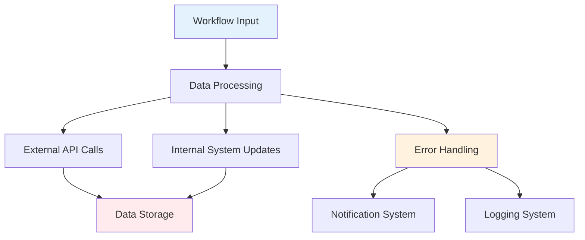
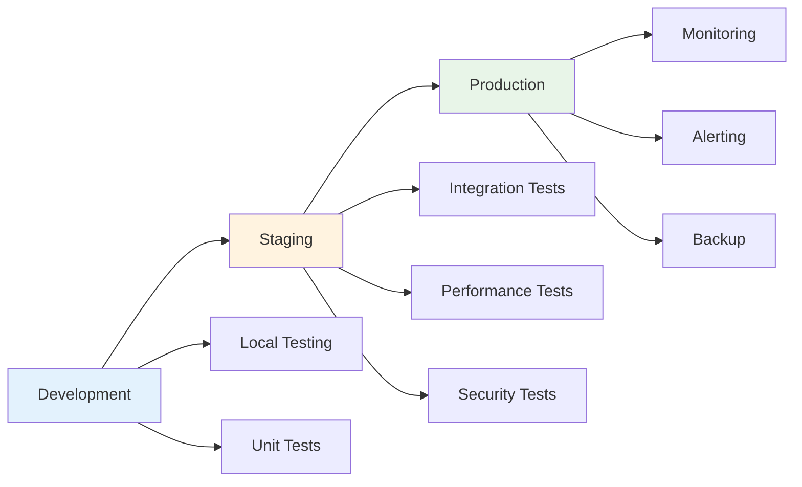
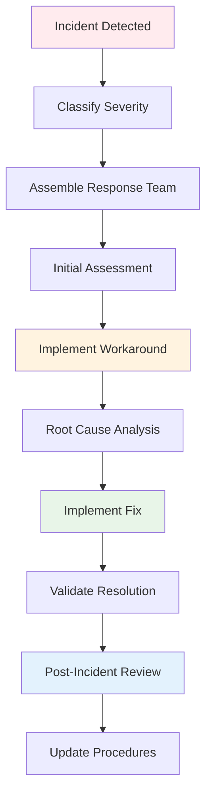

# Risk Management in n8n Automation

## Overview

This guide covers essential risk management strategies for n8n workflows in production environments. Learn how to identify, assess, and mitigate risks to ensure reliable and secure automation systems.

## Table of Contents

1. [Understanding Automation Risks](#understanding-automation-risks)
2. [Risk Assessment Framework](#risk-assessment-framework)
3. [Mitigation Strategies](#mitigation-strategies)
4. [Production Deployment Best Practices](#production-deployment-best-practices)
5. [Monitoring and Alerting](#monitoring-and-alerting)
6. [Incident Response](#incident-response)
7. [Compliance and Governance](#compliance-and-governance)

## Understanding Automation Risks

### Common Risk Categories

#### 1. **Technical Risks**
- **System Failures**: Hardware, software, or network failures
- **Data Corruption**: Loss or corruption of critical data
- **Integration Failures**: API changes or service outages
- **Performance Issues**: Slow execution or resource exhaustion

#### 2. **Business Risks**
- **Process Disruption**: Automation failures affecting business operations
- **Data Breaches**: Unauthorized access to sensitive information
- **Compliance Violations**: Failure to meet regulatory requirements
- **Reputation Damage**: Public exposure of automation failures

#### 3. **Operational Risks**
- **Human Error**: Misconfiguration or incorrect workflow design
- **Vendor Dependencies**: Reliance on third-party services
- **Change Management**: Poor handling of workflow updates
- **Knowledge Gaps**: Lack of expertise to maintain systems

### Risk Impact Assessment

#### Impact Levels:
- **Critical**: Complete system failure, data loss, compliance violation
- **High**: Significant business disruption, partial data loss
- **Medium**: Minor business impact, temporary service degradation
- **Low**: Minimal impact, easily recoverable issues

#### Probability Levels:
- **Very High**: >80% chance of occurrence
- **High**: 60-80% chance of occurrence
- **Medium**: 30-60% chance of occurrence
- **Low**: 10-30% chance of occurrence
- **Very Low**: <10% chance of occurrence

## Risk Assessment Framework

### 1. **Risk Identification Process**

#### Step 1: Workflow Analysis
```markdown
# Workflow Risk Assessment Template

## Workflow Information
- **Name**: [Workflow Name]
- **Purpose**: [Business Purpose]
- **Frequency**: [Execution Frequency]
- **Criticality**: [High/Medium/Low]

## Data Sensitivity
- **Data Types**: [Types of data processed]
- **Sensitivity Level**: [Public/Internal/Confidential/Restricted]
- **Compliance Requirements**: [GDPR, HIPAA, SOX, etc.]

## Dependencies
- **External APIs**: [List of external services]
- **Internal Systems**: [Connected internal systems]
- **Credentials**: [Required authentication methods]

## Potential Risks
1. [Risk 1]: [Description and impact]
2. [Risk 2]: [Description and impact]
3. [Risk 3]: [Description and impact]
```

#### Step 2: Threat Modeling


### 2. **Risk Matrix**

| Impact/Probability | Very Low | Low | Medium | High | Very High |
|-------------------|----------|-----|--------|------|-----------|
| **Critical** | Low | Medium | High | Critical | Critical |
| **High** | Low | Low | Medium | High | Critical |
| **Medium** | Low | Low | Low | Medium | High |
| **Low** | Low | Low | Low | Low | Medium |

### 3. **Risk Register**

```markdown
# Risk Register Template

| Risk ID | Description | Impact | Probability | Risk Level | Owner | Mitigation |
|---------|-------------|--------|-------------|------------|-------|------------|
| R001 | API rate limiting | Medium | High | High | Dev Team | Implement retry logic |
| R002 | Data corruption | Critical | Low | Medium | IT Team | Regular backups |
| R003 | Credential exposure | High | Medium | Medium | Security Team | Credential rotation |
```

## Mitigation Strategies

### 1. **Technical Mitigations**

#### Redundancy and Failover
```json
{
  "name": "High Availability Workflow",
  "nodes": [
    {
      "name": "Primary Service Call",
      "type": "n8n-nodes-base.httpRequest"
    },
    {
      "name": "Check Primary Success",
      "type": "n8n-nodes-base.if"
    },
    {
      "name": "Fallback Service Call",
      "type": "n8n-nodes-base.httpRequest"
    },
    {
      "name": "Emergency Manual Process",
      "type": "n8n-nodes-base.emailSend"
    }
  ]
}
```

#### Data Validation
```javascript
// Input validation example
{
  "validation": {
    "requiredFields": ["email", "name", "amount"],
    "emailFormat": "/^[^\\s@]+@[^\\s@]+\\.[^\\s@]+$/",
    "amountRange": { "min": 0, "max": 10000 },
    "dataTypes": {
      "email": "string",
      "name": "string", 
      "amount": "number"
    }
  }
}
```

#### Rate Limiting Protection
```json
{
  "parameters": {
    "retryOnFail": true,
    "retryTimes": 3,
    "retryInterval": 5000,
    "maxRetries": 3,
    "backoffStrategy": "exponential"
  },
  "name": "Protected API Call",
  "type": "n8n-nodes-base.httpRequest"
}
```

### 2. **Security Mitigations**

#### Credential Management
```markdown
# Credential Security Checklist

## Access Control
- [ ] Principle of least privilege applied
- [ ] Regular credential rotation scheduled
- [ ] Multi-factor authentication enabled
- [ ] Access logging implemented

## Storage Security
- [ ] Credentials encrypted at rest
- [ ] Secure key management system used
- [ ] No hardcoded credentials in workflows
- [ ] Environment-specific credentials used

## Monitoring
- [ ] Failed authentication attempts logged
- [ ] Unusual access patterns monitored
- [ ] Credential usage tracked
- [ ] Regular security audits performed
```

#### Data Protection
```json
{
  "dataClassification": {
    "public": {
      "encryption": "optional",
      "retention": "unlimited",
      "access": "anyone"
    },
    "internal": {
      "encryption": "required",
      "retention": "7 years",
      "access": "authenticated users"
    },
    "confidential": {
      "encryption": "required",
      "retention": "3 years",
      "access": "authorized personnel only"
    },
    "restricted": {
      "encryption": "required",
      "retention": "1 year",
      "access": "need-to-know basis"
    }
  }
}
```

### 3. **Operational Mitigations**

#### Change Management
```markdown
# Change Management Process

## Pre-Change
1. **Risk Assessment**: Evaluate potential impact
2. **Testing**: Comprehensive testing in staging
3. **Approval**: Management approval for high-risk changes
4. **Communication**: Notify stakeholders of changes

## During Change
1. **Monitoring**: Real-time monitoring during deployment
2. **Rollback Plan**: Immediate rollback capability
3. **Communication**: Status updates to stakeholders

## Post-Change
1. **Validation**: Verify system functionality
2. **Documentation**: Update documentation
3. **Review**: Post-implementation review
4. **Lessons Learned**: Capture insights for future changes
```

#### Documentation and Training
```markdown
# Documentation Requirements

## Workflow Documentation
- [ ] Purpose and business value clearly stated
- [ ] Input/output specifications documented
- [ ] Dependencies and prerequisites listed
- [ ] Troubleshooting guide included
- [ ] Contact information for support

## Operational Procedures
- [ ] Deployment procedures documented
- [ ] Monitoring procedures defined
- [ ] Incident response procedures established
- [ ] Backup and recovery procedures tested
- [ ] Regular review schedule established
```

## Production Deployment Best Practices

### 1. **Environment Strategy**

#### Environment Separation


#### Configuration Management
```yaml
# Environment Configuration Template
environments:
  development:
    api_endpoints:
      primary: "https://dev-api.example.com"
      fallback: "https://dev-backup-api.example.com"
    credentials:
      storage: "dev-credentials"
    monitoring:
      enabled: false
      alert_threshold: 1000
    
  staging:
    api_endpoints:
      primary: "https://staging-api.example.com"
      fallback: "https://staging-backup-api.example.com"
    credentials:
      storage: "staging-credentials"
    monitoring:
      enabled: true
      alert_threshold: 500
    
  production:
    api_endpoints:
      primary: "https://api.example.com"
      fallback: "https://backup-api.example.com"
    credentials:
      storage: "prod-credentials"
    monitoring:
      enabled: true
      alert_threshold: 100
```

### 2. **Deployment Checklist**

#### Pre-Deployment
```markdown
# Pre-Deployment Checklist

## Code Quality
- [ ] Code review completed
- [ ] Unit tests passing
- [ ] Integration tests passing
- [ ] Security scan completed
- [ ] Performance tests passed

## Documentation
- [ ] Workflow documentation updated
- [ ] Deployment procedures documented
- [ ] Rollback procedures tested
- [ ] Contact information current

## Infrastructure
- [ ] Target environment ready
- [ ] Dependencies available
- [ ] Credentials configured
- [ ] Monitoring configured
- [ ] Backup procedures tested
```

#### Deployment Process
```markdown
# Deployment Process

## Step 1: Backup Current State
- [ ] Export current workflow
- [ ] Backup database
- [ ] Document current configuration
- [ ] Test rollback procedure

## Step 2: Deploy to Staging
- [ ] Import new workflow
- [ ] Configure credentials
- [ ] Run integration tests
- [ ] Validate functionality

## Step 3: Deploy to Production
- [ ] Schedule maintenance window
- [ ] Deploy during low-traffic period
- [ ] Monitor deployment process
- [ ] Validate post-deployment functionality

## Step 4: Post-Deployment
- [ ] Monitor system health
- [ ] Verify all functions working
- [ ] Update documentation
- [ ] Communicate success to stakeholders
```

### 3. **Quality Gates**

#### Automated Quality Checks
```javascript
// Quality gate validation
{
  "qualityGates": {
    "codeQuality": {
      "complexity": "low",
      "duplication": "< 5%",
      "coverage": "> 80%"
    },
    "security": {
      "vulnerabilities": 0,
      "secrets": "none detected",
      "permissions": "least privilege"
    },
    "performance": {
      "responseTime": "< 5 seconds",
      "memoryUsage": "< 512MB",
      "errorRate": "< 1%"
    }
  }
}
```

## Monitoring and Alerting

### 1. **Key Metrics to Monitor**

#### Performance Metrics
```javascript
{
  "performanceMetrics": {
    "executionTime": {
      "average": "track average execution time",
      "p95": "95th percentile execution time",
      "p99": "99th percentile execution time"
    },
    "throughput": {
      "requestsPerMinute": "track request rate",
      "successRate": "percentage of successful executions",
      "errorRate": "percentage of failed executions"
    },
    "resourceUsage": {
      "memory": "memory consumption",
      "cpu": "CPU utilization",
      "disk": "disk usage"
    }
  }
}
```

#### Business Metrics
```javascript
{
  "businessMetrics": {
    "processMetrics": {
      "itemsProcessed": "number of items processed",
      "processingTime": "time to complete process",
      "accuracy": "percentage of accurate results"
    },
    "userMetrics": {
      "userSatisfaction": "user feedback scores",
      "supportTickets": "number of support requests",
      "uptime": "system availability percentage"
    }
  }
}
```

### 2. **Alerting Strategy**

#### Alert Levels
```json
{
  "alertLevels": {
    "critical": {
      "conditions": [
        "system_down",
        "data_corruption",
        "security_breach"
      ],
      "response": "immediate",
      "channels": ["phone", "email", "slack"]
    },
    "high": {
      "conditions": [
        "high_error_rate",
        "performance_degradation",
        "service_unavailable"
      ],
      "response": "within_1_hour",
      "channels": ["email", "slack"]
    },
    "medium": {
      "conditions": [
        "warning_thresholds",
        "capacity_issues",
        "maintenance_required"
      ],
      "response": "within_4_hours",
      "channels": ["slack"]
    },
    "low": {
      "conditions": [
        "informational",
        "status_updates",
        "scheduled_maintenance"
      ],
      "response": "next_business_day",
      "channels": ["email"]
    }
  }
}
```

#### Alert Configuration
```json
{
  "alertingRules": [
    {
      "name": "High Error Rate",
      "condition": "error_rate > 5%",
      "duration": "5 minutes",
      "severity": "high",
      "actions": ["notify_team", "page_oncall"]
    },
    {
      "name": "Slow Execution",
      "condition": "avg_execution_time > 30 seconds",
      "duration": "10 minutes", 
      "severity": "medium",
      "actions": ["notify_team"]
    },
    {
      "name": "System Down",
      "condition": "success_rate = 0%",
      "duration": "1 minute",
      "severity": "critical",
      "actions": ["page_oncall", "escalate_management"]
    }
  ]
}
```

## Incident Response

### 1. **Incident Classification**

#### Severity Levels
```markdown
# Incident Severity Classification

## P1 - Critical
- Complete system failure
- Data loss or corruption
- Security breach
- Compliance violation
- **Response Time**: Immediate (0-15 minutes)
- **Resolution Target**: 4 hours

## P2 - High
- Significant service degradation
- Partial data loss
- Performance issues affecting users
- **Response Time**: 15-60 minutes
- **Resolution Target**: 8 hours

## P3 - Medium
- Minor service issues
- Non-critical feature failures
- Performance degradation
- **Response Time**: 1-4 hours
- **Resolution Target**: 24 hours

## P4 - Low
- Cosmetic issues
- Minor feature problems
- Documentation issues
- **Response Time**: 4-24 hours
- **Resolution Target**: 1 week
```

### 2. **Incident Response Process**

#### Response Workflow


#### Communication Plan
```markdown
# Incident Communication Template

## Initial Alert (0-15 minutes)
- **To**: Incident Response Team
- **Content**: 
  - Incident description
  - Severity level
  - Initial impact assessment
  - Response team activation

## Status Update (Every 30 minutes for P1/P2)
- **To**: Stakeholders, Management
- **Content**:
  - Current status
  - Actions taken
  - Next steps
  - Estimated resolution time

## Resolution Notification
- **To**: All stakeholders
- **Content**:
  - Incident resolved
  - Root cause summary
  - Preventive measures
  - Lessons learned
```

### 3. **Post-Incident Review**

#### Review Process
```markdown
# Post-Incident Review Template

## Incident Summary
- **Incident ID**: [Unique identifier]
- **Date/Time**: [Incident occurrence]
- **Duration**: [Time to resolution]
- **Severity**: [P1/P2/P3/P4]
- **Impact**: [Business impact description]

## Timeline
- **Detection**: [When was incident detected]
- **Response**: [Time to initial response]
- **Resolution**: [Time to resolution]
- **Communication**: [Key communication milestones]

## Root Cause Analysis
- **Immediate Cause**: [What directly caused the incident]
- **Contributing Factors**: [Factors that enabled the incident]
- **Root Cause**: [Underlying cause that needs to be addressed]

## Action Items
1. [Action 1]: [Description and owner]
2. [Action 2]: [Description and owner]
3. [Action 3]: [Description and owner]

## Lessons Learned
- **What went well**: [Positive aspects of response]
- **What could be improved**: [Areas for improvement]
- **Preventive measures**: [Steps to prevent recurrence]
```

## Compliance and Governance

### 1. **Regulatory Compliance**

#### Common Compliance Frameworks
```markdown
# Compliance Framework Mapping

## GDPR (General Data Protection Regulation)
- **Data Processing**: Lawful basis for processing
- **Data Minimization**: Only collect necessary data
- **Consent Management**: Clear consent mechanisms
- **Data Subject Rights**: Access, rectification, erasure
- **Data Protection**: Technical and organizational measures
- **Breach Notification**: 72-hour notification requirement

## HIPAA (Health Insurance Portability and Accountability Act)
- **Administrative Safeguards**: Policies and procedures
- **Physical Safeguards**: Physical access controls
- **Technical Safeguards**: Access controls, audit logs
- **Business Associate Agreements**: Third-party contracts
- **Risk Assessment**: Regular risk assessments

## SOX (Sarbanes-Oxley Act)
- **Internal Controls**: Adequate internal controls
- **Documentation**: Process documentation
- **Testing**: Regular control testing
- **Reporting**: Management reporting
- **Audit Trail**: Complete audit trail
```

### 2. **Governance Framework**

#### Policy Structure
```markdown
# Automation Governance Policy

## 1. Purpose and Scope
- Define automation governance objectives
- Establish scope of coverage
- Set policy compliance requirements

## 2. Roles and Responsibilities
- **Automation Owner**: Business process owner
- **Technical Owner**: Technical implementation owner
- **Compliance Officer**: Regulatory compliance oversight
- **Risk Manager**: Risk assessment and mitigation

## 3. Approval Process
- **Business Case**: Justification for automation
- **Risk Assessment**: Comprehensive risk evaluation
- **Technical Review**: Technical feasibility assessment
- **Compliance Review**: Regulatory compliance check
- **Final Approval**: Management sign-off

## 4. Monitoring and Reporting
- **Performance Monitoring**: Regular performance reviews
- **Compliance Audits**: Periodic compliance assessments
- **Risk Reviews**: Ongoing risk evaluations
- **Management Reporting**: Regular status reports
```

### 3. **Audit and Assessment**

#### Audit Checklist
```markdown
# Automation Audit Checklist

## Security Controls
- [ ] Access controls properly configured
- [ ] Credentials securely managed
- [ ] Data encryption in transit and at rest
- [ ] Audit logging enabled
- [ ] Regular security assessments performed

## Operational Controls
- [ ] Change management procedures followed
- [ ] Backup and recovery procedures tested
- [ ] Incident response procedures documented
- [ ] Performance monitoring in place
- [ ] Documentation current and complete

## Compliance Controls
- [ ] Regulatory requirements identified
- [ ] Compliance controls implemented
- [ ] Regular compliance assessments performed
- [ ] Non-compliance issues tracked and resolved
- [ ] Compliance reporting accurate and timely
```

## Conclusion

Effective risk management in n8n automation requires a comprehensive approach that addresses technical, business, and operational risks. By implementing proper risk assessment, mitigation strategies, and governance frameworks, organizations can:

- **Minimize business disruption** from automation failures
- **Protect sensitive data** and maintain compliance
- **Ensure reliable operations** with proper monitoring and alerting
- **Respond effectively** to incidents when they occur
- **Continuously improve** automation processes and controls

### Key Takeaways

1. **Assess risks systematically** using structured frameworks
2. **Implement multiple layers** of protection and mitigation
3. **Monitor continuously** with comprehensive alerting
4. **Respond quickly** with well-defined incident procedures
5. **Govern effectively** with clear policies and procedures
6. **Learn continuously** from incidents and near-misses
7. **Adapt proactively** to changing risk landscapes

### Next Steps

1. **Conduct risk assessment** for existing automations
2. **Implement monitoring** and alerting systems
3. **Develop incident response** procedures
4. **Establish governance** frameworks
5. **Train teams** on risk management practices
6. **Regular review** and update of risk management strategies

Remember: Risk management is not a one-time activity but an ongoing process that requires continuous attention and improvement.
