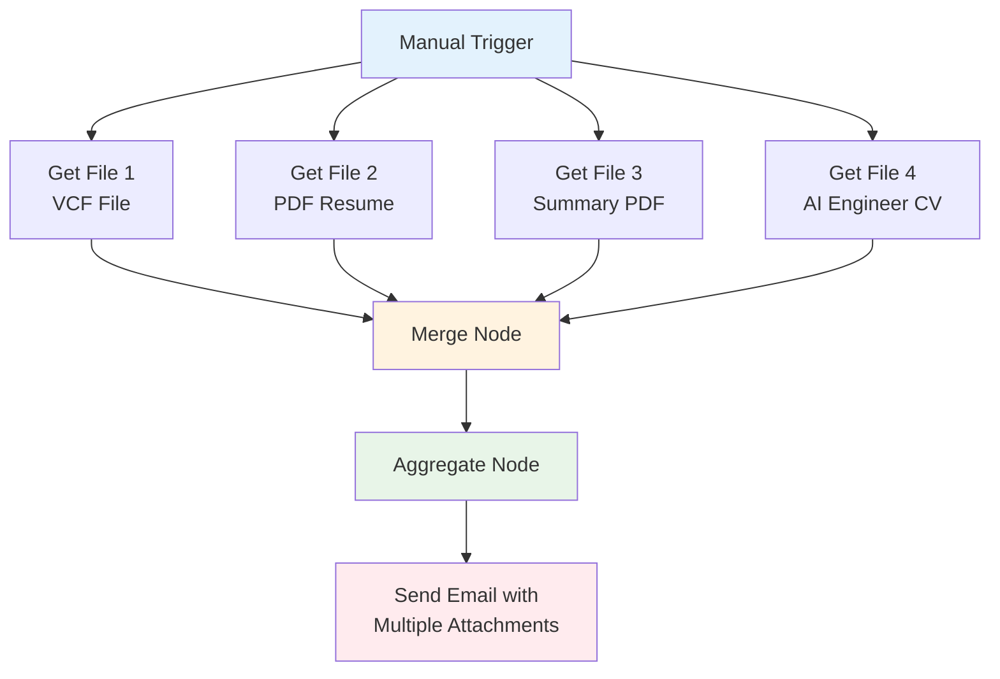
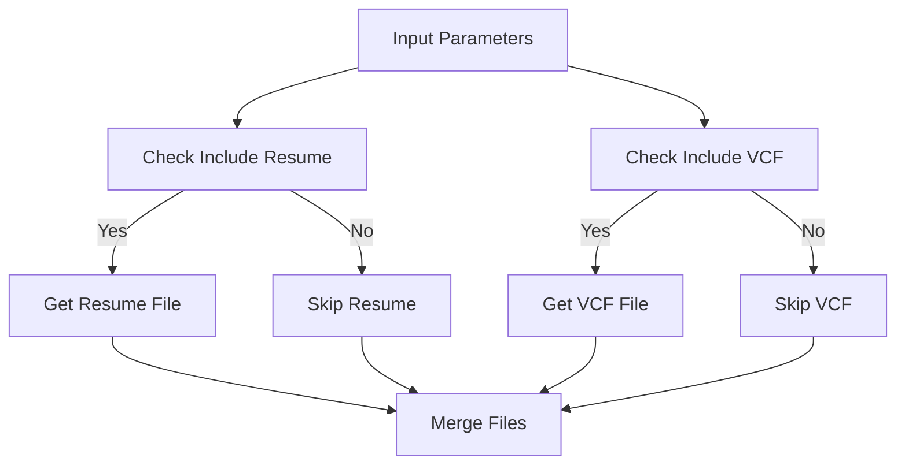
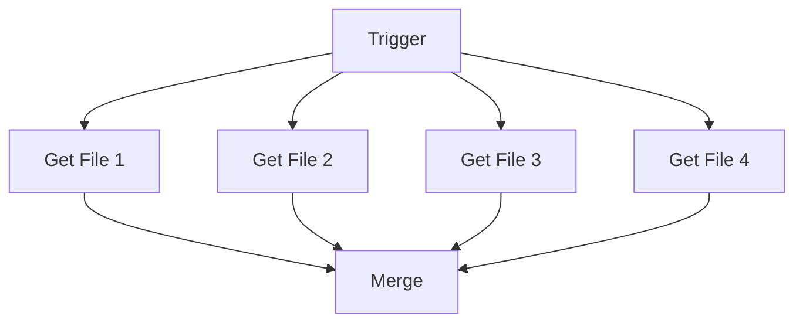

# Send Multi Attachments

## Overview

This guide demonstrates how to send multiple file attachments via email using n8n. Learn how to fetch files from different sources (like GitHub repositories), merge them together, and send them as attachments in a single email message.

## Table of Contents

1. [Understanding Multi-Attachment Emails](#understanding-multi-attachment-emails)
2. [Workflow Architecture](#workflow-architecture)
3. [Step-by-Step Implementation](#step-by-step-implementation)
4. [Advanced Techniques](#advanced-techniques)
5. [Best Practices](#best-practices)
6. [Common Use Cases](#common-use-cases)
7. [Troubleshooting](#troubleshooting)

## Understanding Multi-Attachment Emails

### What are Multi-Attachment Emails?

Multi-attachment emails allow you to send multiple files as attachments in a single email message. This is useful for:

- **Document packages**: Sending multiple related documents together
- **Report bundles**: Combining various reports into one email
- **Resource collections**: Sharing multiple resources at once
- **Backup files**: Sending multiple backup files together

### Benefits of Multi-Attachment Workflows

- **Efficiency**: Send multiple files in one email instead of multiple emails
- **Organization**: Keep related files together
- **Professional**: Present a complete package of information
- **User Experience**: Recipients get all related files at once

## Workflow Architecture

### High-Level Flow



### Node Breakdown

1. **Manual Trigger**: Starts the workflow execution
2. **GitHub File Nodes**: Fetch different files from GitHub repository
3. **Merge Node**: Combines multiple data streams
4. **Aggregate Node**: Collects all binary data for attachments
5. **Gmail Node**: Sends email with multiple attachments

## Step-by-Step Implementation

### 1. **Set Up Manual Trigger**

#### Configuration:
```json
{
  "type": "n8n-nodes-base.manualTrigger",
  "parameters": {},
  "name": "When clicking 'Execute workflow'"
}
```

#### Purpose:
- Provides a way to manually start the workflow
- Useful for testing and on-demand file sending
- Can be replaced with webhooks or scheduled triggers

### 2. **Configure GitHub File Retrieval**

#### Multiple File Sources:
```json
{
  "type": "n8n-nodes-base.github",
  "parameters": {
    "resource": "file",
    "operation": "get",
    "owner": "rifaterdemsahin",
    "repository": "cv",
    "filePath": "/4_UI/dynamic_cv/v16/erdem-sahin.vcf"
  },
  "name": "Get VCF File"
}
```

#### File Types Supported:
- **VCF Files**: Contact information files
- **PDF Files**: Documents, resumes, reports
- **Images**: Screenshots, diagrams
- **Text Files**: Configuration files, logs
- **Any Binary File**: Archives, executables

### 3. **Merge Multiple Data Streams**

#### Merge Node Configuration:
```json
{
  "type": "n8n-nodes-base.merge",
  "parameters": {
    "numberInputs": 4
  },
  "name": "Merge"
}
```

#### Key Features:
- **Multiple Inputs**: Accepts data from up to 4 different sources
- **Data Preservation**: Maintains file data integrity
- **Order Control**: Files are merged in the order they connect

### 4. **Aggregate Binary Data**

#### Aggregate Node Configuration:
```json
{
  "type": "n8n-nodes-base.aggregate",
  "parameters": {
    "fieldsToAggregate": {
      "fieldToAggregate": [
        {
          "fieldToAggregate": "data"
        }
      ]
    },
    "options": {
      "includeBinaries": true
    }
  },
  "name": "Aggregate"
}
```

#### Critical Settings:
- **includeBinaries: true**: Ensures binary data is preserved
- **fieldToAggregate**: Specifies which fields to collect
- **Data Consolidation**: Combines all file data into single output

### 5. **Send Email with Attachments**

#### Gmail Node Configuration:
```json
{
  "type": "n8n-nodes-base.gmail",
  "parameters": {
    "sendTo": "contact@rifaterdemsahin.com",
    "subject": "Requested CV",
    "message": "Here is the CV with all the formats, Long Short and Mid Form",
    "options": {
      "attachmentsUi": {
        "attachmentsBinary": [
          {},
          { "property": "data_1" },
          { "property": "data_2" },
          { "property": "data_3" }
        ]
      }
    }
  },
  "name": "Send a message"
}
```

#### Attachment Configuration:
- **attachmentsBinary**: Array defining attachment sources
- **property**: References to binary data fields
- **Multiple Properties**: Each attachment maps to a different data field

## Advanced Techniques

### 1. **Dynamic File Selection**

#### Conditional File Fetching:
```javascript
// Use IF nodes to conditionally fetch files
{
  "conditions": {
    "conditions": [
      {
        "leftValue": "={{$json.includeResume}}",
        "operator": "equal",
        "rightValue": "true"
      }
    ]
  }
}
```

#### Workflow Pattern:


### 2. **File Validation**

#### Check File Existence:
```javascript
// Validate files before sending
{
  "conditions": {
    "conditions": [
      {
        "leftValue": "={{$json.data}}",
        "operator": "exists"
      },
      {
        "leftValue": "={{$json.data.length}}",
        "operator": "gt",
        "rightValue": "0"
      }
    ],
    "combinator": "and"
  }
}
```

#### File Size Validation:
```javascript
// Check file size limits
{
  "conditions": {
    "conditions": [
      {
        "leftValue": "={{$json.data.length}}",
        "operator": "lt",
        "rightValue": "10485760"  // 10MB limit
      }
    ]
  }
}
```

### 3. **File Processing**

#### Rename Files:
```javascript
// Add custom file names
{
  "values": {
    "string": [
      {
        "name": "fileName",
        "value": "Erdem_Sahin_Resume_2025.pdf"
      }
    ]
  }
}
```

#### Add File Metadata:
```javascript
// Include file information
{
  "values": {
    "string": [
      {
        "name": "fileDescription",
        "value": "Professional resume in PDF format"
      },
      {
        "name": "fileSize",
        "value": "={{Math.round($json.data.length / 1024)}} KB"
      }
    ]
  }
}
```

### 4. **Error Handling**

#### Handle Missing Files:
```javascript
// Provide fallback for missing files
{
  "values": {
    "string": [
      {
        "name": "errorMessage",
        "value": "File not found: {{$json.filePath}}"
      }
    ]
  }
}
```

#### Retry Logic:
```javascript
// Implement retry for failed file fetches
{
  "options": {
    "retry": {
      "enabled": true,
      "maxAttempts": 3,
      "waitBetweenAttempts": 2000
    }
  }
}
```

## Best Practices

### 1. **File Organization**

#### Logical Naming:
```javascript
// Use descriptive file names
"Erdem_Sahin_Resume_2025.pdf"
"Contact_Information.vcf"
"Project_Summary_Report.pdf"
"AI_Engineer_CV_2025.pdf"
```

#### File Grouping:
```javascript
// Group related files
{
  "resumeFiles": ["resume.pdf", "cv_summary.pdf"],
  "contactFiles": ["contact.vcf", "business_card.pdf"],
  "projectFiles": ["project_report.pdf", "portfolio.pdf"]
}
```

### 2. **Email Configuration**

#### Professional Subject Lines:
```javascript
// Clear, descriptive subjects
"Requested Documents - Erdem Sahin"
"CV Package - Multiple Formats"
"Project Deliverables - Q1 2025"
```

#### Informative Messages:
```javascript
// Provide context for attachments
"Please find attached the requested documents:
- Professional Resume (PDF)
- Contact Information (VCF)
- Project Summary Report
- AI Engineer CV

All files are ready for your review."
```

### 3. **Performance Optimization**

#### Parallel File Fetching:


#### Batch Processing:
```javascript
// Process files in batches for large collections
{
  "batchSize": 5,
  "waitBetweenBatches": 1000
}
```

### 4. **Security Considerations**

#### File Validation:
```javascript
// Validate file types
{
  "allowedTypes": ["pdf", "doc", "docx", "vcf", "txt"],
  "maxFileSize": 10485760,  // 10MB
  "scanForViruses": true
}
```

#### Access Control:
```javascript
// Restrict file access
{
  "allowedPaths": ["/4_UI/static_cv/", "/4_UI/dynamic_cv/"],
  "requireAuthentication": true
}
```

## Common Use Cases

### 1. **Document Packages**

#### Use Case: Send Complete Document Set
```javascript
{
  "scenario": "Job Application Package",
  "files": [
    "resume.pdf",
    "cover_letter.pdf",
    "portfolio.pdf",
    "references.pdf"
  ],
  "recipient": "hr@company.com",
  "subject": "Job Application - Software Engineer Position"
}
```

### 2. **Report Bundles**

#### Use Case: Monthly Report Package
```javascript
{
  "scenario": "Monthly Reports",
  "files": [
    "sales_report.pdf",
    "marketing_metrics.pdf",
    "financial_summary.pdf",
    "team_performance.pdf"
  ],
  "recipient": "management@company.com",
  "subject": "Monthly Reports - December 2024"
}
```

### 3. **Resource Collections**

#### Use Case: Educational Materials
```javascript
{
  "scenario": "Course Materials",
  "files": [
    "syllabus.pdf",
    "reading_list.pdf",
    "assignment_guide.pdf",
    "resource_links.pdf"
  ],
  "recipient": "students@university.edu",
  "subject": "Course Materials - Advanced Programming"
}
```

### 4. **Backup Files**

#### Use Case: System Backup
```javascript
{
  "scenario": "Database Backup",
  "files": [
    "database_backup.sql",
    "configuration_files.zip",
    "log_files.tar.gz",
    "backup_report.txt"
  ],
  "recipient": "admin@company.com",
  "subject": "Daily Backup Files - {{new Date().toISOString()}}"
}
```

### 5. **Project Deliverables**

#### Use Case: Client Deliverables
```javascript
{
  "scenario": "Project Completion",
  "files": [
    "final_report.pdf",
    "source_code.zip",
    "documentation.pdf",
    "user_manual.pdf"
  ],
  "recipient": "client@company.com",
  "subject": "Project Deliverables - Website Redesign"
}
```

## Troubleshooting

### Common Issues

#### 1. **Files Not Attaching**

**Symptoms:**
- Email sends but attachments are missing
- Empty attachment files

**Solutions:**
- Check `includeBinaries: true` in Aggregate node
- Verify file paths in GitHub nodes
- Ensure Merge node has correct number of inputs
- Check attachment property mapping in Gmail node

#### 2. **File Size Issues**

**Symptoms:**
- Large files fail to send
- Email size limit exceeded

**Solutions:**
- Implement file size validation
- Compress large files before sending
- Split large files into multiple emails
- Use cloud storage links instead of attachments

#### 3. **Missing Files**

**Symptoms:**
- Workflow fails on file fetch
- "File not found" errors

**Solutions:**
- Verify GitHub repository access
- Check file paths are correct
- Implement error handling for missing files
- Add file existence validation

#### 4. **Performance Issues**

**Symptoms:**
- Slow file fetching
- Workflow timeouts

**Solutions:**
- Use parallel file fetching
- Implement caching for frequently accessed files
- Optimize file sizes
- Add progress tracking

### Debugging Tips

#### 1. **Check Binary Data**
```javascript
// Verify binary data exists
{
  "debug": {
    "checkBinaryData": true,
    "logFileSizes": true,
    "validateFileTypes": true
  }
}
```

#### 2. **Test Individual Components**
```javascript
// Test each file fetch separately
{
  "testing": {
    "testSingleFile": true,
    "validateMerge": true,
    "checkAggregate": true
  }
}
```

#### 3. **Monitor Workflow Execution**
```javascript
// Add logging for debugging
{
  "logging": {
    "logFileFetch": true,
    "logMergeResults": true,
    "logEmailSend": true
  }
}
```

## Conclusion

The multi-attachment email workflow is a powerful way to send multiple files efficiently. By understanding the key components and best practices, you can:

- **Send professional document packages** with multiple attachments
- **Organize related files** into logical groups
- **Handle errors gracefully** with proper validation
- **Optimize performance** with parallel processing
- **Maintain security** with file validation and access control

### Key Takeaways

1. **Use Merge and Aggregate nodes** to combine multiple file sources
2. **Enable binary data inclusion** in the Aggregate node
3. **Configure attachment properties** correctly in the email node
4. **Implement error handling** for missing or invalid files
5. **Validate file sizes** to avoid email limits
6. **Use descriptive file names** and email subjects
7. **Test thoroughly** with various file types and sizes

### Next Steps

1. **Practice with different file types** to understand limitations
2. **Experiment with dynamic file selection** based on conditions
3. **Implement file validation** and error handling
4. **Explore cloud storage integration** for large files
5. **Build automated triggers** for scheduled file sending
6. **Create reusable templates** for common attachment scenarios

This workflow pattern can be adapted for many different use cases, from personal document sharing to enterprise file distribution systems.
