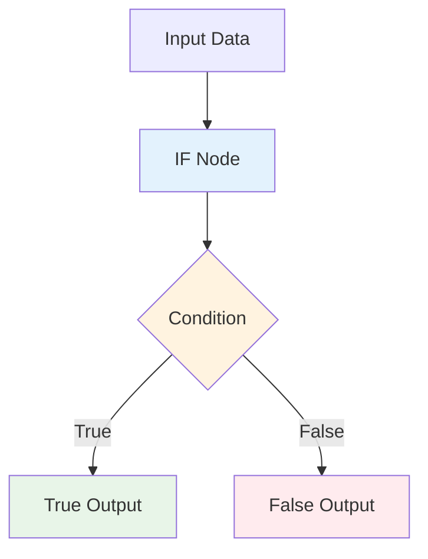

# The IF Node - Adding Logic to Your Workflows

## Overview

This guide covers the IF node in n8n, which is fundamental for adding conditional logic to your workflows. Learn how to create different paths for your data based on conditions and build intelligent workflows that can make decisions.

## Table of Contents

1. [Understanding the IF Node](#understanding-the-if-node)
2. [Basic IF Node Configuration](#basic-if-node-configuration)
3. [Condition Types](#condition-types)
4. [Advanced Techniques](#advanced-techniques)
5. [Practical Examples](#practical-examples)
6. [Best Practices](#best-practices)
7. [Common Use Cases](#common-use-cases)

## Understanding the IF Node

### What is the IF Node?

The IF node is a conditional logic node that evaluates data against specified conditions and routes the data to different outputs based on whether the conditions are true or false. It's the foundation for building intelligent, decision-making workflows.

### How the IF Node Works



### Key Features

- **Binary Logic**: Routes data to True or False outputs
- **Multiple Conditions**: Support for complex condition combinations
- **Flexible Operators**: Various comparison operators available
- **Data Type Support**: Works with strings, numbers, booleans, and dates
- **Expression Support**: Use JavaScript expressions for dynamic conditions

## Basic IF Node Configuration

### 1. **Simple Condition**

#### Basic Configuration:
```json
{
  "conditions": {
    "options": {
      "caseSensitive": true,
      "leftValue": "",
      "typeValidation": "strict"
    },
    "conditions": [
      {
        "leftValue": "={{$json.status}}",
        "rightValue": "active",
        "operator": {
          "type": "string",
          "operation": "equals"
        }
      }
    ]
  }
}
```

### 2. **Multiple Conditions**

#### AND Logic:
```json
{
  "conditions": {
    "conditions": [
      {
        "leftValue": "={{$json.status}}",
        "operator": "equals",
        "rightValue": "active"
      },
      {
        "leftValue": "={{parseInt($json.age)}}",
        "operator": "gte",
        "rightValue": "18"
      }
    ],
    "combinator": "and"
  }
}
```

#### OR Logic:
```json
{
  "conditions": {
    "conditions": [
      {
        "leftValue": "={{$json.userType}}",
        "operator": "equals",
        "rightValue": "admin"
      },
      {
        "leftValue": "={{$json.userType}}",
        "operator": "equals",
        "rightValue": "moderator"
      }
    ],
    "combinator": "or"
  }
}
```

## Condition Types

### 1. **String Conditions**

#### Common String Operations:
```javascript
// Exact match
{
  "leftValue": "={{$json.status}}",
  "operator": "equals",
  "rightValue": "active"
}

// Contains text
{
  "leftValue": "={{$json.description}}",
  "operator": "contains",
  "rightValue": "urgent"
}

// Starts with
{
  "leftValue": "={{$json.email}}",
  "operator": "startsWith",
  "rightValue": "admin@"
}

// Regular expression
{
  "leftValue": "={{$json.email}}",
  "operator": "regex",
  "rightValue": "^[^\\s@]+@[^\\s@]+\\.[^\\s@]+$"
}
```

### 2. **Number Conditions**

#### Common Number Operations:
```javascript
// Greater than
{
  "leftValue": "={{parseInt($json.price)}}",
  "operator": "gt",
  "rightValue": "100"
}

// Less than or equal
{
  "leftValue": "={{parseInt($json.quantity)}}",
  "operator": "lte",
  "rightValue": "10"
}

// Between values
{
  "leftValue": "={{parseInt($json.score)}}",
  "operator": "between",
  "rightValue": "70,90"
}
```

### 3. **Boolean Conditions**

#### Boolean Operations:
```javascript
// True value
{
  "leftValue": "={{$json.isActive}}",
  "operator": "equal",
  "rightValue": "true"
}

// False value
{
  "leftValue": "={{$json.isDeleted}}",
  "operator": "equal",
  "rightValue": "false"
}
```

### 4. **Date Conditions**

#### Date Operations:
```javascript
// After date
{
  "leftValue": "={{$json.createdAt}}",
  "operator": "after",
  "rightValue": "2024-01-01"
}

// Before date
{
  "leftValue": "={{$json.expiryDate}}",
  "operator": "before",
  "rightValue": "={{$now.add(30, 'days')}}"
}

// Date range
{
  "leftValue": "={{$json.eventDate}}",
  "operator": "between",
  "rightValue": "2024-01-01,2024-12-31"
}
```

## Advanced Techniques

### 1. **Expression-Based Conditions**

#### Using JavaScript Expressions:
```javascript
// Complex calculations
{
  "leftValue": "={{($json.revenue - $json.costs) / $json.costs * 100}}",
  "operator": "gt",
  "rightValue": "20"
}

// String manipulation
{
  "leftValue": "={{$json.name.toLowerCase()}}",
  "operator": "contains",
  "rightValue": "john"
}

// Date calculations
{
  "leftValue": "={{$json.createdAt}}",
  "operator": "before",
  "rightValue": "={{$now.subtract(7, 'days')}}"
}
```

### 2. **Nested Conditions**

#### Complex Logic:
```javascript
{
  "conditions": {
    "conditions": [
      {
        "leftValue": "={{$json.userType}}",
        "operator": "equals",
        "rightValue": "premium"
      },
      {
        "conditions": {
          "conditions": [
            {
              "leftValue": "={{parseInt($json.orderValue)}}",
              "operator": "gte",
              "rightValue": "100"
            },
            {
              "leftValue": "={{$json.paymentStatus}}",
              "operator": "equals",
              "rightValue": "completed"
            }
          ],
          "combinator": "and"
        }
      }
    ],
    "combinator": "and"
  }
}
```

### 3. **Dynamic Conditions**

#### Conditions Based on Variables:
```javascript
// Use workflow variables
{
  "leftValue": "={{$json.priority}}",
  "operator": "equals",
  "rightValue": "={{$vars.alertThreshold}}"
}

// Use node parameters
{
  "leftValue": "={{$json.category}}",
  "operator": "equals",
  "rightValue": "={{$node['Get Settings'].json.category}}"
}
```

## Practical Examples

### 1. **Order Processing Logic**

#### Workflow: Route Orders by Value
```json
{
  "name": "Order Processing Logic",
  "nodes": [
    {
      "name": "Order Webhook",
      "type": "n8n-nodes-base.webhook",
      "parameters": {
        "httpMethod": "POST",
        "path": "order"
      }
    },
    {
      "name": "Check Order Value",
      "type": "n8n-nodes-base.if",
      "parameters": {
        "conditions": {
          "conditions": [
            {
              "leftValue": "={{parseInt($json.orderValue)}}",
              "operator": "gte",
              "rightValue": "100"
            }
          ]
        }
      }
    },
    {
      "name": "High Value Processing",
      "type": "n8n-nodes-base.set",
      "parameters": {
        "values": {
          "string": [
            {
              "name": "processingType",
              "value": "priority"
            },
            {
              "name": "assignedTeam",
              "value": "VIP Support"
            }
          ]
        }
      }
    },
    {
      "name": "Standard Processing",
      "type": "n8n-nodes-base.set",
      "parameters": {
        "values": {
          "string": [
            {
              "name": "processingType",
              "value": "standard"
            },
            {
              "name": "assignedTeam",
              "value": "General Support"
            }
          ]
        }
      }
    }
  ]
}
```

### 2. **User Authentication Flow**

#### Workflow: Check User Permissions
```json
{
  "name": "User Authentication Flow",
  "nodes": [
    {
      "name": "User Login Webhook",
      "type": "n8n-nodes-base.webhook"
    },
    {
      "name": "Check User Status",
      "type": "n8n-nodes-base.if",
      "parameters": {
        "conditions": {
          "conditions": [
            {
              "leftValue": "={{$json.isActive}}",
              "operator": "equal",
              "rightValue": "true"
            }
          ]
        }
      }
    },
    {
      "name": "Check Admin Access",
      "type": "n8n-nodes-base.if",
      "parameters": {
        "conditions": {
          "conditions": [
            {
              "leftValue": "={{$json.userRole}}",
              "operator": "equals",
              "rightValue": "admin"
            }
          ]
        }
      }
    },
    {
      "name": "Grant Admin Access",
      "type": "n8n-nodes-base.set"
    },
    {
      "name": "Grant User Access",
      "type": "n8n-nodes-base.set"
    },
    {
      "name": "Deny Access",
      "type": "n8n-nodes-base.set"
    }
  ]
}
```

### 3. **Content Moderation**

#### Workflow: Moderate Content by Risk Level
```json
{
  "name": "Content Moderation",
  "nodes": [
    {
      "name": "Content Submission",
      "type": "n8n-nodes-base.webhook"
    },
    {
      "name": "Check Content Risk",
      "type": "n8n-nodes-base.if",
      "parameters": {
        "conditions": {
          "conditions": [
            {
              "leftValue": "={{$json.riskScore}}",
              "operator": "gte",
              "rightValue": "80"
            }
          ]
        }
      }
    },
    {
      "name": "High Risk Content",
      "type": "n8n-nodes-base.slack",
      "parameters": {
        "channel": "#content-moderation",
        "text": "🚨 High Risk Content Detected\n\n**Content ID:** {{$json.contentId}}\n**Risk Score:** {{$json.riskScore}}\n**Content:** {{$json.content}}\n**Author:** {{$json.author}}"
      }
    },
    {
      "name": "Auto Approve Content",
      "type": "n8n-nodes-base.httpRequest",
      "parameters": {
        "url": "https://api.example.com/content/approve",
        "method": "POST",
        "body": {
          "contentId": "={{$json.contentId}}",
          "status": "approved"
        }
      }
    }
  ]
}
```

### 4. **Email Routing System**

#### Workflow: Route Emails by Sender
```json
{
  "name": "Email Routing System",
  "nodes": [
    {
      "name": "Email Trigger",
      "type": "n8n-nodes-base.emailReadImap"
    },
    {
      "name": "Check Sender Domain",
      "type": "n8n-nodes-base.if",
      "parameters": {
        "conditions": {
          "conditions": [
            {
              "leftValue": "={{$json.from}}",
              "operator": "endsWith",
              "rightValue": "@company.com"
            }
          ]
        }
      }
    },
    {
      "name": "Route Internal Email",
      "type": "n8n-nodes-base.set",
      "parameters": {
        "values": {
          "string": [
            {
              "name": "emailType",
              "value": "internal"
            },
            {
              "name": "priority",
              "value": "high"
            }
          ]
        }
      }
    },
    {
      "name": "Route External Email",
      "type": "n8n-nodes-base.set",
      "parameters": {
        "values": {
          "string": [
            {
              "name": "emailType",
              "value": "external"
            },
            {
              "name": "priority",
              "value": "normal"
            }
          ]
        }
      }
    }
  ]
}
```

## Best Practices

### 1. **Condition Design**

#### Keep Conditions Simple:
```javascript
// Good: Simple, clear condition
{
  "leftValue": "={{$json.status}}",
  "operator": "equals",
  "rightValue": "active"
}

// Avoid: Overly complex conditions
{
  "leftValue": "={{$json.status}}",
  "operator": "equals",
  "rightValue": "={{($json.isActive && $json.hasPermission) ? 'active' : 'inactive'}}"
}
```

#### Use Descriptive Names:
```javascript
// Good: Clear node names
"Check if User is Active"
"Validate Order Amount"
"Route by Priority Level"

// Bad: Generic names
"IF Node"
"Condition Check"
"Router"
```

### 2. **Performance Optimization**

#### Minimize Complex Expressions:
```javascript
// Good: Simple comparison
{
  "leftValue": "={{$json.price}}",
  "operator": "gt",
  "rightValue": "100"
}

// Better: Pre-calculate in previous node
{
  "leftValue": "={{$json.isHighValue}}",
  "operator": "equal",
  "rightValue": "true"
}
```

#### Use Appropriate Data Types:
```javascript
// Good: Correct type handling
{
  "leftValue": "={{parseInt($json.quantity)}}",
  "operator": "gte",
  "rightValue": "10"
}

// Bad: String comparison for numbers
{
  "leftValue": "={{$json.quantity}}",
  "operator": "gte",
  "rightValue": "10"
}
```

### 3. **Error Handling**

#### Handle Missing Data:
```javascript
// Check for data existence
{
  "conditions": {
    "conditions": [
      {
        "leftValue": "={{$json.requiredField}}",
        "operator": "exists"
      }
    ]
  }
}
```

#### Provide Fallback Values:
```javascript
// Use fallback values
{
  "leftValue": "={{$json.status || 'unknown'}}",
  "operator": "equals",
  "rightValue": "active"
}
```

### 4. **Documentation**

#### Add Comments:
```javascript
// Document complex logic
{
  "comment": "Check if user has premium access and valid subscription",
  "conditions": {
    // ... conditions
  }
}
```

#### Use Clear Values:
```javascript
// Good: Clear, readable values
{
  "rightValue": "premium_user"
}

// Bad: Cryptic values
{
  "rightValue": "PU_001"
}
```

## Common Use Cases

### 1. **Data Validation**

#### Validate Input Data:
```javascript
{
  "conditions": {
    "conditions": [
      {
        "leftValue": "={{$json.email}}",
        "operator": "regex",
        "rightValue": "^[^\\s@]+@[^\\s@]+\\.[^\\s@]+$"
      },
      {
        "leftValue": "={{parseInt($json.age)}}",
        "operator": "gte",
        "rightValue": "18"
      }
    ],
    "combinator": "and"
  }
}
```

### 2. **Business Logic**

#### Implement Business Rules:
```javascript
{
  "conditions": {
    "conditions": [
      {
        "leftValue": "={{$json.customerType}}",
        "operator": "equals",
        "rightValue": "premium"
      },
      {
        "leftValue": "={{parseInt($json.orderValue)}}",
        "operator": "gte",
        "rightValue": "100"
      }
    ],
    "combinator": "and"
  }
}
```

### 3. **Routing Logic**

#### Route Data by Type:
```javascript
{
  "conditions": {
    "conditions": [
      {
        "leftValue": "={{$json.messageType}}",
        "operator": "equals",
        "rightValue": "urgent"
      }
    ]
  }
}
```

### 4. **Security Checks**

#### Validate Permissions:
```javascript
{
  "conditions": {
    "conditions": [
      {
        "leftValue": "={{$json.userRole}}",
        "operator": "equals",
        "rightValue": "admin"
      }
    ]
  }
}
```

## Troubleshooting

### Common Issues

#### 1. **Conditions Not Working**

**Symptoms:**
- IF node always routes to same output
- Unexpected routing behavior

**Solutions:**
- Check data types match expected values
- Verify condition syntax is correct
- Test with sample data
- Use debug mode to inspect values

#### 2. **Data Type Mismatches**

**Symptoms:**
- String vs number comparisons failing
- Date comparisons not working

**Solutions:**
- Use type conversion functions (parseInt, parseFloat)
- Ensure consistent data formats
- Validate input data types
- Use appropriate operators for data types

#### 3. **Complex Logic Issues**

**Symptoms:**
- Nested conditions not evaluating correctly
- Unexpected boolean logic results

**Solutions:**
- Simplify complex conditions
- Break down into multiple IF nodes
- Test individual conditions separately
- Use parentheses for clarity

#### 4. **Performance Issues**

**Symptoms:**
- Slow condition evaluation
- Workflow timeouts

**Solutions:**
- Minimize complex expressions
- Pre-calculate values in previous nodes
- Use simpler operators when possible
- Optimize data structure

## Conclusion

The IF node is fundamental to building intelligent workflows in n8n. By mastering conditional logic, you can:

- **Create decision-making workflows** that adapt to different scenarios
- **Implement business rules** and validation logic
- **Route data intelligently** based on conditions
- **Build robust error handling** mechanisms
- **Optimize workflow performance** with efficient conditions

### Key Takeaways

1. **Keep conditions simple** and readable
2. **Use appropriate data types** for comparisons
3. **Handle missing data** gracefully
4. **Document complex logic** for maintainability
5. **Test thoroughly** with various data scenarios
6. **Optimize for performance** with efficient conditions
7. **Plan your logic flow** before implementing

### Next Steps

1. **Practice with simple conditions** to understand the basics
2. **Experiment with different operators** for various data types
3. **Build complex logic flows** using multiple IF nodes
4. **Learn about advanced techniques** like expression-based conditions
5. **Explore real-world examples** of conditional logic
6. **Study error handling** patterns for robust workflows

The IF node enables you to create sophisticated, intelligent workflows that can make decisions and adapt to different situations, making your automation truly powerful and flexible.
