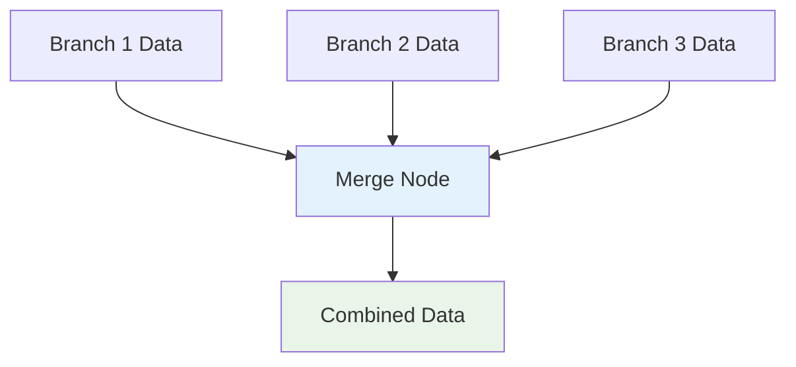
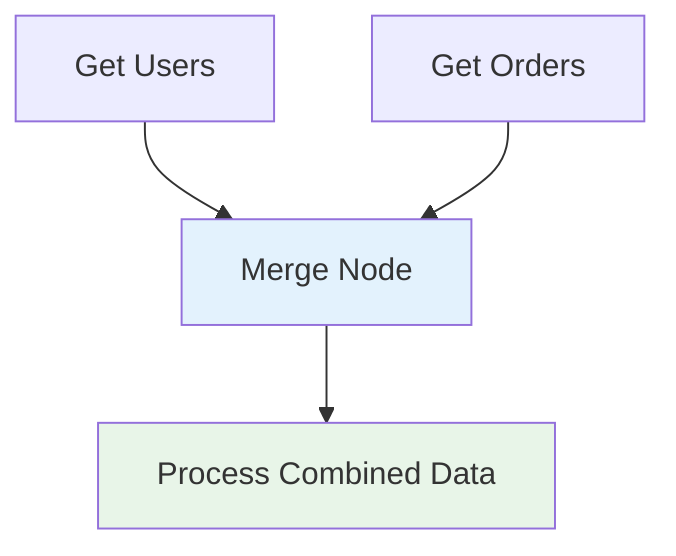
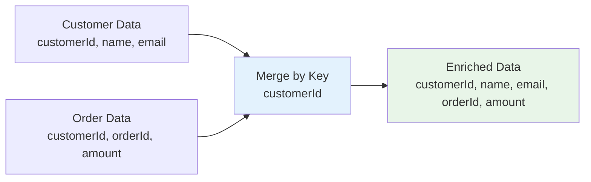
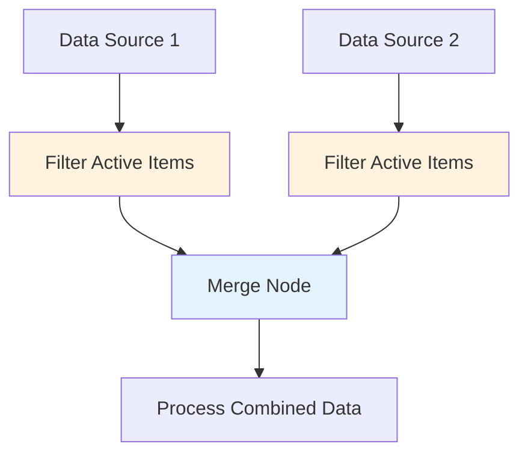

# The Merge Node - Combining Data Sources

## Overview

This guide covers the Merge node in n8n, which is essential for combining data from different branches of your workflow. Learn how to bring together data from multiple sources, merge arrays, and create unified datasets for further processing.

## Table of Contents

1. [Understanding the Merge Node](#understanding-the-merge-node)
2. [Merge Node Operations](#merge-node-operations)
3. [Data Combination Strategies](#data-combination-strategies)
4. [Practical Examples](#practical-examples)
5. [Advanced Techniques](#advanced-techniques)
6. [Best Practices](#best-practices)
7. [Common Use Cases](#common-use-cases)

## Understanding the Merge Node

### What is the Merge Node?

The Merge node combines data from multiple input branches into a single output. It's particularly useful when you have parallel workflow branches that need to be combined for further processing.

### How the Merge Node Works



### Key Features

- **Multiple Input Support**: Accepts data from up to 2 input branches
- **Flexible Merging**: Various merge modes for different data structures
- **Data Preservation**: Maintains data integrity during combination
- **Conditional Merging**: Merge based on specific criteria

## Merge Node Operations

### 1. **Append Mode (Default)**

Appends items from the second input to the first input.

#### Use Case:
- Combining lists of items
- Merging arrays from different sources
- Concatenating data streams

#### Example:
```javascript
// Input 1: [{"name": "John", "age": 30}]
// Input 2: [{"name": "Jane", "age": 25}]
// Output: [{"name": "John", "age": 30}, {"name": "Jane", "age": 25}]
```

### 2. **Merge by Index**

Merges items based on their position in the arrays.

#### Use Case:
- Combining related data by position
- Merging parallel data streams
- Synchronizing arrays

#### Example:
```javascript
// Input 1: [{"id": 1}, {"id": 2}]
// Input 2: [{"name": "John"}, {"name": "Jane"}]
// Output: [{"id": 1, "name": "John"}, {"id": 2, "name": "Jane"}]
```

### 3. **Merge by Key**

Merges items based on a common key field.

#### Use Case:
- Joining related records
- Combining user data with order data
- Merging datasets with common identifiers

#### Example:
```javascript
// Input 1: [{"userId": 1, "name": "John"}, {"userId": 2, "name": "Jane"}]
// Input 2: [{"userId": 1, "order": "ABC123"}, {"userId": 2, "order": "DEF456"}]
// Key: "userId"
// Output: [{"userId": 1, "name": "John", "order": "ABC123"}, {"userId": 2, "name": "Jane", "order": "DEF456"}]
```

### 4. **Merge by Position**

Merges items based on their position in the workflow.

#### Use Case:
- Combining data from different workflow branches
- Merging parallel processing results
- Synchronizing workflow outputs

## Data Combination Strategies

### 1. **Simple Data Merging**

#### Basic Merge Configuration:
```json
{
  "mode": "append",
  "options": {
    "keepOnlySet": false
  }
}
```

#### Example Workflow:


### 2. **Key-Based Merging**

#### Configuration:
```json
{
  "mode": "mergeByKey",
  "key1": "userId",
  "key2": "userId",
  "options": {
    "keepOnlySet": false,
    "overwrite": false
  }
}
```

#### Use Cases:
- User data with order history
- Product information with inventory
- Customer data with support tickets

### 3. **Index-Based Merging**

#### Configuration:
```json
{
  "mode": "mergeByIndex",
  "options": {
    "keepOnlySet": false
  }
}
```

#### Use Cases:
- Parallel data processing results
- Synchronized arrays
- Position-based data combination

## Practical Examples

### 1. **Customer Data Enrichment**

#### Workflow: Merge Customer and Order Data
```json
{
  "name": "Customer Data Enrichment",
  "nodes": [
    {
      "name": "Get Customer Data",
      "type": "n8n-nodes-base.httpRequest",
      "parameters": {
        "url": "https://api.example.com/customers"
      }
    },
    {
      "name": "Get Order Data",
      "type": "n8n-nodes-base.httpRequest",
      "parameters": {
        "url": "https://api.example.com/orders"
      }
    },
    {
      "name": "Merge Customer and Orders",
      "type": "n8n-nodes-base.merge",
      "parameters": {
        "mode": "mergeByKey",
        "key1": "customerId",
        "key2": "customerId",
        "options": {
          "keepOnlySet": false,
          "overwrite": false
        }
      }
    }
  ]
}
```

#### Data Flow:


### 2. **Product Catalog Combination**

#### Workflow: Merge Product Information
```json
{
  "name": "Product Catalog Merge",
  "nodes": [
    {
      "name": "Get Basic Products",
      "type": "n8n-nodes-base.httpRequest"
    },
    {
      "name": "Get Product Details",
      "type": "n8n-nodes-base.httpRequest"
    },
    {
      "name": "Merge Product Data",
      "type": "n8n-nodes-base.merge",
      "parameters": {
        "mode": "mergeByKey",
        "key1": "productId",
        "key2": "productId"
      }
    }
  ]
}
```

### 3. **Survey Response Aggregation**

#### Workflow: Combine Survey Data
```json
{
  "name": "Survey Response Aggregation",
  "nodes": [
    {
      "name": "Get Survey Responses",
      "type": "n8n-nodes-base.httpRequest"
    },
    {
      "name": "Get User Demographics",
      "type": "n8n-nodes-base.httpRequest"
    },
    {
      "name": "Merge Survey Data",
      "type": "n8n-nodes-base.merge",
      "parameters": {
        "mode": "mergeByKey",
        "key1": "userId",
        "key2": "userId"
      }
    }
  ]
}
```

### 4. **Multi-Source Data Integration**

#### Workflow: Combine Multiple Data Sources
```json
{
  "name": "Multi-Source Integration",
  "nodes": [
    {
      "name": "CRM Data",
      "type": "n8n-nodes-base.httpRequest"
    },
    {
      "name": "Marketing Data",
      "type": "n8n-nodes-base.httpRequest"
    },
    {
      "name": "Sales Data",
      "type": "n8n-nodes-base.httpRequest"
    },
    {
      "name": "Merge CRM and Marketing",
      "type": "n8n-nodes-base.merge",
      "parameters": {
        "mode": "mergeByKey",
        "key1": "contactId",
        "key2": "contactId"
      }
    },
    {
      "name": "Merge with Sales",
      "type": "n8n-nodes-base.merge",
      "parameters": {
        "mode": "mergeByKey",
        "key1": "contactId",
        "key2": "contactId"
      }
    }
  ]
}
```

## Advanced Techniques

### 1. **Conditional Merging**

#### Merge Based on Conditions:
```javascript
// Use IF node before merge to filter data
{
  "conditions": [
    {
      "leftValue": "{{$json.status}}",
      "operator": "equals",
      "rightValue": "active"
    }
  ]
}
```

#### Workflow Pattern:


### 2. **Data Transformation Before Merge**

#### Transform Data Structure:
```javascript
// Transform data before merging
{
  "values": {
    "string": [
      {
        "name": "normalizedId",
        "value": "{{$json.id.toString().toLowerCase()}}"
      },
      {
        "name": "formattedDate",
        "value": "{{new Date($json.createdAt).toISOString()}}"
      }
    ]
  }
}
```

### 3. **Error Handling in Merge Operations**

#### Handle Missing Data:
```javascript
// Check for required fields before merge
{
  "conditions": [
    {
      "leftValue": "{{$json.keyField}}",
      "operator": "exists"
    }
  ]
}
```

#### Fallback Values:
```javascript
// Provide fallback values
{
  "name": "safeKey",
  "value": "{{$json.keyField || $json.id || 'unknown'}}"
}
```

### 4. **Performance Optimization**

#### Batch Processing:
```javascript
// Process data in batches to avoid memory issues
{
  "batchSize": 100,
  "waitBetweenBatches": 1000
}
```

#### Data Filtering:
```javascript
// Filter data before merge to reduce processing
{
  "conditions": [
    {
      "leftValue": "{{$json.lastModified}}",
      "operator": "after",
      "rightValue": "{{$now.subtract(7, 'days')}}"
    }
  ]
}
```

## Best Practices

### 1. **Data Validation**

#### Validate Before Merge:
```javascript
// Ensure data quality before merging
{
  "validation": {
    "requiredFields": ["id", "name", "email"],
    "dataTypes": {
      "id": "number",
      "name": "string",
      "email": "string"
    }
  }
}
```

#### Handle Data Inconsistencies:
```javascript
// Standardize data formats
{
  "normalizedData": {
    "id": "{{parseInt($json.id)}}",
    "name": "{{$json.name.trim().toLowerCase()}}",
    "email": "{{$json.email.toLowerCase()}}"
  }
}
```

### 2. **Key Selection**

#### Choose Appropriate Keys:
```javascript
// Use stable, unique identifiers
{
  "primaryKey": "{{$json.id}}",           // Best choice
  "secondaryKey": "{{$json.email}}",      // Good alternative
  "avoidKey": "{{$json.name}}",           // Avoid - not unique
  "avoidKey2": "{{$json.timestamp}}"      // Avoid - changes frequently
}
```

#### Handle Key Conflicts:
```javascript
// Resolve key conflicts
{
  "conflictResolution": {
    "strategy": "overwrite", // or "keep_first", "keep_last"
    "logConflicts": true
  }
}
```

### 3. **Memory Management**

#### Process Large Datasets:
```javascript
// Use streaming for large datasets
{
  "streaming": true,
  "chunkSize": 1000,
  "maxMemoryUsage": "512MB"
}
```

#### Clean Up After Merge:
```javascript
// Remove unnecessary data after merge
{
  "cleanup": {
    "removeFields": ["tempId", "processedFlag"],
    "compressData": true
  }
}
```

### 4. **Error Handling**

#### Handle Merge Failures:
```javascript
// Implement fallback strategies
{
  "errorHandling": {
    "onMergeFailure": "continue_with_partial_data",
    "logErrors": true,
    "retryAttempts": 3
  }
}
```

#### Data Quality Checks:
```javascript
// Validate merged data
{
  "postMergeValidation": {
    "checkRequiredFields": true,
    "validateDataTypes": true,
    "checkForDuplicates": true
  }
}
```

## Common Use Cases

### 1. **Customer 360 View**

#### Combine Customer Data:
```javascript
{
  "sources": [
    "CRM system - basic customer info",
    "Marketing platform - engagement data",
    "Support system - ticket history",
    "Sales system - purchase history"
  ],
  "mergeKey": "customerId",
  "output": "Complete customer profile"
}
```

### 2. **Product Information Aggregation**

#### Merge Product Data:
```javascript
{
  "sources": [
    "Product catalog - basic info",
    "Inventory system - stock levels",
    "Pricing system - current prices",
    "Reviews system - ratings and reviews"
  ],
  "mergeKey": "productId",
  "output": "Complete product information"
}
```

### 3. **Employee Data Integration**

#### Combine HR Data:
```javascript
{
  "sources": [
    "HRIS - employee basic info",
    "Payroll - salary and benefits",
    "Performance - reviews and goals",
    "Training - completed courses"
  ],
  "mergeKey": "employeeId",
  "output": "Complete employee profile"
}
```

### 4. **Financial Data Consolidation**

#### Merge Financial Records:
```javascript
{
  "sources": [
    "Accounting system - transactions",
    "Banking - account balances",
    "Invoicing - customer invoices",
    "Expenses - cost tracking"
  ],
  "mergeKey": "accountId",
  "output": "Consolidated financial view"
}
```

### 5. **Analytics Data Combination**

#### Merge Analytics Sources:
```javascript
{
  "sources": [
    "Google Analytics - web traffic",
    "Social media - engagement metrics",
    "Email marketing - campaign performance",
    "CRM - lead conversion data"
  ],
  "mergeKey": "date",
  "output": "Unified analytics dashboard"
}
```

## Troubleshooting

### Common Issues

#### 1. **Data Not Merging**

**Symptoms:**
- Merge node outputs empty results
- Data from one branch missing

**Solutions:**
- Check key field names match exactly
- Verify data types are compatible
- Ensure both inputs have data
- Check for null or undefined values

#### 2. **Duplicate Records**

**Symptoms:**
- Same record appears multiple times
- Data integrity issues

**Solutions:**
- Use unique keys for merging
- Implement deduplication logic
- Check for data inconsistencies
- Validate key field uniqueness

#### 3. **Performance Issues**

**Symptoms:**
- Slow merge operations
- Memory usage problems

**Solutions:**
- Process data in smaller batches
- Filter data before merging
- Use appropriate merge modes
- Optimize data structures

#### 4. **Data Type Mismatches**

**Symptoms:**
- Merge failures
- Unexpected data formats

**Solutions:**
- Standardize data types before merge
- Use data transformation nodes
- Implement type validation
- Handle type conversions

## Conclusion

The Merge node is a powerful tool for combining data from multiple sources in n8n workflows. By understanding its different modes and best practices, you can:

- **Combine related data** from multiple sources effectively
- **Create unified datasets** for comprehensive analysis
- **Build robust data pipelines** with proper error handling
- **Optimize performance** for large-scale data operations
- **Maintain data integrity** throughout the merge process

### Key Takeaways

1. **Choose the right merge mode** for your data structure
2. **Use appropriate keys** for reliable data matching
3. **Validate data quality** before and after merging
4. **Handle errors gracefully** with fallback strategies
5. **Optimize for performance** with batching and filtering
6. **Document merge logic** for maintainability
7. **Test thoroughly** with various data scenarios

### Next Steps

1. **Practice with simple merges** to understand the basics
2. **Experiment with different merge modes** for various use cases
3. **Build complex data pipelines** using merge operations
4. **Learn about data transformation** techniques
5. **Explore advanced patterns** like conditional merging
6. **Study performance optimization** strategies

The Merge node opens up possibilities for creating sophisticated data integration workflows that can handle complex business requirements and provide unified views of information from multiple sources.
