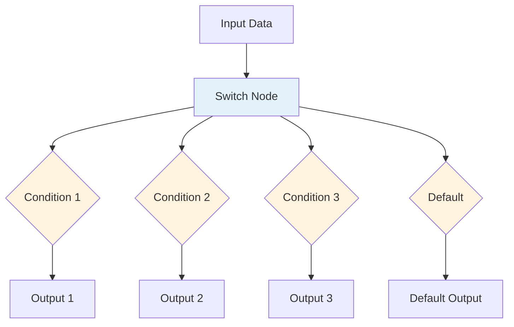
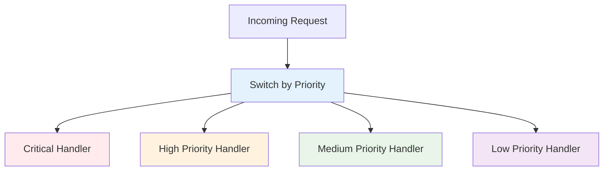
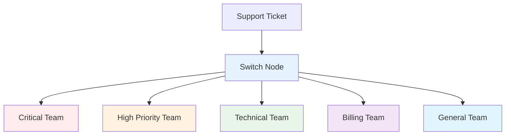

# The Switch Node - Handling Multiple Conditions

## Overview

This comprehensive guide covers the Switch node in n8n, which provides a more advanced way to route data based on different values compared to the IF node. Learn how to handle multiple conditions efficiently and create complex routing logic for your workflows.

## Table of Contents

1. [Understanding the Switch Node](#understanding-the-switch-node)
2. [Switch Node Configuration](#switch-node-configuration)
3. [Routing Strategies](#routing-strategies)
4. [Advanced Techniques](#advanced-techniques)
5. [Practical Examples](#practical-examples)
6. [Best Practices](#best-practices)
7. [Common Use Cases](#common-use-cases)

## Understanding the Switch Node

### What is the Switch Node?

The Switch node is a conditional routing node that evaluates input data against multiple conditions and routes the data to different outputs based on which condition matches. It's more efficient than multiple IF nodes for handling many conditions.

### Switch vs IF Node

| Feature | IF Node | Switch Node |
|---------|---------|-------------|
| **Outputs** | 2 (True/False) | Multiple (based on conditions) |
| **Conditions** | 1 per node | Multiple per node |
| **Performance** | Good for simple logic | Better for complex routing |
| **Readability** | Simple conditions | Complex routing scenarios |
| **Use Case** | Binary decisions | Multi-way routing |

### How the Switch Node Works



### Key Features

- **Multiple Outputs**: Route data to different branches based on conditions
- **Efficient Evaluation**: Evaluate multiple conditions in a single node
- **Default Route**: Handle unmatched cases with a default output
- **Flexible Conditions**: Support various data types and operators
- **Performance**: More efficient than multiple IF nodes

## Switch Node Configuration

### 1. **Basic Switch Configuration**

#### Configuration Structure:
```json
{
  "mode": "expression",
  "value": "{{$json.field}}",
  "rules": [
    {
      "outputIndex": 0,
      "conditions": {
        "options": {
          "caseSensitive": true,
          "leftValue": "",
          "typeValidation": "strict"
        },
        "conditions": [
          {
            "leftValue": "={{$json.field}}",
            "rightValue": "value1",
            "operator": {
              "type": "string",
              "operation": "equals"
            }
          }
        ]
      }
    }
  ]
}
```

### 2. **Switch Modes**

#### Expression Mode:
```javascript
// Evaluate an expression and route based on result
{
  "mode": "expression",
  "value": "{{$json.priority}}",
  "rules": [
    {
      "outputIndex": 0,
      "value": "high"
    },
    {
      "outputIndex": 1,
      "value": "medium"
    },
    {
      "outputIndex": 2,
      "value": "low"
    }
  ]
}
```

#### Rules Mode:
```javascript
// Define custom rules for routing
{
  "mode": "rules",
  "rules": [
    {
      "outputIndex": 0,
      "conditions": {
        "conditions": [
          {
            "leftValue": "={{$json.status}}",
            "operator": "equals",
            "rightValue": "active"
          }
        ]
      }
    }
  ]
}
```

### 3. **Condition Types**

#### String Conditions:
```javascript
{
  "conditions": [
    {
      "leftValue": "={{$json.category}}",
      "operator": "equals",
      "rightValue": "electronics"
    },
    {
      "leftValue": "={{$json.name}}",
      "operator": "contains",
      "rightValue": "urgent"
    },
    {
      "leftValue": "={{$json.email}}",
      "operator": "regex",
      "rightValue": "^[^\\s@]+@[^\\s@]+\\.[^\\s@]+$"
    }
  ]
}
```

#### Number Conditions:
```javascript
{
  "conditions": [
    {
      "leftValue": "={{parseInt($json.price)}}",
      "operator": "gte",
      "rightValue": "100"
    },
    {
      "leftValue": "={{parseInt($json.quantity)}}",
      "operator": "between",
      "rightValue": "1,10"
    }
  ]
}
```

#### Boolean Conditions:
```javascript
{
  "conditions": [
    {
      "leftValue": "={{$json.isActive}}",
      "operator": "equal",
      "rightValue": "true"
    }
  ]
}
```

## Routing Strategies

### 1. **Priority-Based Routing**

#### Route by Priority Level:
```javascript
{
  "mode": "expression",
  "value": "={{$json.priority}}",
  "rules": [
    {
      "outputIndex": 0,
      "value": "critical"
    },
    {
      "outputIndex": 1,
      "value": "high"
    },
    {
      "outputIndex": 2,
      "value": "medium"
    },
    {
      "outputIndex": 3,
      "value": "low"
    }
  ],
  "fallbackOutput": 3
}
```

#### Workflow Example:


### 2. **Category-Based Routing**

#### Route by Product Category:
```javascript
{
  "mode": "expression",
  "value": "={{$json.category}}",
  "rules": [
    {
      "outputIndex": 0,
      "value": "electronics"
    },
    {
      "outputIndex": 1,
      "value": "clothing"
    },
    {
      "outputIndex": 2,
      "value": "books"
    },
    {
      "outputIndex": 3,
      "value": "home"
    }
  ],
  "fallbackOutput": 4 // Default category handler
}
```

### 3. **Status-Based Routing**

#### Route by Order Status:
```javascript
{
  "mode": "rules",
  "rules": [
    {
      "outputIndex": 0,
      "conditions": {
        "conditions": [
          {
            "leftValue": "={{$json.status}}",
            "operator": "equals",
            "rightValue": "pending"
          }
        ]
      }
    },
    {
      "outputIndex": 1,
      "conditions": {
        "conditions": [
          {
            "leftValue": "={{$json.status}}",
            "operator": "equals",
            "rightValue": "processing"
          }
        ]
      }
    },
    {
      "outputIndex": 2,
      "conditions": {
        "conditions": [
          {
            "leftValue": "={{$json.status}}",
            "operator": "equals",
            "rightValue": "shipped"
          }
        ]
      }
    },
    {
      "outputIndex": 3,
      "conditions": {
        "conditions": [
          {
            "leftValue": "={{$json.status}}",
            "operator": "equals",
            "rightValue": "delivered"
          }
        ]
      }
    }
  ]
}
```

### 4. **Complex Condition Routing**

#### Multi-Field Routing:
```javascript
{
  "mode": "rules",
  "rules": [
    {
      "outputIndex": 0,
      "conditions": {
        "conditions": [
          {
            "leftValue": "={{$json.customerType}}",
            "operator": "equals",
            "rightValue": "premium"
          },
          {
            "leftValue": "={{parseInt($json.orderValue)}}",
            "operator": "gte",
            "rightValue": "100"
          }
        ],
        "combinator": "and"
      }
    },
    {
      "outputIndex": 1,
      "conditions": {
        "conditions": [
          {
            "leftValue": "={{$json.customerType}}",
            "operator": "equals",
            "rightValue": "standard"
          },
          {
            "leftValue": "={{parseInt($json.orderValue)}}",
            "operator": "gte",
            "rightValue": "50"
          }
        ],
        "combinator": "and"
      }
    }
  ]
}
```

## Advanced Techniques

### 1. **Dynamic Routing**

#### Route Based on Calculated Values:
```javascript
{
  "mode": "expression",
  "value": "={{Math.floor($json.score / 20)}}",
  "rules": [
    {
      "outputIndex": 0,
      "value": "0"
    },
    {
      "outputIndex": 1,
      "value": "1"
    },
    {
      "outputIndex": 2,
      "value": "2"
    },
    {
      "outputIndex": 3,
      "value": "3"
    },
    {
      "outputIndex": 4,
      "value": "4"
    }
  ]
}
```

#### Route by Date Ranges:
```javascript
{
  "mode": "rules",
  "rules": [
    {
      "outputIndex": 0,
      "conditions": {
        "conditions": [
          {
            "leftValue": "={{$json.createdAt}}",
            "operator": "after",
            "rightValue": "={{$now.subtract(1, 'day')}}"
          }
        ]
      }
    },
    {
      "outputIndex": 1,
      "conditions": {
        "conditions": [
          {
            "leftValue": "={{$json.createdAt}}",
            "operator": "between",
            "rightValue": "={{$now.subtract(7, 'days')}},{{$now.subtract(1, 'day')}}"
          }
        ]
      }
    },
    {
      "outputIndex": 2,
      "conditions": {
        "conditions": [
          {
            "leftValue": "={{$json.createdAt}}",
            "operator": "before",
            "rightValue": "={{$now.subtract(7, 'days')}}"
          }
        ]
      }
    }
  ]
}
```

### 2. **Conditional Aggregation**

#### Route for Different Processing:
```javascript
{
  "mode": "rules",
  "rules": [
    {
      "outputIndex": 0,
      "conditions": {
        "conditions": [
          {
            "leftValue": "={{$json.itemCount}}",
            "operator": "gte",
            "rightValue": "100"
          }
        ]
      }
    },
    {
      "outputIndex": 1,
      "conditions": {
        "conditions": [
          {
            "leftValue": "={{$json.itemCount}}",
            "operator": "between",
            "rightValue": "10,99"
          }
        ]
      }
    },
    {
      "outputIndex": 2,
      "conditions": {
        "conditions": [
          {
            "leftValue": "={{$json.itemCount}}",
            "operator": "lt",
            "rightValue": "10"
          }
        ]
      }
    }
  ]
}
```

### 3. **Error Handling with Switch**

#### Route Errors to Different Handlers:
```javascript
{
  "mode": "expression",
  "value": "={{$json.errorType}}",
  "rules": [
    {
      "outputIndex": 0,
      "value": "validation"
    },
    {
      "outputIndex": 1,
      "value": "network"
    },
    {
      "outputIndex": 2,
      "value": "authentication"
    },
    {
      "outputIndex": 3,
      "value": "server"
    }
  ],
  "fallbackOutput": 4 // Unknown error handler
}
```

## Practical Examples

### 1. **Customer Support Ticket Routing**

#### Workflow: Route Tickets by Priority and Category
```json
{
  "name": "Support Ticket Routing",
  "nodes": [
    {
      "name": "Ticket Trigger",
      "type": "n8n-nodes-base.webhook"
    },
    {
      "name": "Route by Priority and Category",
      "type": "n8n-nodes-base.switch",
      "parameters": {
        "mode": "rules",
        "rules": [
          {
            "outputIndex": 0,
            "conditions": {
              "conditions": [
                {
                  "leftValue": "={{$json.priority}}",
                  "operator": "equals",
                  "rightValue": "critical"
                }
              ]
            }
          },
          {
            "outputIndex": 1,
            "conditions": {
              "conditions": [
                {
                  "leftValue": "={{$json.priority}}",
                  "operator": "equals",
                  "rightValue": "high"
                }
              ]
            }
          },
          {
            "outputIndex": 2,
            "conditions": {
              "conditions": [
                {
                  "leftValue": "={{$json.category}}",
                  "operator": "equals",
                  "rightValue": "technical"
                }
              ]
            }
          },
          {
            "outputIndex": 3,
            "conditions": {
              "conditions": [
                {
                  "leftValue": "={{$json.category}}",
                  "operator": "equals",
                  "rightValue": "billing"
                }
              ]
            }
          }
        ]
      }
    },
    {
      "name": "Critical Support Team",
      "type": "n8n-nodes-base.slack"
    },
    {
      "name": "High Priority Support",
      "type": "n8n-nodes-base.slack"
    },
    {
      "name": "Technical Support",
      "type": "n8n-nodes-base.slack"
    },
    {
      "name": "Billing Support",
      "type": "n8n-nodes-base.slack"
    },
    {
      "name": "General Support",
      "type": "n8n-nodes-base.slack"
    }
  ]
}
```

#### Workflow Flow:


### 2. **E-commerce Order Processing**

#### Workflow: Route Orders by Value and Customer Type
```json
{
  "name": "Order Processing Router",
  "nodes": [
    {
      "name": "Order Trigger",
      "type": "n8n-nodes-base.webhook"
    },
    {
      "name": "Route Orders",
      "type": "n8n-nodes-base.switch",
      "parameters": {
        "mode": "rules",
        "rules": [
          {
            "outputIndex": 0,
            "conditions": {
              "conditions": [
                {
                  "leftValue": "={{$json.customerType}}",
                  "operator": "equals",
                  "rightValue": "vip"
                },
                {
                  "leftValue": "={{parseInt($json.orderValue)}}",
                  "operator": "gte",
                  "rightValue": "1000"
                }
              ],
              "combinator": "and"
            }
          },
          {
            "outputIndex": 1,
            "conditions": {
              "conditions": [
                {
                  "leftValue": "={{$json.customerType}}",
                  "operator": "equals",
                  "rightValue": "premium"
                },
                {
                  "leftValue": "={{parseInt($json.orderValue)}}",
                  "operator": "gte",
                  "rightValue": "500"
                }
              ],
              "combinator": "and"
            }
          },
          {
            "outputIndex": 2,
            "conditions": {
              "conditions": [
                {
                  "leftValue": "={{parseInt($json.orderValue)}}",
                  "operator": "gte",
                  "rightValue": "100"
                }
              ]
            }
          }
        ]
      }
    },
    {
      "name": "VIP Processing",
      "type": "n8n-nodes-base.set"
    },
    {
      "name": "Premium Processing",
      "type": "n8n-nodes-base.set"
    },
    {
      "name": "Standard Processing",
      "type": "n8n-nodes-base.set"
    },
    {
      "name": "Basic Processing",
      "type": "n8n-nodes-base.set"
    }
  ]
}
```

### 3. **Content Moderation System**

#### Workflow: Route Content by Type and Risk Level
```json
{
  "name": "Content Moderation Router",
  "nodes": [
    {
      "name": "Content Submission",
      "type": "n8n-nodes-base.webhook"
    },
    {
      "name": "Route Content",
      "type": "n8n-nodes-base.switch",
      "parameters": {
        "mode": "rules",
        "rules": [
          {
            "outputIndex": 0,
            "conditions": {
              "conditions": [
                {
                  "leftValue": "={{$json.riskLevel}}",
                  "operator": "equals",
                  "rightValue": "high"
                }
              ]
            }
          },
          {
            "outputIndex": 1,
            "conditions": {
              "conditions": [
                {
                  "leftValue": "={{$json.contentType}}",
                  "operator": "equals",
                  "rightValue": "image"
                }
              ]
            }
          },
          {
            "outputIndex": 2,
            "conditions": {
              "conditions": [
                {
                  "leftValue": "={{$json.contentType}}",
                  "operator": "equals",
                  "rightValue": "video"
                }
              ]
            }
          },
          {
            "outputIndex": 3,
            "conditions": {
              "conditions": [
                {
                  "leftValue": "={{$json.contentType}}",
                  "operator": "equals",
                  "rightValue": "text"
                }
              ]
            }
          }
        ]
      }
    },
    {
      "name": "High Risk Review",
      "type": "n8n-nodes-base.slack"
    },
    {
      "name": "Image Moderation",
      "type": "n8n-nodes-base.httpRequest"
    },
    {
      "name": "Video Moderation",
      "type": "n8n-nodes-base.httpRequest"
    },
    {
      "name": "Text Moderation",
      "type": "n8n-nodes-base.httpRequest"
    }
  ]
}
```

### 4. **User Onboarding Flow**

#### Workflow: Route Users by Registration Source
```json
{
  "name": "User Onboarding Router",
  "nodes": [
    {
      "name": "User Registration",
      "type": "n8n-nodes-base.webhook"
    },
    {
      "name": "Route by Source",
      "type": "n8n-nodes-base.switch",
      "parameters": {
        "mode": "expression",
        "value": "={{$json.registrationSource}}",
        "rules": [
          {
            "outputIndex": 0,
            "value": "google"
          },
          {
            "outputIndex": 1,
            "value": "facebook"
          },
          {
            "outputIndex": 2,
            "value": "linkedin"
          },
          {
            "outputIndex": 3,
            "value": "email"
          },
          {
            "outputIndex": 4,
            "value": "referral"
          }
        ],
        "fallbackOutput": 5
      }
    },
    {
      "name": "Google Onboarding",
      "type": "n8n-nodes-base.set"
    },
    {
      "name": "Facebook Onboarding",
      "type": "n8n-nodes-base.set"
    },
    {
      "name": "LinkedIn Onboarding",
      "type": "n8n-nodes-base.set"
    },
    {
      "name": "Email Onboarding",
      "type": "n8n-nodes-base.set"
    },
    {
      "name": "Referral Onboarding",
      "type": "n8n-nodes-base.set"
    },
    {
      "name": "Default Onboarding",
      "type": "n8n-nodes-base.set"
    }
  ]
}
```

## Best Practices

### 1. **Condition Ordering**

#### Order by Specificity:
```javascript
// Most specific conditions first
{
  "rules": [
    {
      "outputIndex": 0,
      "conditions": {
        "conditions": [
          {
            "leftValue": "={{$json.priority}}",
            "operator": "equals",
            "rightValue": "critical"
          },
          {
            "leftValue": "={{$json.category}}",
            "operator": "equals",
            "rightValue": "security"
          }
        ],
        "combinator": "and"
      }
    },
    {
      "outputIndex": 1,
      "conditions": {
        "conditions": [
          {
            "leftValue": "={{$json.priority}}",
            "operator": "equals",
            "rightValue": "critical"
          }
        ]
      }
    }
  ]
}
```

### 2. **Performance Optimization**

#### Use Expression Mode for Simple Values:
```javascript
// More efficient for simple string/number matching
{
  "mode": "expression",
  "value": "={{$json.status}}",
  "rules": [
    {
      "outputIndex": 0,
      "value": "active"
    },
    {
      "outputIndex": 1,
      "value": "inactive"
    }
  ]
}
```

#### Use Rules Mode for Complex Logic:
```javascript
// Better for complex conditions
{
  "mode": "rules",
  "rules": [
    {
      "outputIndex": 0,
      "conditions": {
        "conditions": [
          {
            "leftValue": "={{$json.score}}",
            "operator": "gte",
            "rightValue": "80"
          },
          {
            "leftValue": "={{$json.completedTasks}}",
            "operator": "gte",
            "rightValue": "10"
          }
        ],
        "combinator": "and"
      }
    }
  ]
}
```

### 3. **Error Handling**

#### Always Provide Fallback:
```javascript
{
  "rules": [
    // ... your rules
  ],
  "fallbackOutput": "default_output_index"
}
```

#### Validate Input Data:
```javascript
// Add validation before switch node
{
  "name": "Validate Data",
  "type": "n8n-nodes-base.if",
  "parameters": {
    "conditions": {
      "conditions": [
        {
          "leftValue": "={{$json.routingField}}",
          "operator": "exists"
        }
      ]
    }
  }
}
```

### 4. **Documentation**

#### Clear Node Names:
```javascript
// Good: Descriptive names
"Route Orders by Customer Type and Value"
"Switch Based on Priority Level"
"Content Type Router"

// Bad: Generic names
"Switch Node"
"Router"
"Condition Check"
```

#### Document Complex Logic:
```javascript
// Add comments for complex routing logic
{
  "comment": "Route orders based on customer tier and order value thresholds",
  "rules": [
    {
      "comment": "VIP customers with orders over $1000 get premium processing",
      "outputIndex": 0,
      "conditions": {
        // ... conditions
      }
    }
  ]
}
```

## Common Use Cases

### 1. **Workflow Orchestration**

#### Route by Process Type:
```javascript
{
  "mode": "expression",
  "value": "={{$json.processType}}",
  "rules": [
    {
      "outputIndex": 0,
      "value": "data_processing"
    },
    {
      "outputIndex": 1,
      "value": "file_conversion"
    },
    {
      "outputIndex": 2,
      "value": "notification"
    },
    {
      "outputIndex": 3,
      "value": "report_generation"
    }
  ]
}
```

### 2. **API Gateway Routing**

#### Route by Endpoint:
```javascript
{
  "mode": "expression",
  "value": "={{$json.endpoint}}",
  "rules": [
    {
      "outputIndex": 0,
      "value": "/api/users"
    },
    {
      "outputIndex": 1,
      "value": "/api/orders"
    },
    {
      "outputIndex": 2,
      "value": "/api/products"
    }
  ]
}
```

### 3. **Data Pipeline Routing**

#### Route by Data Source:
```javascript
{
  "mode": "expression",
  "value": "={{$json.source}}",
  "rules": [
    {
      "outputIndex": 0,
      "value": "database"
    },
    {
      "outputIndex": 1,
      "value": "api"
    },
    {
      "outputIndex": 2,
      "value": "file"
    },
    {
      "outputIndex": 3,
      "value": "stream"
    }
  ]
}
```

### 4. **Alert Routing**

#### Route by Severity:
```javascript
{
  "mode": "rules",
  "rules": [
    {
      "outputIndex": 0,
      "conditions": {
        "conditions": [
          {
            "leftValue": "={{$json.severity}}",
            "operator": "equals",
            "rightValue": "critical"
          }
        ]
      }
    },
    {
      "outputIndex": 1,
      "conditions": {
        "conditions": [
          {
            "leftValue": "={{$json.severity}}",
            "operator": "equals",
            "rightValue": "warning"
          }
        ]
      }
    },
    {
      "outputIndex": 2,
      "conditions": {
        "conditions": [
          {
            "leftValue": "={{$json.severity}}",
            "operator": "equals",
            "rightValue": "info"
          }
        ]
      }
    }
  ]
}
```

## Troubleshooting

### Common Issues

#### 1. **No Data Reaching Outputs**

**Symptoms:**
- Switch node processes but no outputs receive data
- Data appears to be lost

**Solutions:**
- Check condition logic carefully
- Verify data types match expected values
- Ensure fallback output is configured
- Test with sample data

#### 2. **Unexpected Routing**

**Symptoms:**
- Data goes to wrong output
- Conditions not matching as expected

**Solutions:**
- Review condition order (most specific first)
- Check data format and types
- Validate condition syntax
- Test individual conditions

#### 3. **Performance Issues**

**Symptoms:**
- Slow switch evaluation
- Workflow timeouts

**Solutions:**
- Use expression mode for simple matching
- Optimize condition complexity
- Consider data filtering before switch
- Review workflow design

#### 4. **Data Type Mismatches**

**Symptoms:**
- Conditions not matching
- Unexpected routing behavior

**Solutions:**
- Ensure consistent data types
- Use type conversion if needed
- Validate input data format
- Test with various data samples

## Conclusion

The Switch node is a powerful tool for creating sophisticated routing logic in n8n workflows. By understanding its different modes and best practices, you can:

- **Route data efficiently** based on multiple conditions
- **Create complex workflows** with multiple processing paths
- **Optimize performance** compared to multiple IF nodes
- **Handle various scenarios** with flexible routing logic
- **Build maintainable workflows** with clear routing structure

### Key Takeaways

1. **Choose the right mode** (expression vs rules) for your use case
2. **Order conditions by specificity** for accurate routing
3. **Always provide fallback outputs** for unmatched cases
4. **Document complex routing logic** for maintainability
5. **Test thoroughly** with various data scenarios
6. **Optimize for performance** with appropriate mode selection
7. **Validate input data** before routing

### Next Steps

1. **Practice with simple switches** to understand the basics
2. **Experiment with different modes** for various scenarios
3. **Build complex routing workflows** using switch nodes
4. **Learn about performance optimization** techniques
5. **Explore advanced patterns** like dynamic routing
6. **Study error handling** strategies for switch nodes

The Switch node enables you to create sophisticated, multi-path workflows that can handle complex business logic and routing requirements efficiently.
