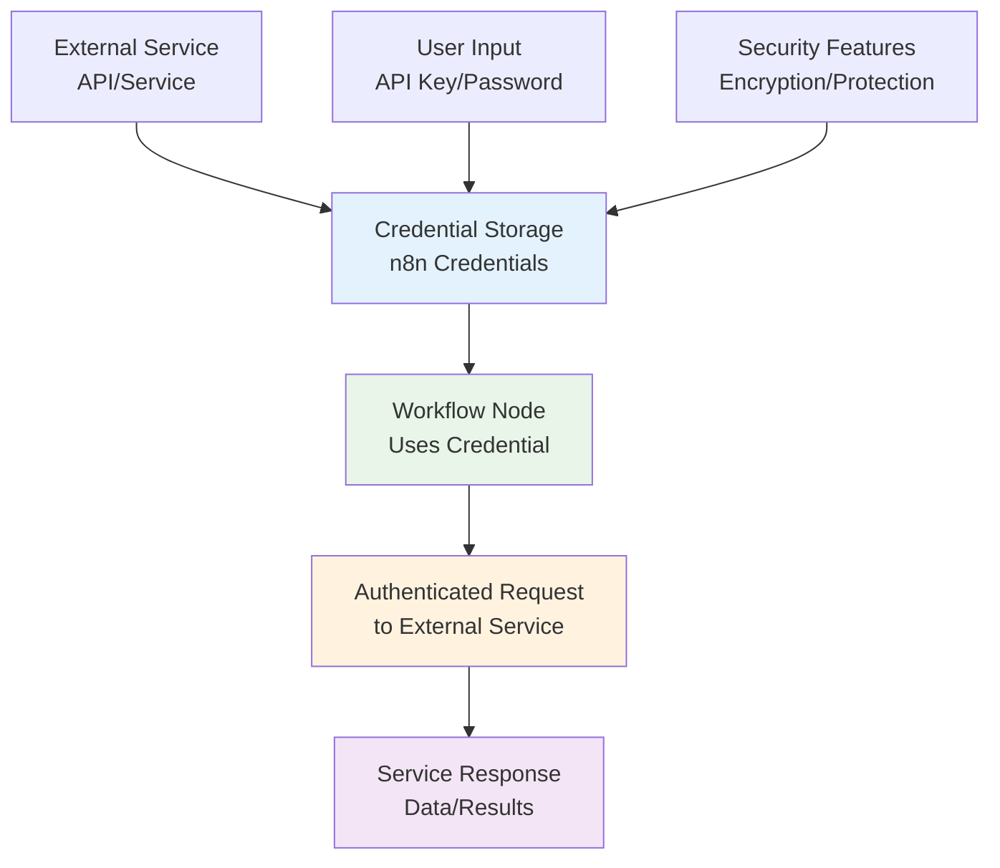
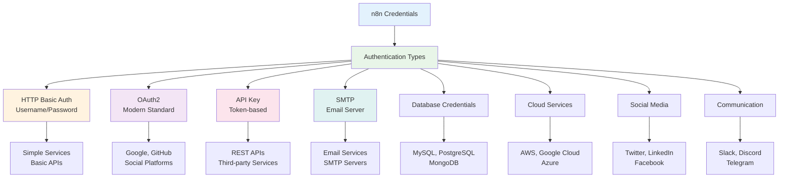

# Understanding Credentials in n8n

## What are Credentials and Why are They Important?

**Credentials** in n8n are secure storage mechanisms that allow you to safely store and manage authentication information for third-party services. They act as a secure vault for sensitive data like API keys, passwords, tokens, and other authentication details that your workflows need to interact with external services.

### Credential Management Flow



### Why Credentials Matter:

1. **Security**: Credentials are encrypted and stored securely, preventing exposure of sensitive information in your workflow definitions
2. **Reusability**: Once created, credentials can be used across multiple workflows and nodes
3. **Centralized Management**: All authentication information is managed in one place
4. **Version Control Safety**: Workflow files don't contain sensitive data, making them safe to share and version control
5. **Easy Updates**: Change credentials once, and all workflows using them are automatically updated

## Types of Credentials in n8n

n8n supports various credential types for different services:

### Credential Types Overview



### Common Credential Types:
- **HTTP Basic Auth**: Username/password authentication
- **OAuth2**: Modern authentication standard used by Google, GitHub, etc.
- **API Key**: Simple token-based authentication
- **SMTP**: Email server authentication
- **Database**: MySQL, PostgreSQL, MongoDB connections
- **Cloud Services**: AWS, Google Cloud, Azure credentials
- **Social Media**: Twitter, LinkedIn, Facebook APIs
- **Communication**: Slack, Discord, Telegram bots

## How to Securely Add Credentials

### Step 1: Access Credentials Management

1. In your n8n instance, click on **"Credentials"** in the left sidebar
2. Click **"Create New Credential"**
3. Select the service you want to authenticate with

### Step 2: Configure Your Credential

#### For API Key Authentication:
```
Credential Name: "My Service API"
API Key: [paste your API key here]
Base URL: https://api.myservice.com (if applicable)
```

#### For OAuth2 Authentication:
```
Credential Name: "Google Drive OAuth2"
Client ID: [your OAuth2 client ID]
Client Secret: [your OAuth2 client secret]
Scope: [required permissions]
```

#### For SMTP Authentication:
```
Credential Name: "Company Email SMTP"
Host: smtp.company.com
Port: 587
Username: your-email@company.com
Password: [your email password]
Security: TLS
```

### Step 3: Test Your Credential

1. Click **"Test"** to verify the credential works
2. If successful, click **"Save"**
3. Your credential is now available for use in workflows

## Best Practices for Credential Security

### 1. Use Strong, Unique Credentials
- Generate strong passwords and API keys
- Use different credentials for different environments (dev, staging, production)
- Regularly rotate your credentials

### 2. Principle of Least Privilege
- Only grant the minimum permissions necessary
- Use specific OAuth2 scopes rather than broad permissions
- Regularly audit which workflows use which credentials

### 3. Environment Separation
- Use separate credentials for development and production
- Never use production credentials in development workflows
- Consider using different n8n instances for different environments

### 4. Monitoring and Auditing
- Regularly review which workflows are using which credentials
- Monitor for unusual authentication patterns
- Set up alerts for failed authentication attempts

### 5. Backup and Recovery
- Keep secure backups of your credential configurations
- Document which services require which credentials
- Have a recovery plan for credential rotation

## Using Credentials in Workflows

### Adding Credentials to Nodes:

1. **Select a Node**: Click on any node that requires authentication
2. **Choose Credential**: In the node's parameters, select your pre-configured credential
3. **Test**: The node will automatically use the credential for authentication

### Example Workflow Structure:
```
Webhook Trigger → HTTP Request (with API credentials) → Email Send (with SMTP credentials) → Google Sheets (with OAuth2 credentials)
```

## Demo Workflow: Credentials Test

The included `credentials-demo-workflow.json` demonstrates:

### Workflow Components:
1. **Webhook Trigger**: Starts the workflow
2. **SMTP Email**: Sends a test email using SMTP credentials
3. **GitHub API**: Makes an authenticated API call using HTTP Basic Auth
4. **Google Sheets**: Creates a spreadsheet using OAuth2 credentials
5. **Success/Error Handling**: Checks if all credentials work correctly

### Required Credentials:
Before running this workflow, you'll need to create these credentials in n8n:

1. **SMTP Credentials**:
   - Name: "SMTP Credentials"
   - Type: SMTP
   - Configure with your email server details

2. **GitHub API Credentials**:
   - Name: "GitHub API Credentials"
   - Type: HTTP Basic Auth
   - Username: Your GitHub username
   - Password: Your GitHub personal access token

3. **Google OAuth2 Credentials**:
   - Name: "Google OAuth2 Credentials"
   - Type: Google OAuth2 API
   - Configure with your Google Cloud project credentials

### Running the Demo:
1. Import the workflow JSON file
2. Create the required credentials
3. Update the credential references in the workflow nodes
4. Activate the workflow
5. Trigger via webhook or manually execute

## Troubleshooting Credentials

### Common Issues:

#### "Invalid Credentials" Error:
- Verify your username/password or API key
- Check if the credential has expired
- Ensure you're using the correct credential type

#### "Access Denied" Error:
- Verify the credential has the necessary permissions
- Check OAuth2 scopes for the required access
- Ensure the service account has proper roles

#### "Connection Timeout" Error:
- Verify the service endpoint URL
- Check network connectivity
- Ensure firewall allows the connection

### Testing Individual Credentials:
1. Go to Credentials → Select your credential
2. Click "Test" to verify it works
3. Check the response for any error messages
4. Update the credential if needed

## Security Checklist

Before deploying workflows with credentials:

- [ ] All credentials are properly configured and tested
- [ ] Credentials use strong, unique values
- [ ] Principle of least privilege is applied
- [ ] Production and development credentials are separated
- [ ] Credential access is documented
- [ ] Regular credential rotation is planned
- [ ] Monitoring is set up for authentication failures
- [ ] Backup and recovery procedures are in place

## Conclusion

Credentials are the foundation of secure automation in n8n. By properly managing credentials, you can:

- Keep sensitive information secure
- Build reliable, reusable workflows
- Maintain compliance with security best practices
- Scale your automation safely

Remember: Never hardcode credentials in your workflows. Always use n8n's credential management system to ensure your automation remains secure and maintainable.

---

**Next Steps:**
- Practice creating credentials for your most-used services
- Import and test the demo workflow
- Explore the different credential types available in n8n
- Set up credential monitoring and rotation procedures
