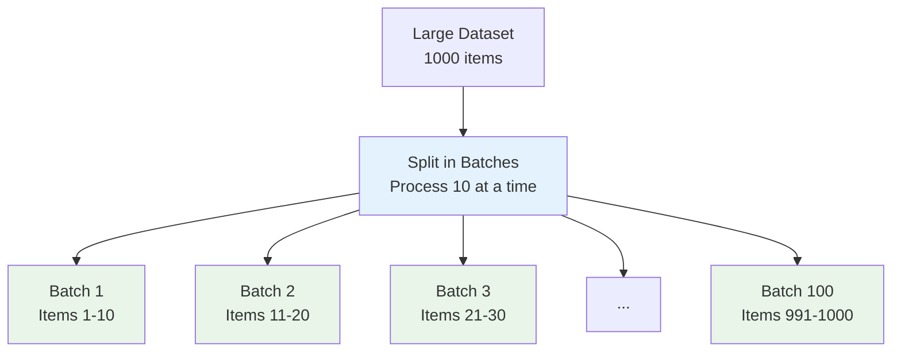
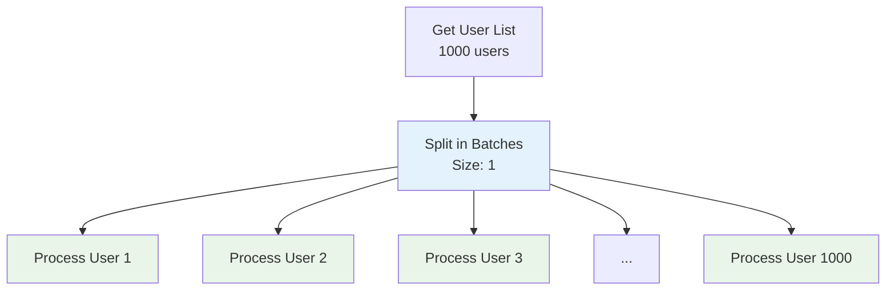
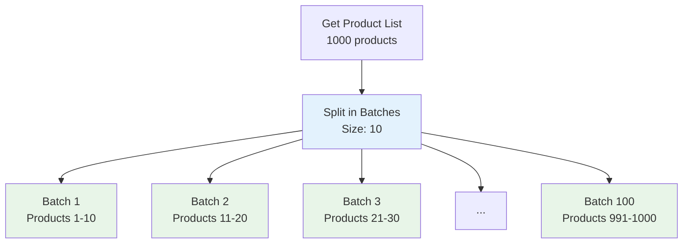
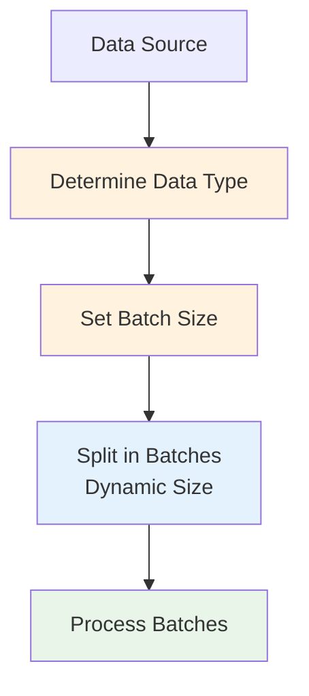
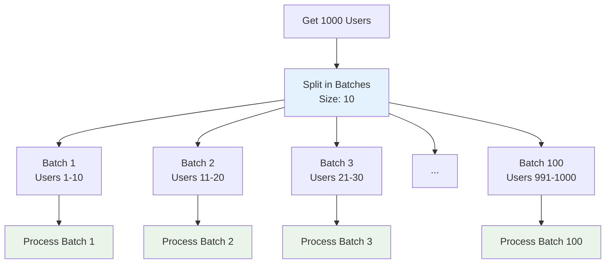

# Understanding Data Loops - The Split in Batches Node

## Overview

This comprehensive guide covers the Split in Batches node in n8n, which is essential for processing large datasets efficiently. Learn how to handle loops, process items one by one, and manage memory usage when working with large amounts of data.

## Table of Contents

1. [Understanding Data Loops](#understanding-data-loops)
2. [The Split in Batches Node](#the-split-in-batches-node)
3. [Loop Processing Strategies](#loop-processing-strategies)
4. [Advanced Techniques](#advanced-techniques)
5. [Practical Examples](#practical-examples)
6. [Best Practices](#best-practices)
7. [Common Use Cases](#common-use-cases)

## Understanding Data Loops

### What are Data Loops?

Data loops are a fundamental concept in workflow automation where you need to process multiple items from a dataset one by one. Instead of processing all items at once (which can cause memory issues), loops allow you to handle items individually or in small batches.

### Why Use Loops?

#### Benefits of Loop Processing:
- **Memory Efficiency**: Process large datasets without overwhelming system memory
- **Error Handling**: Handle failures for individual items without stopping entire workflow
- **Rate Limiting**: Respect API rate limits by processing items with delays
- **Progress Tracking**: Monitor progress through large datasets
- **Resource Management**: Control system resources during processing

### Loop Concepts in n8n



### How n8n Handles Loops

#### Automatic Loop Processing:
- n8n automatically processes arrays of data
- Each item in an array triggers subsequent nodes
- Nodes receive individual items, not the entire array
- Results are collected and passed to the next node

#### Manual Loop Control:
- Use Split in Batches for explicit batch processing
- Control batch size and processing intervals
- Handle large datasets more efficiently
- Implement custom loop logic

## The Split in Batches Node

### What is the Split in Batches Node?

The Split in Batches node takes an array of items and splits them into smaller batches, processing each batch separately. This is essential for handling large datasets that would otherwise cause memory or performance issues.

### Key Features

- **Batch Size Control**: Define how many items to process at once
- **Delay Between Batches**: Add delays to respect rate limits
- **Memory Management**: Process large datasets efficiently
- **Progress Tracking**: Monitor batch processing progress
- **Error Handling**: Handle failures for individual batches

### Split in Batches Configuration

#### Basic Configuration:
```json
{
  "batchSize": 10,
  "options": {
    "reset": false
  }
}
```

#### Advanced Configuration:
```json
{
  "batchSize": 25,
  "options": {
    "reset": false,
    "waitBetweenBatches": 2000
  }
}
```

### Configuration Parameters

#### 1. **Batch Size**
```javascript
// Process 10 items at a time
{
  "batchSize": 10
}

// Process 100 items at a time
{
  "batchSize": 100
}

// Process 1 item at a time (individual processing)
{
  "batchSize": 1
}
```

#### 2. **Wait Between Batches**
```javascript
// Wait 2 seconds between batches
{
  "waitBetweenBatches": 2000
}

// Wait 5 seconds between batches
{
  "waitBetweenBatches": 5000
}

// No delay between batches
{
  "waitBetweenBatches": 0
}
```

#### 3. **Reset Options**
```javascript
// Reset the batch counter (useful for testing)
{
  "options": {
    "reset": true
  }
}
```

## Loop Processing Strategies

### 1. **Sequential Processing**

#### Process Items One by One:
```javascript
{
  "batchSize": 1,
  "waitBetweenBatches": 1000
}
```

#### Use Cases:
- API calls with strict rate limits
- Database operations that need to be sequential
- File processing that requires individual attention
- Operations that modify shared resources

#### Workflow Example:


### 2. **Batch Processing**

#### Process Items in Groups:
```javascript
{
  "batchSize": 10,
  "waitBetweenBatches": 2000
}
```

#### Use Cases:
- Bulk API operations
- Database batch inserts
- File batch processing
- Parallel operations within batches

#### Workflow Example:


### 3. **Large Batch Processing**

#### Process Large Groups:
```javascript
{
  "batchSize": 100,
  "waitBetweenBatches": 5000
}
```

#### Use Cases:
- Bulk data operations
- Large file processing
- Batch database operations
- High-throughput processing

### 4. **Rate-Limited Processing**

#### Respect API Rate Limits:
```javascript
{
  "batchSize": 5,
  "waitBetweenBatches": 10000  // 10 seconds
}
```

#### Use Cases:
- API integrations with rate limits
- Third-party service calls
- External system integration
- Compliance with service terms

## Advanced Techniques

### 1. **Dynamic Batch Sizing**

#### Adjust Batch Size Based on Conditions:
```javascript
// Use IF node before Split in Batches to set different batch sizes
{
  "conditions": [
    {
      "leftValue": "={{$json.dataType}}",
      "operator": "equals",
      "rightValue": "large"
    }
  ],
  "trueValue": 5,    // Small batches for large items
  "falseValue": 25   // Larger batches for small items
}
```

#### Workflow Pattern:


### 2. **Conditional Batch Processing**

#### Skip Certain Items:
```javascript
// Filter items before splitting
{
  "conditions": [
    {
      "leftValue": "={{$json.status}}",
      "operator": "equals",
      "rightValue": "active"
    }
  ]
}
```

#### Process Different Item Types Separately:
```javascript
// Route different item types to different batch processors
{
  "mode": "expression",
  "value": "={{$json.itemType}}",
  "rules": [
    {
      "outputIndex": 0,
      "value": "user"
    },
    {
      "outputIndex": 1,
      "value": "product"
    },
    {
      "outputIndex": 2,
      "value": "order"
    }
  ]
}
```

### 3. **Progress Tracking**

#### Track Batch Progress:
```javascript
// Add progress tracking to batches
{
  "name": "Track Progress",
  "type": "n8n-nodes-base.set",
  "parameters": {
    "values": {
      "string": [
        {
          "name": "batchNumber",
          "value": "={{$json.batchNumber}}"
        },
        {
          "name": "totalBatches",
          "value": "={{$json.totalBatches}}"
        },
        {
          "name": "progressPercentage",
          "value": "={{Math.round(($json.batchNumber / $json.totalBatches) * 100)}}%"
        }
      ]
    }
  }
}
```

#### Send Progress Notifications:
```javascript
// Notify about batch completion
{
  "name": "Send Progress Update",
  "type": "n8n-nodes-base.slack",
  "parameters": {
    "text": "Processed batch {{$json.batchNumber}} of {{$json.totalBatches}} ({{$json.progressPercentage}})"
  }
}
```

### 4. **Error Handling in Loops**

#### Handle Individual Batch Failures:
```javascript
// Continue processing even if individual batches fail
{
  "errorHandling": {
    "continueOnError": true,
    "retryAttempts": 3,
    "retryDelay": 5000
  }
}
```

#### Log Batch Failures:
```javascript
// Log failed batches for later processing
{
  "name": "Log Failed Batch",
  "type": "n8n-nodes-base.set",
  "parameters": {
    "values": {
      "string": [
        {
          "name": "errorMessage",
          "value": "={{$json.error.message}}"
        },
        {
          "name": "batchData",
          "value": "={{JSON.stringify($json.batchItems)}}"
        },
        {
          "name": "timestamp",
          "value": "={{new Date().toISOString()}}"
        }
      ]
    }
  }
}
```

### 5. **Memory Optimization**

#### Process Large Datasets Efficiently:
```javascript
// Use appropriate batch sizes for memory management
{
  "memoryOptimization": {
    "batchSize": "auto",  // Automatically determine optimal size
    "maxMemoryUsage": "512MB",
    "cleanupAfterBatch": true
  }
}
```

#### Stream Processing:
```javascript
// Process data in streams for very large datasets
{
  "streaming": {
    "enabled": true,
    "chunkSize": 1000,
    "bufferSize": 10000
  }
}
```

## Practical Examples

### 1. **User Data Processing**

#### Workflow: Process User Records in Batches
```json
{
  "name": "User Data Processing",
  "nodes": [
    {
      "name": "Get Users",
      "type": "n8n-nodes-base.httpRequest",
      "parameters": {
        "url": "https://api.example.com/users",
        "method": "GET"
      }
    },
    {
      "name": "Split Users into Batches",
      "type": "n8n-nodes-base.splitInBatches",
      "parameters": {
        "batchSize": 10,
        "options": {
          "waitBetweenBatches": 2000
        }
      }
    },
    {
      "name": "Process User Batch",
      "type": "n8n-nodes-base.set",
      "parameters": {
        "values": {
          "string": [
            {
              "name": "batchNumber",
              "value": "={{$json.batchNumber}}"
            },
            {
              "name": "processedAt",
              "value": "={{new Date().toISOString()}}"
            }
          ]
        }
      }
    },
    {
      "name": "Update User Status",
      "type": "n8n-nodes-base.httpRequest",
      "parameters": {
        "url": "https://api.example.com/users/batch-update",
        "method": "POST",
        "body": {
          "users": "={{$json.users}}",
          "status": "processed"
        }
      }
    },
    {
      "name": "Log Batch Completion",
      "type": "n8n-nodes-base.set",
      "parameters": {
        "values": {
          "string": [
            {
              "name": "logMessage",
              "value": "Completed batch {{$json.batchNumber}} with {{$json.users.length}} users"
            }
          ]
        }
      }
    }
  ]
}
```

#### Data Flow:


### 2. **API Rate Limit Handling**

#### Workflow: Respect API Rate Limits
```json
{
  "name": "Rate-Limited API Processing",
  "nodes": [
    {
      "name": "Get Data to Process",
      "type": "n8n-nodes-base.httpRequest"
    },
    {
      "name": "Split for Rate Limiting",
      "type": "n8n-nodes-base.splitInBatches",
      "parameters": {
        "batchSize": 5,
        "options": {
          "waitBetweenBatches": 10000  // 10 seconds between batches
        }
      }
    },
    {
      "name": "Process API Batch",
      "type": "n8n-nodes-base.httpRequest",
      "parameters": {
        "url": "https://api.example.com/batch-process",
        "method": "POST",
        "body": "={{$json.batchItems}}"
      }
    },
    {
      "name": "Check Rate Limit Headers",
      "type": "n8n-nodes-base.set",
      "parameters": {
        "values": {
          "string": [
            {
              "name": "remainingRequests",
              "value": "={{$json.headers['x-ratelimit-remaining']}}"
            },
            {
              "name": "resetTime",
              "value": "={{$json.headers['x-ratelimit-reset']}}"
            }
          ]
        }
      }
    }
  ]
}
```

### 3. **File Processing Pipeline**

#### Workflow: Process Large Files in Chunks
```json
{
  "name": "File Processing Pipeline",
  "nodes": [
    {
      "name": "Get File List",
      "type": "n8n-nodes-base.httpRequest",
      "parameters": {
        "url": "https://api.example.com/files",
        "method": "GET"
      }
    },
    {
      "name": "Split Files into Batches",
      "type": "n8n-nodes-base.splitInBatches",
      "parameters": {
        "batchSize": 3,  // Process 3 files at a time
        "options": {
          "waitBetweenBatches": 5000  // 5 seconds between batches
        }
      }
    },
    {
      "name": "Download File Batch",
      "type": "n8n-nodes-base.httpRequest",
      "parameters": {
        "url": "={{$json.fileUrl}}",
        "method": "GET"
      }
    },
    {
      "name": "Process File Content",
      "type": "n8n-nodes-base.set",
      "parameters": {
        "values": {
          "string": [
            {
              "name": "processedContent",
              "value": "={{$json.content.toUpperCase()}}"
            },
            {
              "name": "fileSize",
              "value": "={{$json.content.length}}"
            }
          ]
        }
      }
    },
    {
      "name": "Upload Processed File",
      "type": "n8n-nodes-base.httpRequest",
      "parameters": {
        "url": "https://api.example.com/upload",
        "method": "POST",
        "body": "={{$json.processedContent}}"
      }
    }
  ]
}
```

### 4. **Database Batch Operations**

#### Workflow: Bulk Database Updates
```json
{
  "name": "Database Batch Updates",
  "nodes": [
    {
      "name": "Get Records to Update",
      "type": "n8n-nodes-base.httpRequest",
      "parameters": {
        "url": "https://api.example.com/records",
        "method": "GET"
      }
    },
    {
      "name": "Split Records into Batches",
      "type": "n8n-nodes-base.splitInBatches",
      "parameters": {
        "batchSize": 50,  // Update 50 records at a time
        "options": {
          "waitBetweenBatches": 1000
        }
      }
    },
    {
      "name": "Prepare Batch Update",
      "type": "n8n-nodes-base.set",
      "parameters": {
        "values": {
          "string": [
            {
              "name": "updateQuery",
              "value": "UPDATE records SET status = 'processed' WHERE id IN ({{$json.recordIds.join(',')}})"
            },
            {
              "name": "batchSize",
              "value": "={{$json.recordIds.length}}"
            }
          ]
        }
      }
    },
    {
      "name": "Execute Batch Update",
      "type": "n8n-nodes-base.httpRequest",
      "parameters": {
        "url": "https://api.example.com/database/execute",
        "method": "POST",
        "body": {
          "query": "={{$json.updateQuery}}"
        }
      }
    },
    {
      "name": "Log Batch Results",
      "type": "n8n-nodes-base.set",
      "parameters": {
        "values": {
          "string": [
            {
              "name": "logMessage",
              "value": "Updated {{$json.batchSize}} records in batch {{$json.batchNumber}}"
            }
          ]
        }
      }
    }
  ]
}
```

## Best Practices

### 1. **Batch Size Selection**

#### Choose Appropriate Batch Sizes:
```javascript
// Small batches for API calls
{
  "batchSize": 5,
  "waitBetweenBatches": 2000
}

// Medium batches for database operations
{
  "batchSize": 50,
  "waitBetweenBatches": 1000
}

// Large batches for file processing
{
  "batchSize": 100,
  "waitBetweenBatches": 5000
}
```

#### Consider Memory Usage:
```javascript
// Monitor memory usage
{
  "memoryMonitoring": {
    "maxBatchSize": 100,
    "memoryThreshold": "512MB",
    "autoAdjustBatchSize": true
  }
}
```

### 2. **Error Handling**

#### Handle Batch Failures Gracefully:
```javascript
// Implement retry logic for failed batches
{
  "errorHandling": {
    "retryAttempts": 3,
    "retryDelay": 5000,
    "continueOnError": true,
    "logErrors": true
  }
}
```

#### Skip Failed Items:
```javascript
// Skip items that consistently fail
{
  "skipFailedItems": true,
  "maxFailuresPerItem": 3,
  "logSkippedItems": true
}
```

### 3. **Progress Monitoring**

#### Track Processing Progress:
```javascript
// Add progress tracking
{
  "progressTracking": {
    "enabled": true,
    "notifyEveryNBatches": 10,
    "logProgress": true
  }
}
```

#### Send Progress Notifications:
```javascript
// Notify about progress
{
  "notifications": {
    "onBatchComplete": true,
    "onProgressMilestones": [25, 50, 75, 100],
    "onError": true
  }
}
```

### 4. **Performance Optimization**

#### Optimize for Speed:
```javascript
// Minimize delays when possible
{
  "performanceOptimization": {
    "minimizeDelays": true,
    "parallelProcessing": true,
    "memoryOptimization": true
  }
}
```

#### Use Appropriate Delays:
```javascript
// Balance speed with rate limits
{
  "delayStrategy": {
    "apiCalls": 2000,      // 2 seconds for API calls
    "databaseOps": 500,    // 0.5 seconds for database
    "fileProcessing": 1000 // 1 second for files
  }
}
```

## Common Use Cases

### 1. **Data Migration**

#### Migrate Large Datasets:
```javascript
{
  "useCase": "data_migration",
  "batchSize": 100,
  "waitBetweenBatches": 2000,
  "description": "Migrate user data from old system to new system"
}
```

### 2. **API Integration**

#### Process API Responses:
```javascript
{
  "useCase": "api_integration",
  "batchSize": 10,
  "waitBetweenBatches": 5000,
  "description": "Process API responses while respecting rate limits"
}
```

### 3. **File Processing**

#### Process Large Files:
```javascript
{
  "useCase": "file_processing",
  "batchSize": 25,
  "waitBetweenBatches": 1000,
  "description": "Process large files in manageable chunks"
}
```

### 4. **Database Operations**

#### Bulk Database Updates:
```javascript
{
  "useCase": "database_operations",
  "batchSize": 50,
  "waitBetweenBatches": 500,
  "description": "Perform bulk database operations efficiently"
}
```

### 5. **Email Processing**

#### Send Bulk Emails:
```javascript
{
  "useCase": "email_processing",
  "batchSize": 20,
  "waitBetweenBatches": 3000,
  "description": "Send bulk emails while respecting sending limits"
}
```

## Troubleshooting

### Common Issues

#### 1. **Memory Issues**

**Symptoms:**
- Workflow crashes with memory errors
- Slow performance with large datasets

**Solutions:**
- Reduce batch size
- Add delays between batches
- Process data in smaller chunks
- Use streaming when possible

#### 2. **Rate Limit Errors**

**Symptoms:**
- API calls failing with rate limit errors
- 429 HTTP status codes

**Solutions:**
- Increase wait time between batches
- Reduce batch size
- Implement exponential backoff
- Check API rate limit headers

#### 3. **Timeout Issues**

**Symptoms:**
- Workflows timing out
- Long-running processes failing

**Solutions:**
- Optimize batch processing time
- Reduce batch size
- Add progress checkpoints
- Use workflow resumption

#### 4. **Data Loss**

**Symptoms:**
- Some items not processed
- Incomplete results

**Solutions:**
- Implement error handling
- Add retry logic
- Log failed items
- Use transaction-like processing

## Conclusion

The Split in Batches node is essential for handling large datasets efficiently in n8n workflows. By understanding its capabilities and best practices, you can:

- **Process large datasets** without memory issues
- **Respect API rate limits** with appropriate delays
- **Handle errors gracefully** with retry logic
- **Monitor progress** through large processing jobs
- **Optimize performance** with appropriate batch sizes
- **Build scalable workflows** that can handle any data size

### Key Takeaways

1. **Choose appropriate batch sizes** based on your use case
2. **Add delays between batches** to respect rate limits
3. **Implement error handling** for robust processing
4. **Monitor progress** through large datasets
5. **Optimize for memory usage** with appropriate configurations
6. **Test with sample data** to find optimal settings
7. **Document batch processing logic** for maintainability

### Next Steps

1. **Practice with small datasets** to understand the basics
2. **Experiment with different batch sizes** for various use cases
3. **Build complex processing pipelines** using batch processing
4. **Learn about error handling** strategies for loops
5. **Explore performance optimization** techniques
6. **Study real-world examples** of batch processing

The Split in Batches node enables you to build scalable, efficient workflows that can handle datasets of any size while maintaining system performance and respecting external service limits.
