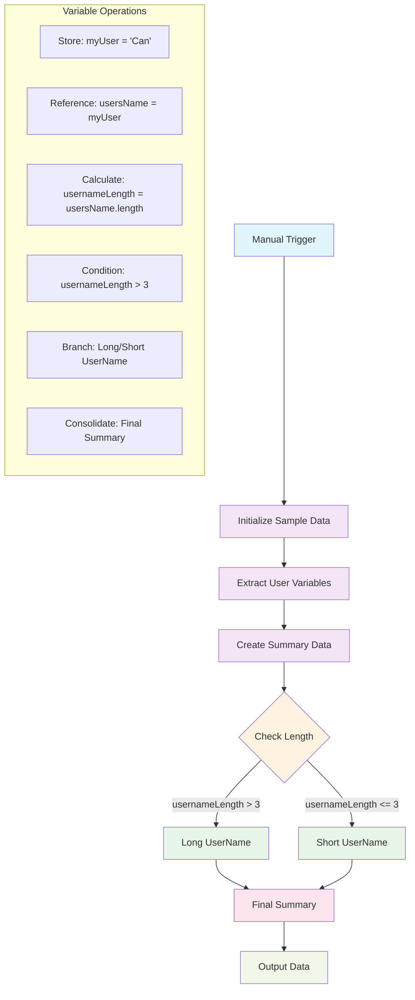

# Working with Variables in n8n

Variables in n8n are essential for storing, manipulating, and passing data between nodes in your workflows. This guide covers the fundamental concepts of working with variables, including storing values, using the Set node, working with JSON data, and implementing conditional logic.

## Table of Contents

1. [Workflow Overview](#workflow-overview)
2. [Store Values](#store-values)
3. [Using a Set Node](#using-a-set-node)
4. [Using JSON](#using-json)
5. [Conditional Logic with IF Nodes](#conditional-logic-with-if-nodes)
6. [Variable Flow Diagram](#variable-flow-diagram)
7. [Best Practices](#best-practices)

## Workflow Overview

This guide includes a practical workflow example that demonstrates variable management in n8n. The workflow follows this structure:

```
Manual Trigger → Initialize Sample Data → Extract User Variables → Create Summary Data → Check Length (IF) → Long/Short UserName → Final Summary
```

### Workflow Nodes Explained

1. **Manual Trigger**: Starts the workflow execution
2. **Initialize Sample Data**: Sets initial variable `myUser` with value "Can"
3. **Extract User Variables**: References the previous variable using `{{ $json.myUser }}`
4. **Create Summary Data**: Creates multiple variables including calculated values like `usernameLength`
5. **Check Length**: IF node that compares username length to determine flow
6. **Long/Short UserName**: Conditional branches based on username length
7. **Final Summary**: Consolidates results from both branches

### Key Learning Objectives

- Store and reference variables across nodes
- Use expressions to access and manipulate data
- Implement conditional logic with IF nodes
- Handle different data types and conversions
- Create branching workflows based on data conditions

## Store Values

Variables in n8n allow you to store and reference data throughout your workflow execution. There are several ways to store values:

### Data Storage Methods

- **Input Data**: Data comes from trigger nodes or previous nodes
- **Set Node**: Explicitly set values using the Set node
- **Expression Variables**: Use JavaScript expressions to create dynamic values
- **Environment Variables**: Store sensitive or configuration data
- **Global Variables**: Store data accessible across all executions

### Basic Variable Storage

```javascript
// Store a simple string
{{ $json.name }}

// Store a calculated value
{{ $json.price * 1.2 }}

// Store from multiple sources
{{ $json.firstName + " " + $json.lastName }}
```

## Using a Set Node

The Set node is one of the most powerful nodes in n8n for data manipulation and variable management.

### Key Features

- **Add Fields**: Add new fields to your data
- **Keep Fields**: Select which fields to keep
- **Remove Fields**: Remove unwanted fields
- **Rename Fields**: Change field names
- **Set Values**: Assign values to fields

### Set Node Configuration

1. **Mode Options**:
   - **Manual**: Manually define each field
   - **Using Fields Below**: Use the field selection interface
   - **Keep Only Set Fields**: Only keep the fields you define

2. **Field Types**:
   - **String**: Text values
   - **Number**: Numeric values
   - **Boolean**: True/false values
   - **Object**: Complex data structures
   - **Array**: Lists of values

### Example Set Node Usage

Based on our workflow example, here are real Set node configurations:

#### Initialize Sample Data
```json
{
  "name": "myUser",
  "value": "Can",
  "type": "string"
}
```

#### Extract User Variables
```json
{
  "name": "usersName",
  "value": "{{ $json.myUser }}",
  "type": "string"
}
```

#### Create Summary Data
```json
{
  "name": "username",
  "value": "{{ $json.usersName }}",
  "type": "string"
},
{
  "name": "usernameLength",
  "value": "{{ $json.usersName.length }}",
  "type": "number"
}
```

#### Conditional Branch Examples
```json
// Long UserName branch
{
  "name": "username",
  "value": "{{ $json.username }}",
  "type": "string"
},
{
  "name": "resultComesFrom",
  "value": "Long UserName",
  "type": "string"
}

// Short UserName branch
{
  "name": "username",
  "value": "{{ $json.username }}",
  "type": "string"
},
{
  "name": "resultComesFrom",
  "value": "Short UserName",
  "type": "string"
}
```

## Using JSON

JSON (JavaScript Object Notation) is the primary data format in n8n workflows. Understanding how to work with JSON is crucial for effective workflow development.

### JSON Structure

```json
{
  "user": {
    "id": 123,
    "name": "John Doe",
    "email": "john@example.com",
    "preferences": {
      "theme": "dark",
      "notifications": true
    },
    "orders": [
      {"id": 1, "amount": 99.99},
      {"id": 2, "amount": 149.99}
    ]
  }
}
```

### Accessing JSON Data

```javascript
// Access top-level properties
{{ $json.user.name }}

// Access nested properties
{{ $json.user.preferences.theme }}

// Access array elements
{{ $json.user.orders[0].amount }}

// Loop through arrays
{{ $json.user.orders.map(order => order.amount).join(', ') }}
```

### JSON Manipulation

```javascript
// Create new JSON objects
{{ { "fullName": $json.firstName + " " + $json.lastName, "age": 25 } }}

// Modify existing JSON
{{ Object.assign($json, { "status": "processed" }) }}

// Filter arrays
{{ $json.orders.filter(order => order.amount > 100) }}
```

## Conditional Logic with IF Nodes

The IF node is crucial for creating dynamic workflows that respond to different data conditions. Our workflow example demonstrates this with username length validation.

### IF Node Configuration

The "Check Length" node in our workflow uses this configuration:

```json
{
  "conditions": {
    "conditions": [
      {
        "leftValue": "{{ $json.usernameLength }}",
        "rightValue": 3,
        "operator": {
          "type": "number",
          "operation": "gt"
        }
      }
    ],
    "combinator": "and"
  }
}
```

### Conditional Flow Logic

1. **Condition**: `usernameLength > 3`
2. **True Path**: Routes to "Long UserName" node
3. **False Path**: Routes to "Short UserName" node
4. **Both Paths**: Converge at "Final Summary" node

### IF Node Best Practices

#### 1. Clear Condition Logic
```javascript
// Good: Clear, specific conditions
{{ $json.usernameLength > 3 }}

// Avoid: Complex nested conditions
{{ $json.user && $json.user.name && $json.user.name.length > 3 }}
```

#### 2. Type-Safe Comparisons
```javascript
// Use appropriate operators for data types
{{ $json.age > 18 }}           // Number comparison
{{ $json.status === "active" }} // String comparison
{{ $json.isEnabled === true }}  // Boolean comparison
```

#### 3. Handle Edge Cases
```javascript
// Check for null/undefined values
{{ $json.username && $json.username.length > 3 }}

// Provide default values
{{ ($json.username || "").length > 3 }}
```

### Multiple Conditions

You can combine multiple conditions using logical operators:

```json
{
  "conditions": [
    {
      "leftValue": "{{ $json.usernameLength }}",
      "rightValue": 3,
      "operator": { "type": "number", "operation": "gt" }
    },
    {
      "leftValue": "{{ $json.status }}",
      "rightValue": "active",
      "operator": { "type": "string", "operation": "equals" }
    }
  ],
  "combinator": "and"
}
```

### Branching Strategies

#### 1. Binary Decisions
- Simple true/false conditions
- Two clear paths
- Easy to understand and maintain

#### 2. Multiple Conditions
- Use Switch node for 3+ conditions
- More complex but flexible
- Better for business logic

#### 3. Nested Conditions
- IF nodes within IF nodes
- Handle complex scenarios
- Use sparingly to avoid confusion

## Variable Flow Diagram



### Workflow Data Flow

1. **Initialize**: `myUser = "Can"`
2. **Extract**: `usersName = myUser` (references previous data)
3. **Calculate**: `usernameLength = usersName.length` (JavaScript expression)
4. **Condition**: `usernameLength > 3` (IF node logic)
5. **Branch**: Different paths based on condition
6. **Consolidate**: Both paths merge at Final Summary

## Best Practices

### 1. Variable Naming
- Use descriptive, camelCase names (`myUser`, `usernameLength`)
- Avoid special characters and spaces
- Be consistent across your workflow
- Use meaningful prefixes for related variables

### 2. Data Validation
- Always validate input data before processing
- Use conditional logic to handle missing data
- Implement error handling for data transformation
- Check for null/undefined values before operations

### 3. Set Node Organization
- Group related variables in the same Set node
- Use clear, descriptive field names
- Set appropriate data types (string, number, boolean)
- Keep variable assignments simple and readable

### 4. Conditional Logic Best Practices
- Use clear, simple conditions in IF nodes
- Avoid complex nested conditions
- Test both true and false paths
- Use meaningful node names for branches
- Always converge branches at a common point

### 5. Variable Referencing
- Use `{{ $json.variableName }}` to reference previous data
- Be consistent with variable naming across nodes
- Test expressions in the expression editor
- Handle edge cases with default values

### 6. Performance Optimization
- Minimize complex expressions in loops
- Cache frequently used values
- Use appropriate data types for better performance
- Avoid unnecessary data transformations

### 7. Security Considerations
- Never expose sensitive data in expressions
- Use environment variables for secrets
- Validate and sanitize user input
- Be careful with user-provided data in expressions

### 8. Debugging Tips
- Use the expression editor to test expressions
- Add temporary Set nodes to inspect data
- Use the workflow execution log for troubleshooting
- Test with different input values
- Use sticky notes to document complex logic

## Common Use Cases

### Data Transformation
```javascript
// Combine multiple fields
{{ $json.firstName + " " + $json.lastName }}

// Format dates
{{ new Date($json.timestamp).toISOString() }}

// Calculate totals
{{ $json.items.reduce((sum, item) => sum + item.price, 0) }}
```

### Conditional Logic
```javascript
// Simple conditions
{{ $json.age >= 18 ? "adult" : "minor" }}

// Complex conditions
{{ $json.status === "active" && $json.balance > 0 ? "eligible" : "ineligible" }}
```

### Array Operations
```javascript
// Filter arrays
{{ $json.users.filter(user => user.active) }}

// Map arrays
{{ $json.products.map(product => product.name) }}

// Reduce arrays
{{ $json.orders.reduce((total, order) => total + order.amount, 0) }}
```

## Troubleshooting

### Common Issues

1. **Undefined Variables**: Check if the data path exists
2. **Type Errors**: Ensure data types match expected formats
3. **Expression Errors**: Validate JavaScript syntax
4. **Performance Issues**: Optimize complex expressions

### Debugging Steps

1. Check the input data structure
2. Test expressions in the expression editor
3. Add Set nodes to inspect intermediate values
4. Review workflow execution logs
5. Use browser developer tools for complex debugging

## Workflow Example Summary

The variables workflow demonstrates a complete variable management scenario:

### Step-by-Step Execution

1. **Manual Trigger** → Starts the workflow
2. **Initialize Sample Data** → Sets `myUser = "Can"`
3. **Extract User Variables** → References `myUser` as `usersName`
4. **Create Summary Data** → Creates `username` and calculates `usernameLength`
5. **Check Length** → IF condition: `usernameLength > 3`
6. **Branching** → Routes to Long/Short UserName based on condition
7. **Final Summary** → Consolidates results from both branches

### Key Learning Points

- **Variable Storage**: Using Set nodes to store and manipulate data
- **Data Referencing**: Using `{{ $json.variableName }}` expressions
- **Type Conversion**: Converting strings to numbers for calculations
- **Conditional Logic**: Using IF nodes for branching workflows
- **Data Flow**: How variables pass between nodes in sequence

### Try It Yourself

1. Import the `variables-workflow.json` into your n8n instance
2. Execute the workflow and observe the data flow
3. Modify the initial `myUser` value to test different scenarios
4. Experiment with different username lengths to see branching behavior

## Conclusion

Working with variables in n8n is fundamental to creating powerful and flexible workflows. By mastering the concepts of storing values, using the Set node, manipulating JSON data, and implementing conditional logic, you can build sophisticated automation solutions that handle complex data transformations and business logic.

The workflow example provided demonstrates real-world variable management patterns that you can adapt for your own use cases. Remember to always test your expressions and validate your data to ensure reliable workflow execution.
