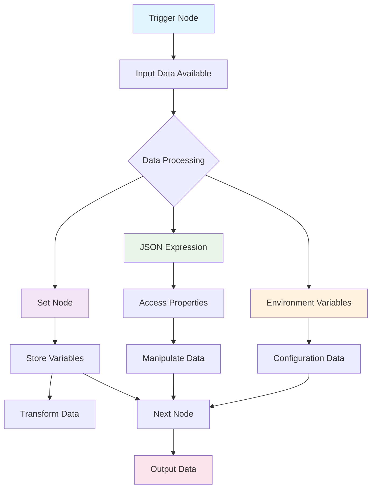

# Working with Variables in n8n

Variables in n8n are essential for storing, manipulating, and passing data between nodes in your workflows. This guide covers the fundamental concepts of working with variables, including storing values, using the Set node, and working with JSON data.

## Table of Contents

1. [Store Values](#store-values)
2. [Using a Set Node](#using-a-set-node)
3. [Using JSON](#using-json)
4. [Variable Flow Diagram](#variable-flow-diagram)
5. [Best Practices](#best-practices)

## Store Values

Variables in n8n allow you to store and reference data throughout your workflow execution. There are several ways to store values:

### Data Storage Methods

- **Input Data**: Data comes from trigger nodes or previous nodes
- **Set Node**: Explicitly set values using the Set node
- **Expression Variables**: Use JavaScript expressions to create dynamic values
- **Environment Variables**: Store sensitive or configuration data
- **Global Variables**: Store data accessible across all executions

### Basic Variable Storage

```javascript
// Store a simple string
{{ $json.name }}

// Store a calculated value
{{ $json.price * 1.2 }}

// Store from multiple sources
{{ $json.firstName + " " + $json.lastName }}
```

## Using a Set Node

The Set node is one of the most powerful nodes in n8n for data manipulation and variable management.

### Key Features

- **Add Fields**: Add new fields to your data
- **Keep Fields**: Select which fields to keep
- **Remove Fields**: Remove unwanted fields
- **Rename Fields**: Change field names
- **Set Values**: Assign values to fields

### Set Node Configuration

1. **Mode Options**:
   - **Manual**: Manually define each field
   - **Using Fields Below**: Use the field selection interface
   - **Keep Only Set Fields**: Only keep the fields you define

2. **Field Types**:
   - **String**: Text values
   - **Number**: Numeric values
   - **Boolean**: True/false values
   - **Object**: Complex data structures
   - **Array**: Lists of values

### Example Set Node Usage

```json
{
  "name": "customer_name",
  "value": "{{ $json.first_name + ' ' + $json.last_name }}",
  "type": "string"
}
```

## Using JSON

JSON (JavaScript Object Notation) is the primary data format in n8n workflows. Understanding how to work with JSON is crucial for effective workflow development.

### JSON Structure

```json
{
  "user": {
    "id": 123,
    "name": "John Doe",
    "email": "john@example.com",
    "preferences": {
      "theme": "dark",
      "notifications": true
    },
    "orders": [
      {"id": 1, "amount": 99.99},
      {"id": 2, "amount": 149.99}
    ]
  }
}
```

### Accessing JSON Data

```javascript
// Access top-level properties
{{ $json.user.name }}

// Access nested properties
{{ $json.user.preferences.theme }}

// Access array elements
{{ $json.user.orders[0].amount }}

// Loop through arrays
{{ $json.user.orders.map(order => order.amount).join(', ') }}
```

### JSON Manipulation

```javascript
// Create new JSON objects
{{ { "fullName": $json.firstName + " " + $json.lastName, "age": 25 } }}

// Modify existing JSON
{{ Object.assign($json, { "status": "processed" }) }}

// Filter arrays
{{ $json.orders.filter(order => order.amount > 100) }}
```

## Variable Flow Diagram



## Best Practices

### 1. Variable Naming
- Use descriptive, camelCase names
- Avoid special characters and spaces
- Be consistent across your workflow

### 2. Data Validation
- Always validate input data before processing
- Use conditional logic to handle missing data
- Implement error handling for data transformation

### 3. Performance Optimization
- Minimize complex expressions in loops
- Cache frequently used values
- Use appropriate data types for better performance

### 4. Security Considerations
- Never expose sensitive data in expressions
- Use environment variables for secrets
- Validate and sanitize user input

### 5. Debugging Tips
- Use the expression editor to test expressions
- Add temporary Set nodes to inspect data
- Use the workflow execution log for troubleshooting

## Common Use Cases

### Data Transformation
```javascript
// Combine multiple fields
{{ $json.firstName + " " + $json.lastName }}

// Format dates
{{ new Date($json.timestamp).toISOString() }}

// Calculate totals
{{ $json.items.reduce((sum, item) => sum + item.price, 0) }}
```

### Conditional Logic
```javascript
// Simple conditions
{{ $json.age >= 18 ? "adult" : "minor" }}

// Complex conditions
{{ $json.status === "active" && $json.balance > 0 ? "eligible" : "ineligible" }}
```

### Array Operations
```javascript
// Filter arrays
{{ $json.users.filter(user => user.active) }}

// Map arrays
{{ $json.products.map(product => product.name) }}

// Reduce arrays
{{ $json.orders.reduce((total, order) => total + order.amount, 0) }}
```

## Troubleshooting

### Common Issues

1. **Undefined Variables**: Check if the data path exists
2. **Type Errors**: Ensure data types match expected formats
3. **Expression Errors**: Validate JavaScript syntax
4. **Performance Issues**: Optimize complex expressions

### Debugging Steps

1. Check the input data structure
2. Test expressions in the expression editor
3. Add Set nodes to inspect intermediate values
4. Review workflow execution logs
5. Use browser developer tools for complex debugging

## Conclusion

Working with variables in n8n is fundamental to creating powerful and flexible workflows. By mastering the concepts of storing values, using the Set node, and manipulating JSON data, you can build sophisticated automation solutions that handle complex data transformations and business logic.

Remember to always test your expressions and validate your data to ensure reliable workflow execution.
