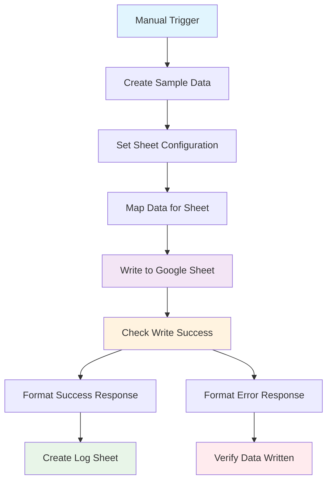
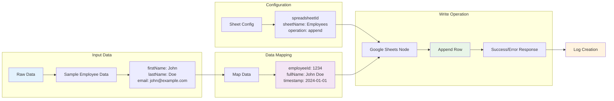
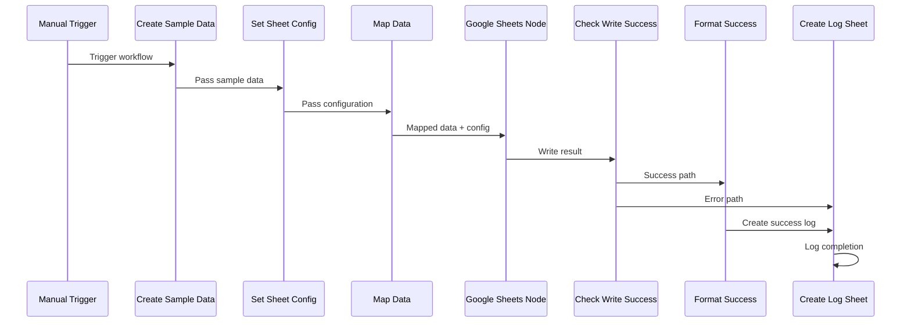
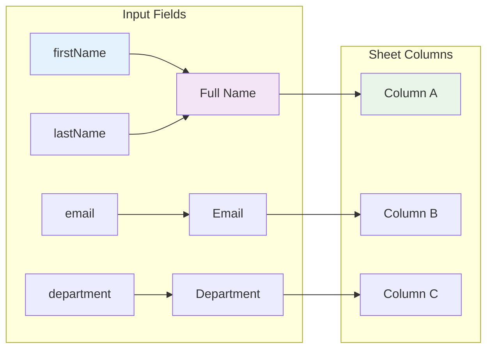
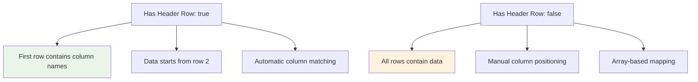
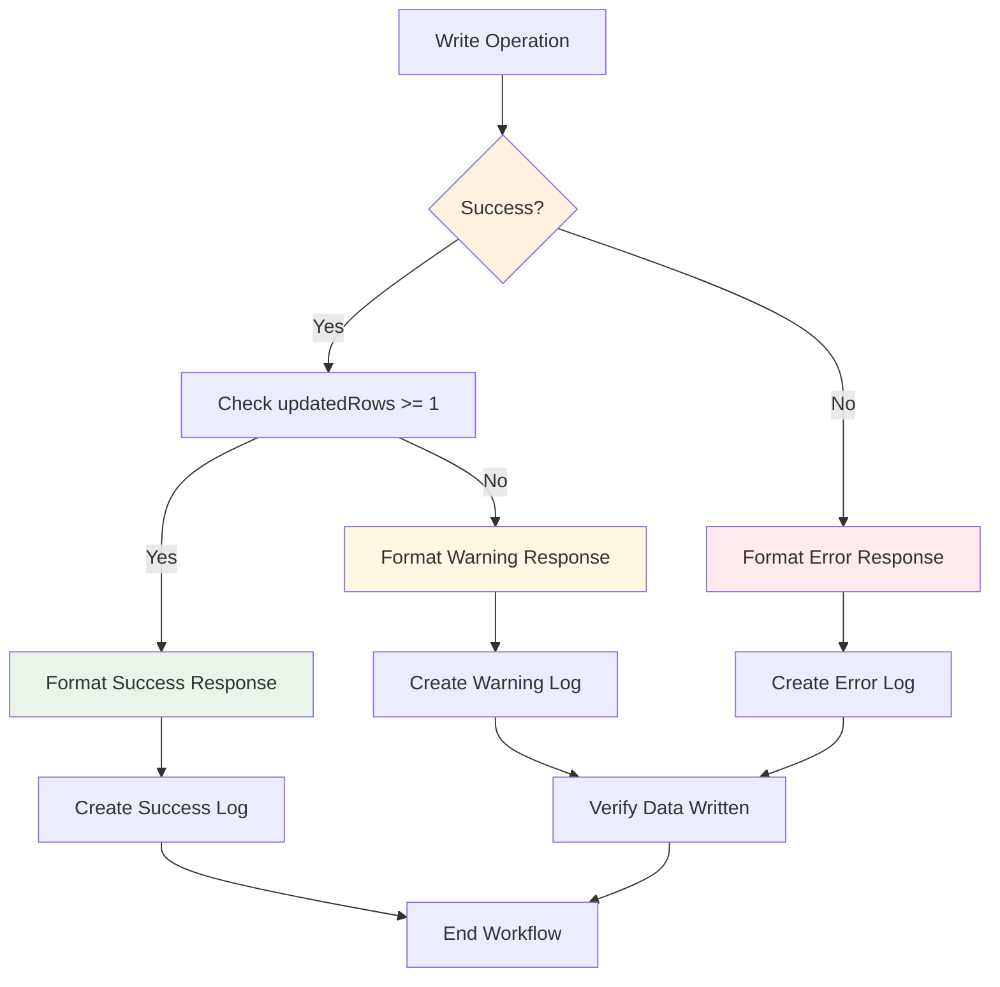
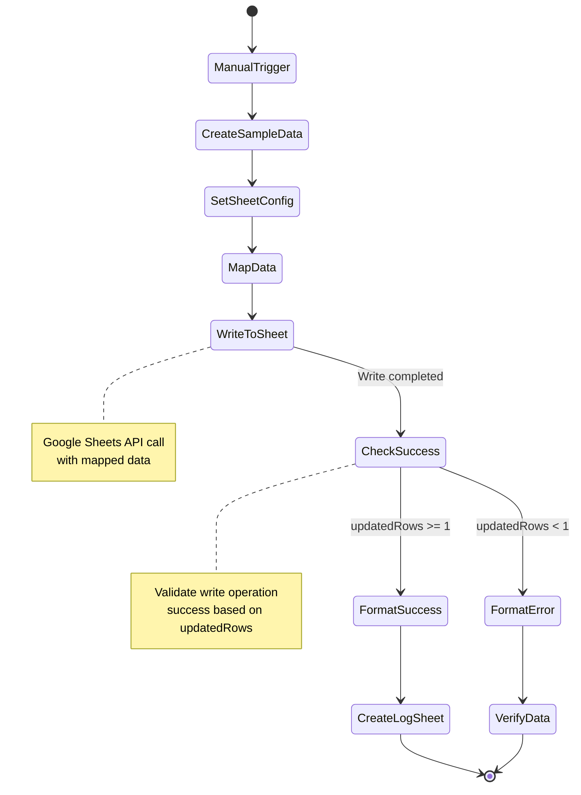
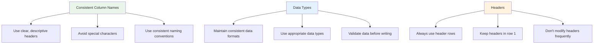
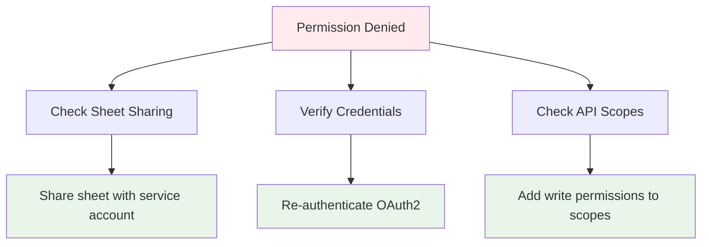
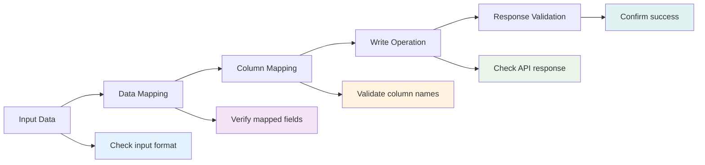

# Writing Data to Google Sheets

## Overview

This project demonstrates how to write data to Google Sheets using n8n's Google Sheets node. You'll learn how to append new rows, map data from previous nodes, and implement proper data validation and error handling. The project includes practical examples with Mermaid diagrams to visualize the workflow structure and data flow.

## Table of Contents

1. [Prerequisites](#prerequisites)
2. [Understanding Google Sheets Write Operations](#understanding-google-sheets-write-operations)
3. [Workflow Structure and Data Flow](#workflow-structure-and-data-flow)
4. [Step-by-Step Implementation](#step-by-step-implementation)
5. [Data Mapping Techniques](#data-mapping-techniques)
6. [Advanced Configuration](#advanced-configuration)
7. [Error Handling and Validation](#error-handling-and-validation)
8. [Demo Workflow Walkthrough](#demo-workflow-walkthrough)
9. [Best Practices](#best-practices)
10. [Troubleshooting](#troubleshooting)

## Prerequisites

Before starting this project, ensure you have:

- An active n8n instance with Google Sheets credentials configured
- A Google account with access to Google Sheets
- Basic understanding of n8n nodes and workflow concepts
- Familiarity with Google Sheets API (recommended)

## Understanding Google Sheets Write Operations

### Available Write Operations

The Google Sheets node supports several write operations:

#### 1. **Append**
- Adds new rows to the end of a sheet
- Automatically detects the last row
- Preserves existing data

#### 2. **Update**
- Modifies existing rows based on conditions
- Requires specifying which rows to update
- Can update specific cells or entire rows

#### 3. **Append or Update**
- Combines append and update functionality
- Updates existing rows if found, appends if not
- Most flexible option for data synchronization

#### 4. **Clear and Write**
- Clears existing data and writes new data
- Useful for complete data replacement
- ⚠️ **Warning**: This will delete existing data

### Operation Comparison

| Operation | Use Case | Data Safety | Performance |
|-----------|----------|-------------|-------------|
| Append | Adding new records | Safe | Fast |
| Update | Modifying existing records | Safe | Medium |
| Append or Update | Sync operations | Safe | Medium |
| Clear and Write | Complete data replacement | Destructive | Fast |

## Workflow Structure and Data Flow

### High-Level Workflow Architecture



### Data Flow Diagram



### Node Interaction Sequence



## Step-by-Step Implementation

### Step 1: Create Manual Trigger

1. **Add Manual Trigger Node**
   - Drag and drop from the node panel
   - Configure basic settings (optional)
   - This will be your workflow entry point

### Step 2: Prepare Sample Data

```javascript
// Example data structure
{
  "firstName": "John",
  "lastName": "Doe", 
  "email": "john.doe@example.com",
  "department": "Engineering",
  "salary": "75000",
  "startDate": "2024-01-15"
}
```

### Step 3: Configure Sheet Settings

```javascript
// Sheet configuration
{
  "spreadsheetId": "1BxiMVs0XRA5nFMdKvBdBZjgmUUqptlbs74OgvE2upms",
  "sheetName": "Employees",
  "operation": "append",
  "hasHeaderRow": true
}
```

### Step 4: Map Data for Sheet

```javascript
// Mapped data structure
{
  "employeeId": "{{Math.floor(Math.random() * 10000) + 1000}}",
  "fullName": "{{$json.firstName}} {{$json.lastName}}",
  "email": "{{$json.email}}",
  "department": "{{$json.department}}",
  "salary": "{{$json.salary}}",
  "startDate": "{{$json.startDate}}",
  "timestamp": "{{$now}}",
  "status": "Active"
}
```

### Step 5: Configure Google Sheets Node

#### Basic Configuration:
```javascript
Operation: Append or Update
Document ID: {{$node['Set Sheet Configuration'].json.spreadsheetId}}
Sheet Name: {{$node['Set Sheet Configuration'].json.sheetName}}
Columns: [Configure column mapping]
```

#### Column Mapping:
```javascript
Employee ID: {{$json.employeeId}}
Full Name: {{$json.fullName}}
Email: {{$json.email}}
Department: {{$json.department}}
Salary: {{$json.salary}}
Start Date: {{$json.startDate}}
Timestamp: {{$json.timestamp}}
Status: {{$json.status}}
```

## Data Mapping Techniques

### 1. Direct Field Mapping



### 2. Computed Field Mapping

```javascript
// Dynamic field creation
{
  "employeeId": "{{Math.floor(Math.random() * 10000) + 1000}}",
  "fullName": "{{$json.firstName}} {{$json.lastName}}",
  "displayName": "{{$json.lastName.toUpperCase()}}, {{$json.firstName}}",
  "emailDomain": "{{$json.email.split('@')[1]}}",
  "age": "{{$now.diff($json.birthDate, 'years')}}",
  "status": "{{$json.active ? 'Active' : 'Inactive'}}"
}
```

### 3. Conditional Mapping

```javascript
// Conditional field mapping
{
  "salaryGrade": "{{$json.salary > 80000 ? 'Senior' : 'Junior'}}",
  "bonusEligible": "{{$json.department === 'Sales' ? 'Yes' : 'No'}}",
  "location": "{{$json.remote ? 'Remote' : 'Office'}}",
  "clearanceLevel": "{{$json.department === 'Security' ? 'High' : 'Standard'}}"
}
```

### 4. Array and Object Mapping

```javascript
// Complex data mapping
{
  "skills": "{{$json.skillsArray.join(', ')}}",
  "projects": "{{$json.projects.map(p => p.name).join('; ')}}",
  "manager": "{{$json.manager.name}}",
  "teamSize": "{{$json.team.length}}",
  "budget": "{{$json.budget.amount}} {{$json.budget.currency}}"
}
```

## Advanced Configuration

### 1. Header Row Management



### 2. Value Input Modes

| Mode | Description | Use Case |
|------|-------------|----------|
| `userEntered` | Raw values as entered by user | General data entry |
| `raw` | Values without formatting | Data processing |
| `formula` | Values as formulas | Calculations |

### 3. Batch Operations

```javascript
// Multiple rows in single operation
[
  {
    "Employee ID": "1001",
    "Full Name": "John Doe",
    "Email": "john@example.com"
  },
  {
    "Employee ID": "1002", 
    "Full Name": "Jane Smith",
    "Email": "jane@example.com"
  }
]
```

### 4. Dynamic Sheet Selection

```javascript
// Dynamic sheet name based on data
"sheetName": "{{$json.department.toLowerCase().replace(' ', '_')}}"
```

## Error Handling and Validation

### Error Handling Flow



### Validation Techniques

#### 1. Data Type Validation
```javascript
// Validate required fields
"{{$json.firstName && $json.lastName && $json.email ? 'Valid' : 'Invalid'}}"

// Validate email format
"{{$json.email.match(/^[^\s@]+@[^\s@]+\.[^\s@]+$/) ? 'Valid Email' : 'Invalid Email'}}"

// Validate numeric values
"{{!isNaN($json.salary) && $json.salary > 0 ? 'Valid Salary' : 'Invalid Salary'}}"
```

#### 2. Business Logic Validation
```javascript
// Department validation
"{{['Engineering', 'Sales', 'Marketing', 'HR'].includes($json.department) ? 'Valid Department' : 'Invalid Department'}}"

// Salary range validation
"{{$json.salary >= 30000 && $json.salary <= 200000 ? 'Valid Salary Range' : 'Invalid Salary Range'}}"
```

#### 3. Data Completeness Check
```javascript
// Check all required fields
"{{Object.keys($json).filter(key => !$json[key] || $json[key] === '').length === 0 ? 'Complete' : 'Incomplete'}}"
```

## Demo Workflow Walkthrough

### Workflow Overview

The included `google-sheets-write-workflow.json` demonstrates a complete data writing workflow with the following features:

#### 1. **Data Preparation**
- Creates sample employee data
- Configures sheet parameters
- Maps data to sheet format

#### 2. **Write Operation**
- Appends data to Google Sheet
- Handles success/error scenarios
- Validates write results

#### 3. **Logging and Verification**
- Creates log sheets for audit trail
- Verifies data was written correctly
- Provides detailed response information

### Workflow Execution Flow



### Configuration Requirements

Before running the demo workflow:

1. **Update Spreadsheet ID**: Replace the placeholder ID with your actual Google Sheet ID
2. **Configure Sheet Name**: Ensure the sheet "Employees" exists or change to an existing sheet
3. **Verify Credentials**: Ensure Google OAuth2 credentials are properly configured
4. **Check Permissions**: Verify the service account has write access to the spreadsheet

### Running the Demo

1. **Import** the workflow JSON file into n8n
2. **Update configuration** parameters as needed
3. **Execute workflow** manually
4. **Check results** in both the workflow output and the Google Sheet
5. **Review logs** in the created log sheet

## Best Practices

### 1. Data Structure Design



### 2. Performance Optimization

#### Batch Operations
```javascript
// Process multiple records in batches
const batchSize = 100;
const batches = Math.ceil(totalRecords / batchSize);

for (let i = 0; i < batches; i++) {
  const batch = records.slice(i * batchSize, (i + 1) * batchSize);
  // Process batch
}
```

#### Efficient Column Mapping
```javascript
// Use object mapping for better performance
const columnMapping = {
  "Employee ID": "$json.employeeId",
  "Full Name": "$json.fullName",
  "Email": "$json.email"
};
```

### 3. Error Prevention

#### Data Validation Before Write
```javascript
// Validate data before writing
{
  "isValid": "{{$json.firstName && $json.lastName && $json.email}}",
  "validationErrors": "{{!$json.firstName ? 'Missing firstName; ' : ''}}{{!$json.lastName ? 'Missing lastName; ' : ''}}{{!$json.email ? 'Missing email' : ''}}"
}
```

#### Graceful Error Handling
```javascript
// Handle errors gracefully
{
  "status": "{{$json.error ? 'Error: ' + $json.error : 'Success'}}",
  "retryCount": "{{$json.retryCount || 0}}",
  "maxRetries": "3"
}
```

### 4. Security Considerations

#### Sensitive Data Handling
- **Never log sensitive information** (passwords, SSNs, etc.)
- **Use data masking** for sensitive fields in logs
- **Implement access controls** for sheet permissions
- **Encrypt sensitive data** before writing to sheets

#### Access Control
```javascript
// Check permissions before writing
{
  "hasWritePermission": "{{$json.userRole === 'admin' || $json.userRole === 'editor'}}",
  "allowedDepartments": "{{$json.userRole === 'admin' ? 'all' : $json.userDepartment}}"
}
```

## Troubleshooting

### Common Issues and Solutions

#### 1. "Permission Denied" Error

**Symptoms:**
- Cannot write to Google Sheet
- "Insufficient permissions" error

**Solutions:**


#### 2. "Invalid Range" Error

**Symptoms:**
- "Range not found" message
- Data not written to expected location

**Solutions:**
- Verify sheet name exists and is spelled correctly
- Check if sheet has been renamed or deleted
- Ensure range notation is valid (e.g., A:Z, A1:B10)
- Test with a simple range first (A1:B5)

#### 3. "Quota Exceeded" Error

**Symptoms:**
- "Quota exceeded" message
- Rate limiting errors

**Solutions:**
- Implement retry logic with exponential backoff
- Reduce batch sizes
- Add delays between operations
- Monitor API usage in Google Cloud Console

#### 4. "Data Type Mismatch" Error

**Symptoms:**
- Data written in wrong format
- Numbers treated as text

**Solutions:**
```javascript
// Ensure proper data types
{
  "salary": "{{parseInt($json.salary)}}",  // Convert to integer
  "startDate": "{{new Date($json.startDate).toISOString()}}",  // Format date
  "isActive": "{{$json.active === true ? 'TRUE' : 'FALSE'}}"  // Boolean format
}
```

### Debugging Techniques

#### 1. Enable Detailed Logging
```javascript
// Add debug information
{
  "debugInfo": {
    "inputData": "{{JSON.stringify($json)}}",
    "mappedData": "{{JSON.stringify($json)}}",
    "sheetConfig": "{{JSON.stringify($node['Set Sheet Configuration'].json)}}",
    "timestamp": "{{$now}}"
  }
}
```

#### 2. Test with Small Data Sets
- Start with single row writes
- Use simple column mappings
- Test with public sheets first
- Gradually increase complexity

#### 3. Verify Data Flow


## Conclusion

This project provides a comprehensive guide to writing data to Google Sheets using n8n. You've learned:

- **How to configure** Google Sheets write operations
- **How to map data** from previous nodes to sheet columns
- **How to implement** proper error handling and validation
- **How to optimize** performance and handle large datasets
- **How to troubleshoot** common issues effectively

### Key Takeaways

1. **Proper data mapping** is crucial for successful writes
2. **Error handling** prevents data loss and improves reliability
3. **Validation** ensures data quality and consistency
4. **Performance optimization** improves workflow efficiency
5. **Security practices** protect sensitive information

### Next Steps

1. **Experiment** with different write operations and data types
2. **Implement** batch processing for large datasets
3. **Add** more sophisticated validation and error handling
4. **Integrate** with other services and data sources
5. **Monitor** and optimize workflow performance

### Additional Resources

- [Google Sheets API Documentation](https://developers.google.com/sheets/api)
- [n8n Google Sheets Node Documentation](https://docs.n8n.io/integrations/builtin/cli-nodes/n8n-nodes-base.googlesheets/)
- [Google Sheets API Limits and Quotas](https://developers.google.com/sheets/api/limits)
- [n8n Expression Documentation](https://docs.n8n.io/code-examples/expressions/)

Happy automating with Google Sheets! 📊✨
